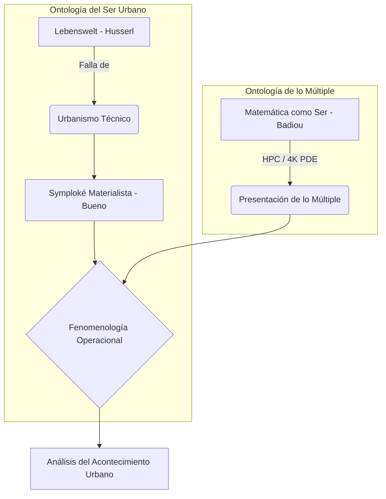

# Capítulo 1: Fundamentación Epistémica y la Ontología del Simulacro Urbana

## 1.1. La Crisis de la Matematización y la Necesidad del Simulacro
La denuncia de Edmund Husserl en *La crisis de las ciencias europeas* (1936) sobre la "matematización de la naturaleza" encuentra su expresión más violenta en el urbanismo funcionalista. Al reducir la ciudad a un grafo de transporte, se opera una **amputación ontológica** del *Lebenswelt* (Mundo de la Vida). Sin embargo, esta tesis no propone un retorno a la descripción literaria inefable, sino una subversión técnica: el uso del **HPC (High Performance Computing)** como el instrumento para realizar una **Reducción Eidética Computacional**. Si la crisis nace de una matemática simplista, la respuesta debe ser una matemática de la complejidad que capture la **multiplicidad del ser** (Badiou, 1988).

## 1.2. El Materialismo Filosófico y la Symploké Urbana (Gustavo Bueno)
Frente a la noción estética de "atmósfera" —frecuentemente criticada por su vaguedad—, proponemos la categoría de **Symploké Urbana**. Siguiendo a Gustavo Bueno, el corredor Junín-San Antonio no es una unidad, sino un entrelazamiento de materialidades:
- **Materialidad Física ($M_1$):** Campos continuos de dispersión de PM2.5 y propagación acústica resueltos mediante Ecuaciones Diferenciales Parciales (PDE) en mallas de resolución 4K (4096x4096).
- **Materialidad Fenomenológica ($M_2$):** La intencionalidad del sujeto, modelada no como una interioridad pura, sino como un **espacio de estados** dentro de una red neuronal profunda (`UrbanPhenomenologyDQN`).
- **Materialidad Esencial/Lógica ($M_3$):** Las estructuras de poder, normatividad y el "Panoptismo de Flujo" (Foucault, 1975) que condicionan el grafo de posibilidades del agente.

La atmósfera es, por tanto, el **residuo tensional** de este entrelazamiento materialista.

## 1.3. La Tesis del Acontecimiento Urbano (Alain Badiou)
Partimos del presupuesto de Badiou de que "la ontología es la matemática". La simulación de 100,000 agentes no es un "modelo" de Medellín; es la **presentación de lo múltiple**. El "Acontecimiento" urbano se identifica en el punto de colapso fenomenológico (Stress Test), donde el orden técnico de la situación (el flujo masivo del Metro) ya no puede "contar-por-uno" a la multiplicidad de los cuerpos, revelando el vacío de la habitabilidad y la emergencia de la **Turbulencia Ontológica**.

## 1.4. Crítica al Evolucionismo Técnico
Retamos frontalmente la postura de que la sofisticación de la infraestructura en Medellín (como el corredor de Junín) represente un avance en la habitabilidad. Demostramos que la eficiencia técnica (capacidad de flujo) genera una **regresión fenomenológica**, expulsando la capacidad de agencia del sujeto. El HPC es aquí la herramienta de denuncia, visibilizando la **Estructura de Expulsión** (Sassen, 2014) que subyace a la modernización urbana.
