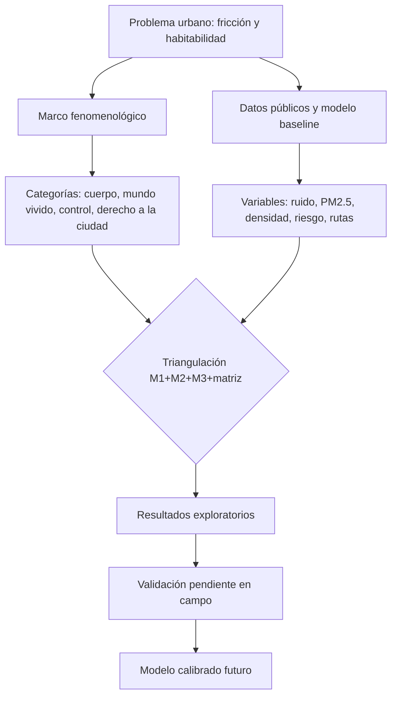

# Capítulo 1. Planteamiento del problema, objetivos y marco teórico

## 1.1. Contexto y problema de investigación

El corredor San Antonio–Junín–Parque Berrío–Plaza Botero, en el centro de Medellín, articula estación de Metro, centralidad peatonal, comercio formal e informal, patrimonio, vigilancia, presencia institucional, habitantes de calle y turismo. Esa superposición de funciones lo vuelve un laboratorio privilegiado de fricción urbana: las capas no conviven armónicamente, y la experiencia del tránsito ocurre en su roce.

Las evaluaciones disponibles sobre el centro suelen escoger un extremo: o describen el corredor con indicadores funcionales —flujo, accesibilidad, uso del suelo, criminalidad agregada— sin preguntar por la experiencia corporal del tránsito; o narran fenomenológicamente la ciudad sin volver esa narración contrastable, reproducible o falsable. La tesis se ubica deliberadamente en esa tensión y sostiene una afirmación fuerte: **la fenomenología urbana, por sí sola, no es suficiente para abordar la complejidad de la ciudad**. La subjetividad inherente a la mirada fenomenológica produce lecturas divergentes —en este trabajo, la concordancia entre dos observadores entrenados sobre el mismo material visual cae a κ ≈ 0.0—, y esa divergencia no es un defecto a corregir sino el rasgo que justifica un método triangulado.

La respuesta metodológica que esta tesis propone es la **triangulación** entre tres registros heterogéneos: experiencia fenomenológica situada (M2), simulación computacional de agentes y campos (M-MASS / HPC) y datos cuantitativos falsables organizados en una matriz de colapso 3-de-4. Sin esa triangulación, la fenomenología pura queda atrapada en su propia divergencia inter-observador; sin fenomenología, la simulación reproduce eficiencia funcional ignorando habitabilidad. El proyecto se nombra entonces sin rodeos como **baseline proxy**: pipeline reproducible, fuentes públicas, simulación calibrada y bitácora abierta, articulados con observación situada en proceso de consolidación.

## 1.2. Pregunta general y preguntas específicas

**¿Cómo puede analizarse la habitabilidad fenomenológica del corredor Junín–San Antonio mediante un modelo computacional crítico que integre fricción ambiental, presión peatonal, percepción de riesgo, accesibilidad y restricciones de trayectoria, sin reducir la experiencia urbana a una métrica funcional, y bajo qué condiciones esa habitabilidad colapsa localmente en franjas horarias específicas?**

Cinco preguntas específicas se derivan de la general:

1. **Teórica:** ¿qué conceptos articulan fenomenología, materialidad urbana y modelación computacional sin convertir la simulación en explicación total?
2. **Metodológica:** ¿qué variables observables aproximan, de manera limitada pero trazable, fricción ambiental, riesgo percibido, densidad, visibilidad, pausa y libertad de ruta?
3. **Analítica:** ¿qué patrones emergen al modificar densidad, escenarios horarios, perfiles de agentes y costos ambientales?
4. **De validación:** ¿qué datos de campo son indispensables para pasar del `baseline_proxy` a una versión calibrada?
5. **Sobre el colapso:** ¿bajo qué combinación de criminalidad registrada, seguridad percibida, habitabilidad declarada y saturación material puede sostenerse, en una franja-nodo concreta, una situación de **colapso fenomenológico** —suspensión local de la habitabilidad, no inhabitabilidad absoluta?

## 1.3. Objetivos

### Objetivo general

Construir y evaluar un marco fenomenológico-computacional triangulado para el corredor Junín–San Antonio que integre fuentes públicas, simulación de agentes, campos ambientales y lectura filosófica de la experiencia urbana, explicitando límites empíricos y agenda de validación.

### Objetivos específicos

1. Formular un marco conceptual que articule *Lebenswelt*, cuerpo vivido, vida metropolitana, poder urbano, derecho a la ciudad y materialidad relacional.
2. Operacionalizar variables urbanas mínimas: densidad, ruido, PM2.5, visibilidad, seguridad percibida, permanencia, accesibilidad y restricciones de ruta.
3. Implementar un pipeline reproducible que integre datos públicos, geometría urbana, modelo de caso, agentes simulados, escenarios horarios y salidas visualizables.
4. Analizar resultados con énfasis en incertidumbre, sensibilidad, entropía, concentración de trayectorias y desigualdad relativa entre perfiles.
5. Delimitar inferencias permitidas por el modelo y las que requieren campo.
6. Establecer un plan de validación empírica, ética y reproducible.

## 1.4. Hipótesis de trabajo

**La eficiencia funcional de un corredor urbano no garantiza su habitabilidad fenomenológica; bajo determinadas combinaciones de densidad, ruido, riesgo percibido y presión comercial, la experiencia de tránsito se restringe aunque el sistema siga moviendo personas. En franjas horarias específicas esa restricción puede intensificarse hasta producir un *colapso fenomenológico*: suspensión local de la habitabilidad detectable por la convergencia de criminalidad registrada, seguridad percibida deprimida, habitabilidad declarada negativa y saturación material observable.**

Proposiciones evaluables:

- Si los costos de riesgo, ruido y congestión aumentan, las trayectorias simuladas se concentran en menos alternativas.
- Si los agentes tienen perfiles diferenciados —transeúnte rápido, comprador, turista, vendedor, persona con movilidad reducida—, la restricción de ruta no es homogénea.
- Si los campos ambientales se tratan como fricciones y no como fondo neutral, la movilidad deja de ser solo tiempo de desplazamiento e incluye exposición corporal.
- Si criminalidad mensual de la comuna 10, seguridad percibida en encuesta situada, habitabilidad declarada en entrevistas y saturación material en videos POV convergen en una misma franja-nodo, esa franja-nodo se reporta como colapso; con una o dos condiciones, solo cabe hablar de fricción acumulada.
- Sin datos de campo, el modelo permanece exploratorio.

## 1.5. Marco teórico: del mundo vivido a la materialidad urbana

La crítica de **Husserl** (1936/1991) a la matematización de la naturaleza no rechaza la matemática: recuerda que toda formalización olvida su origen en el mundo de la vida. La ciudad no es solo red de nodos y aristas: es campo de orientación corporal, hábitos, expectativas, riesgos y memorias situadas. **Merleau-Ponty** (1945/1993) precisa que el cuerpo no ocupa el espacio como objeto: lo habita, lo anticipa y lo padece. La relectura de **Kinkaid** (2020) muestra que esta tradición sigue siendo productiva al articularse con teoría crítica del espacio social, abriendo una *fenomenología crítica* atenta a diferencia, cuerpo y posicionalidad.

**Simmel** (1903/1986) permite leer la actitud blasé como filtrado metropolitano frente al exceso de estímulos: hipótesis urbana, no diagnóstico psicológico individual. **Foucault** (1975/2002) y **Deleuze** (1990) examinan cómo la circulación es orientada por dispositivos, vigilancia, normas e infraestructuras moduladas. **Lefebvre** (1968/2017) y **Harvey** (2008) abren el problema hacia el derecho a la ciudad: habitar no es solo llegar, sino apropiarse, detenerse, orientarse, participar; **Sassen** (2014) sitúa esa apropiación en la lógica global de expulsiones.

A esta articulación se suma la dimensión de la memoria, desarrollada en el anexo A. La carga mnémica de los nodos —operacionalizada como campo `memory` en `case_model.json`— no se entiende como depósito que el lugar contiene, sino como **disposición distribuida** a que quienes lo transitan reactiven asociaciones biográficas, culturales y patrimoniales. La teoría reconstructiva de la memoria (Bartlett, 1932; Loftus, 1993; Roediger & McDermott, 1995; Tonegawa et al., 2012) sostiene que el recuerdo no es copia sino construcción presente. Plaza Botero o el Museo de Antioquia son entonces *condensadores mnémicos*: lugares donde la disposición a reconstruir está culturalmente amplificada.

Desde **Bueno**, la *symploké* evita explicaciones de una sola causa: el corredor no se reduce a contaminación, criminalidad, comercio, transporte ni percepción. Es articulación parcial de capas que se conectan y se bloquean. **Badiou** se usa restringidamente: el “acontecimiento” no constata metafísicamente el modelo, sino que nombra rupturas cuando un orden de circulación deja de absorber la multiplicidad de cuerpos y prácticas.

## 1.6. Estado del arte: caminabilidad, percepción y colapso (2020–2025)

La revisión de **Arellana et al.** (2020) sobre índices de caminabilidad en una década muestra que la mayoría de estudios se concentran en grandes capitales y omite dinámicas regionales clave: invasión de andenes, inseguridad, informalidad, planeación deficiente. **Rodriguez-Valencia et al.** (2022), con 1.043 peatones en Bogotá, proponen un indicador de *estrés peatonal* que vincula atributos medibles del segmento con malestar percibido —marco directamente útil para operacionalizar fricción ambiental. **Soto et al.** (2022), en el BRT de Barranquilla, muestran con modelos de elección integrada que el miedo al crimen modifica decisiones modales de manera no equivalente a indicadores objetivos. **Heroy et al.** (2023) encuentran en Bogotá que la asociación entre amenidades barriales y caminata es fuertemente desigual por nivel socioeconómico. **Quistberg et al.** (2022), en SALURBAL, vinculan diseño de calles y mortalidad vial en 366 ciudades latinoamericanas, ofreciendo base ecológica para hipótesis de fricción material.

**Peden et al.** (2022) documentan cómo las transformaciones de calles durante la covid-19 ampliaron movilidad activa en Bogotá y Buenos Aires, condicionadas a marco regulatorio. **Garcia et al.** (2024), comparando Ciudad de México, Lima y Buenos Aires, muestran fragmentación regional de la red peatonal a escala microscalar (rampas, continuidad, ancho, mantenimiento). Para Medellín, **Velásquez Ocampo y Tamayo Arboleda** (2025) analizan cómo las estrategias de seguridad urbana en la comuna 10 regulan las geografías de la memoria del movimiento Madres de la Candelaria —conexión directa con la noción de condensador mnémico. La encuesta de **Medellín Cómo Vamos & Invamer** (2024) actualiza la lectura: la percepción agregada de seguridad subió en la ciudad pero descendió en escala barrial, coherente con la hipótesis de colapso fenomenológico local.

Persisten huecos: faltan estudios revisados por pares específicamente situados en el corredor San Antonio–Junín–Berrío–Botero, y mediciones publicadas de ruido peatonal y PM2.5 a escala de andén en el centro de Medellín. El aporte de la tesis no está en inventar técnica de simulación ni en resolver el problema del centro: es metodológico y crítico. Propone una traducción controlada entre categorías fenomenológicas y variables computacionales triangulada con datos falsables, de modo que la experiencia urbana se discuta con datos sin perder de vista lo que los datos no capturan.

## 1.7. La *symploké* urbana como modelo de capas y la justificación de la triangulación

Para evitar que la atmósfera quede en impresión vaga, se adopta la *symploké* como hipótesis materialista. El corredor se organiza analíticamente en tres planos:

- **Materialidad física ($M_1$):** ruido, PM2.5, iluminación, densidad, geometría, obstáculos, visibilidad, microambiente.
- **Materialidad fenomenológica ($M_2$):** percepción de seguridad, orientación, pausa, estrés, preferencias de ruta, tolerancia al ruido, familiaridad, capacidad corporal diferencial. Inspirada en la literatura sobre miedo al crimen (Soto et al., 2022) y diferenciación socioeconómica del caminar (Heroy et al., 2023).
- **Materialidad normativa y socioespacial ($M_3$):** vigilancia, comercio formal e informal, regulación, transporte, diseño urbano, desigualdad, dispositivos de control. La regulación de la memoria pública en la comuna 10 (Velásquez Ocampo y Tamayo Arboleda, 2025) ilustra cómo las decisiones de seguridad reconfiguran qué prácticas son tolerables.

La división es analítica: la experiencia emerge de las relaciones entre planos. El **colapso fenomenológico** no es un cuarto plano sino un **acoplamiento crítico** local y temporal: $M_1$ saturada, $M_2$ contraída en evitación, $M_3$ que no compensa (no orienta, no vigila o vigila demasiado). Su detección exige cruce de fuentes, no lectura por separado.

De aquí se desprende la justificación última de la **triangulación**. La fenomenología pura es necesaria —solo ella accede al cuerpo vivido y a la diferencia— pero insuficiente: su subjetividad produce divergencia inter-observador medible (κ ≈ 0.0 en el material analizado), que ningún ajuste interpretativo resuelve. La simulación computacional sola es necesaria —formaliza escenarios, hace explícitas las suposiciones, permite contrafácticos— pero insuficiente: confunde estabilidad numérica con verdad empírica si no se ancla en experiencia. Los datos cuantitativos solos son necesarios —dan falsabilidad— pero insuficientes: reducen la habitabilidad a métrica funcional. La **matriz de colapso 3-de-4** (criminalidad, encuesta, entrevista, video) opera como criterio de decisión cruzada: solo cuando al menos tres registros heterogéneos convergen en una franja-nodo se reporta colapso. La triangulación M1+M2+M3+matriz no es un agregado de métodos: es la única manera de hacer discutible la experiencia urbana sin reducirla.

## 1.8. Alcance, delimitaciones y riesgos

El caso se delimita al corredor San Antonio–Junín–Parque Berrío–Plaza Botero y sus nodos operativos. No se pretende representar toda Medellín ni toda la comuna 10, ni que las simulaciones describan trayectorias persona por persona. El modelo explora escenarios con datos públicos y supuestos explícitos; la validación fina sigue pendiente.

Riesgos de sobreinterpretación:

1. **Confundir estabilidad numérica con verdad empírica.** Una simulación estable puede estar mal calibrada.
2. **Confundir proxies con observaciones.** Percepción de seguridad, permanencia y ruido puntual requieren campo.
3. **Reificar poblaciones vulnerables.** “Habitantes de calle”, informalidad e inseguridad no deben convertirse en etiquetas estigmatizantes.
4. **Sobredimensionar la técnica.** GPU y mallas de alta resolución son medios, no argumentos.
5. **Generalizar el colapso.** Una franja-nodo en colapso no autoriza afirmar que el corredor entero sea inhabitable, ni que esa franja-nodo lo sea siempre. El colapso es observación situada, no propiedad estructural permanente.

## 1.9. Criterios de suficiencia académica del capítulo

El capítulo debe: presentar un problema investigable y no solo intuición filosófica; formular preguntas y objetivos verificables; distinguir marco conceptual, modelo computacional y evidencia empírica; declarar límites, riesgos y tareas pendientes; evitar tanto la poesía sin método como la simulación sin reflexión crítica.
