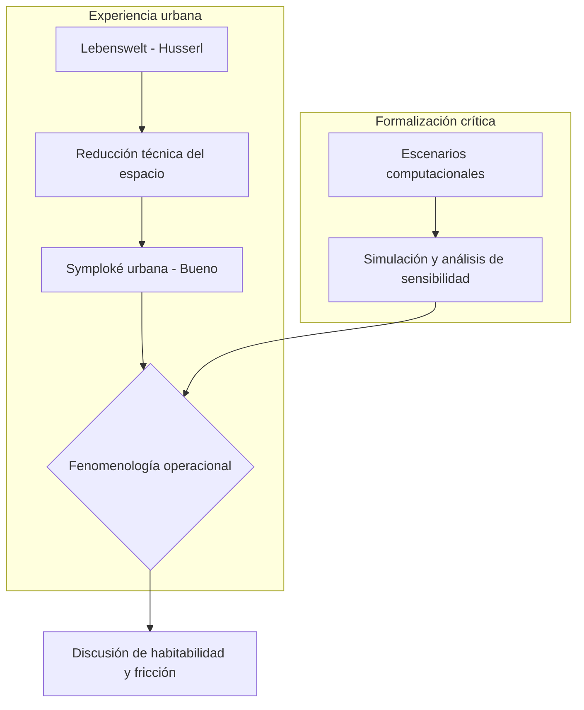

# Capítulo 1: Fundamentación teórica y marco de modelación urbana

## 1.1. Matematización, experiencia urbana y alcance del modelo

La crítica de Edmund Husserl en *La crisis de las ciencias europeas* (1936/1991) a la “matematización de la naturaleza” ofrece un punto de partida útil para revisar ciertos usos contemporáneos del urbanismo funcionalista. Cuando la ciudad se reduce únicamente a flujos, tiempos de viaje o grafos de conectividad, parte del *Lebenswelt* —el mundo de la vida vivido por cuerpos situados— queda fuera del análisis. Esta investigación no propone abandonar la formalización, sino usarla con cautela: el modelo computacional M-MASS funciona como un dispositivo de exploración que permite contrastar hipótesis sobre fricción, percepción, accesibilidad y presión ambiental en el corredor Junín-San Antonio.

En ese sentido, el cómputo de alto rendimiento y la aceleración por GPU no son presentados como prueba autosuficiente ni como sustituto del trabajo de campo. Son herramientas para construir escenarios, evaluar sensibilidad y hacer visibles relaciones que luego deben ser discutidas filosófica y empíricamente. La tesis sostiene, de manera acotada, que una formalización compleja puede ayudar a no empobrecer la experiencia urbana siempre que declare sus supuestos, límites y fuentes de validación.

## 1.2. Materialidades urbanas y *symploké* como hipótesis de lectura

Para evitar que la noción de “atmósfera” quede reducida a una impresión estética general, se adopta la categoría de *symploké* como una hipótesis de lectura materialista: el corredor no se entiende como una unidad simple, sino como un entrelazamiento parcial de capas físicas, perceptivas y normativas (Bueno, 1972). Esta hipótesis se organiza en tres planos analíticos:

- **Materialidad física ($M_1$):** campos aproximados de PM2.5, ruido, densidad y visibilidad, modelados mediante mallas y ecuaciones diferenciales parciales cuando el experimento lo requiere.
- **Materialidad fenomenológica ($M_2$):** decisiones de agentes con estados simplificados de percepción, riesgo, tiempo, atracción comercial y exposición ambiental.
- **Materialidad normativa ($M_3$):** reglas, dispositivos de vigilancia, infraestructuras, hábitos y condiciones de poder que restringen o habilitan trayectorias posibles (Foucault, 1975/2002).

La atmósfera urbana se trata, por tanto, como un efecto relacional de estas capas, no como una esencia previa ni como una conclusión garantizada por el modelo.

## 1.3. Acontecimiento urbano como categoría interpretativa

La referencia a Badiou (1988/1999) permite formular una pregunta filosófica: ¿qué ocurre cuando un orden espacial que parece estable deja de absorber la multiplicidad de prácticas, cuerpos y ritmos que lo atraviesan? En esta tesis, los experimentos de estrés no se leen como reproducción literal de Medellín, sino como escenarios límite para observar cambios en entropía, presión y velocidad media bajo supuestos controlados.

El “acontecimiento” urbano se usa entonces como una categoría interpretativa: nombra el momento en que las condiciones de circulación dejan de parecer naturales y se vuelven problemáticas. No se afirma que el modelo agote la realidad del centro; más bien, se propone que puede señalar zonas donde la habitabilidad requiere discusión empírica, política y fenomenológica.

## 1.4. Crítica moderada al progreso técnico como criterio único

La infraestructura de movilidad y centralidad de Medellín puede producir beneficios verificables: accesibilidad, conexión metropolitana y concentración de servicios. Sin embargo, la eficiencia técnica no equivale automáticamente a habitabilidad. Esta investigación problematiza esa equivalencia y pregunta si determinados aumentos de capacidad, velocidad o control pueden coexistir con pérdida de agencia, saturación sensorial o exclusión cotidiana.

El argumento no consiste en negar la importancia de la modernización urbana, sino en someterla a una evaluación más amplia. Desde esta perspectiva, los conceptos de expulsión y desigualdad urbana (Sassen, 2014), así como el derecho a la ciudad (Lefebvre, 1968/2017; Harvey, 2008), ayudan a leer el corredor Junín-San Antonio como un espacio donde la movilidad, el comercio, la seguridad, la informalidad y la experiencia corporal entran en tensión.
