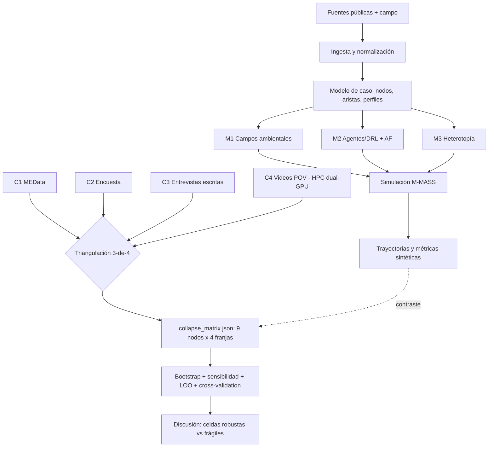

# Capítulo 2. Metodología y diseño computacional

## 2.1. Diseño general de la triangulación

La tesis nuclear de esta investigación —que la fenomenología por sí sola es insuficiente para diagnosticar el colapso urbano— exige un diseño metodológico que articule cuatro registros heterogéneos en lugar de privilegiar uno. La metodología cruza (i) descripción fenomenológica situada en la capa $M_2$ del modelo, (ii) simulación multi-agente sobre el corredor real (M-MASS), (iii) procesamiento HPC dual-GPU de evidencia de campo (fotos georreferenciadas, videos POV, entrevistas escritas, serie histórica MEData), y (iv) una matriz de colapso falsable construida bajo regla **3-de-4** sobre 36 celdas (9 nodos × 4 franjas horarias). Ninguno de los cuatro registros tiene autoridad por sí mismo: la convergencia mínima entre tres es la única condición que autoriza el diagnóstico de colapso, y cualquier celda con menos de tres condiciones se reporta como *fricción acumulada* o *flujo ordinario*.

El caso se concentra en el corredor San Antonio–Junín–Parque Berrío–Plaza Botero, discretizado en nueve nodos operativos: `san_antonio_metro`, `parque_san_antonio`, `palacio_nacional`, `junin_paseo`, `oriental_cruce`, `parque_berrio`, `carabobo_cultural`, `plaza_botero`, `museo_antioquia`. Las cuatro franjas horarias son `peak_am`, `midday`, `peak_pm` y `night`. Los perfiles simulados son cinco —transeúnte rápido, comprador, turista cultural, vendedor ambulante, persona con movilidad reducida—. Esta discretización es deliberadamente mínima: no agota la complejidad del centro, pero permite una malla manejable para la triangulación.

La distinción central que ordena el resto del capítulo es la separación entre **simulación** (M-MASS, §2.2) y **pipeline empírico** (HPC dual-GPU, §2.3): el segundo no alimenta al primero sino que produce la matriz contra la cual el primero se contrasta. El cruce final se opera por la regla 3-de-4 (§2.4) y se somete a tres pruebas independientes de robustez (§2.5).

## 2.2. Modelo M-MASS: tres capas de la *symploké*

**M-MASS** designa una *Multi-layer Multi-Agent Spatial Simulation*: la integración de agentes autónomos con perfiles diferenciados sobre una topología georreferenciada (grafo Junín–San Antonio) bajo tres planos de campo superpuestos. La arquitectura se apoya en literatura consolidada de modelos basados en agentes y dinámica peatonal (Batty, 2013; Bonabeau, 2002; Epstein, 2006; Helbing & Molnár, 1995), pero estas referencias orientan el diseño sin reemplazar la validación situada.

**Capa $M_1$ — físico-ambiental.** Representa la materialidad del corredor mediante un solucionador vectorizado de ecuaciones de reacción-difusión sobre malla 4096×4096 (16.7 millones de celdas):
$$ \frac{\partial u(x,t)}{\partial t} = D \nabla^2 u(x,t) - \kappa u(x,t) + S(x,t) $$
donde $u(x,t)$ aproxima la concentración del estresor (PM2.5, PM10, presión acústica), $D$ la difusión, $\kappa$ el decaimiento y $S(x,t)$ las fuentes. En el marco de los sistemas emergentes (Johnson, 2001) estos campos operan como señales estigmérgicas negativas que modifican la probabilidad de elección de ruta sin orden centralizada. Los valores pico de `hpc_environmental_report.json` deben leerse como unidades internas del modelo, no como mediciones normativas: cualquier afirmación sanitaria exige calibración con instrumentos de campo. La capa se nutre además de `photo_summary_*.json` (YOLO11) y `video_saturation_*.json` (HPC dual-GPU) para conteos de obstáculos, escala de indigencia 0–10, escala de consumo 0–10, ratio de turistas y presencia policial.

**Capa $M_2$ — agente / experiencia.** Formaliza al transeúnte como agente con información limitada y preferencias ponderadas. Las políticas de navegación se estiman mediante aprendizaje por refuerzo profundo bajo Bellman (Bellman, 1957; Sutton & Barto, 2018):
$$ Q^*(s, a) = \mathbb{E} \left[ R(s, a) + \gamma \max_{a'} Q^*(s', a') \right] $$
La función $R(s,a)$ codifica costos de tiempo, riesgo y exposición. La arquitectura `UrbanPhenomenologyDQN` incorpora *LayerNorm* y *Dropout* (Mnih et al., 2015): técnicamente estabilizan el entrenamiento; interpretativamente permiten discutir el filtrado perceptivo sin afirmar reproducción de los *qualia*. Los perfiles son tipos analíticos para comparar sensibilidades a costos, no representaciones de identidades. La capa $M_2$ se alimenta también de **apreciaciones fenomenológicas** (AF) auto-etnográficas del observador, que entran al modelo como evidencia legítima sobre la dimensión experiencial del corredor —en línea con la tradición husserliana del *Lebenswelt* y la fenomenología de la percepción de Merleau-Ponty—, articulando los pesos abstractos de riesgo, exposición y recompensa con descripción situada del espacio vivido.

**Capa $M_3$ — social / heterotopía.** Reúne reglas implícitas, vigilancia, infraestructura, comercio formal/informal, centralidad y desigualdad. La expresión "Panóptico de Flujo" se utiliza como lente foucaultiana para describir cómo ciertas condiciones orientan el movimiento sin prohibirlo, no como entidad empírica cerrada. La capa se opera mediante un *score* de heterotopía por nodo (mezcla de usos, demografía, comercio formal/informal) registrado en `m3_heterotopy_signals.json`. Esta es la capa más difícil de formalizar porque incluye poder, expectativa y costumbre; se aproxima mediante variables de control, riesgo, atracción y conectividad, y se corrige con observación cualitativa.

**Distinción metodológica AF / C3.** Las apreciaciones fenomenológicas alimentan $M_2$ pero **no se cuentan como C3** (testimonio de habitabilidad declarada) en la matriz de colapso. C3 exige entrevistas elicitadas a terceros, escritas y codificadas. Esta doble inscripción —AF válidas para $M_2$, AF excluidas de C3— preserva la triangulación 3-de-4 sin descartar la riqueza descriptiva de la observación participante, y es estructuralmente necesaria por la razón empírica que se documenta en §2.5.

Las métricas que produce M-MASS son: velocidad media, entropía de trayectorias, divergencia de Kullback-Leibler $D_{KL}(P \parallel Q) = \sum_x P(x)\log(P(x)/Q(x))$ (Kullback & Leibler, 1951), Gini de entropía, índice de presión e intervalos de confianza Monte Carlo. Ninguna constituye juicio normativo automático: un valor alto puede indicar restricción, diversidad, ruido o mala especificación según el experimento.

## 2.3. Pipeline HPC dual-GPU

El pipeline empírico opera sobre datos de campo reales y se ejecuta en la torre `ubuntu-raid` con dos GPUs en paralelo. **GPU 0**: NVIDIA RTX 5070 Ti (Blackwell, sm_120), modelo primario YOLO11x. **GPU 1**: NVIDIA RTX 2060 (Turing, sm_75), modelo secundario YOLO11s. **CPU/RAM**: 32 cores, 123 GiB. **Stack**: Docker Engine 29.1.3 con runtime `nvidia` y CDI specs en `/var/run/cdi/nvidia.yaml`; la asignación per-GPU se realiza con `devices: ["nvidia.com/gpu=N"]` en `docker-compose.yml` para evitar el bug de eBPF device-filter detectado con `--gpus all` en kernel 6.17. La cooperación entre workers se garantiza con locks por video en `investigacion/hpc/jobs/` y por foto en `jobs_photos/`: ambas GPUs leen de la misma cola sin solapamiento.

El directorio `investigacion/hpc/` contiene **nueve scripts** que cubren la cadena ingesta→derivación→ensamblaje:

1. **`process_photos.py`** — extrae EXIF (timestamp, GPS) por foto y emite `photo_summary_<basename>.json`.
2. **`process_video.py`** — muestrea frames, corre YOLO11 sobre la GPU asignada y emite `video_saturation_<basename>.json` con `saturation_index` y p50/p75/p90 de personas por frame. La convención `NODE__WINDOW__YYYY-MM-DD__libre.mp4` ubica la celda sin sidecar.
3. **`transcribe_audio.py`** — transcribe la pista de audio de los videos POV. Las transcripciones se conservan como ruido ambiente y **no** alimentan C3: el audio del celular satura la firma armónica y recoge comentarios del observador, no testimonio elicitado.
4. **`code_interviews.py`** — codifica entrevistas escritas según el esquema `HABITABLE / DESEABLE / EVITABLE / NO_DESEABLE / DIFICIL_DE_VIVIR / AMBIVALENTE` y agrega por celda nodo×franja para C3.
5. **`assign_nodes.py`** — asigna cada foto al nodo más cercano por distancia haversine y genera `photo_node_assignments.json`.
6. **`assign_videos_by_time.py`** — asigna videos a celdas por timestamp y proximidad espacial cuando la convención de nombre o el sidecar no son suficientes.
7. **`c1_project_hourly.py`** — proyecta la serie histórica MEData de hurto a persona de comuna 10 a las cuatro franjas mediante un supuesto distribucional documentado, calcula el corte por **percentil 75 sobre la serie histórica completa** y emite `c1_hourly_projection.json` con el mapa `c1_high_by_window`. C1 se opera consultando este mapa precomputado en lugar de recalcular la condición celda por celda; así el corte se mantiene como propiedad estable del corredor en su escala disponible (comuna 10), reconociendo que MEData no resuelve detalle por nodo.
8. **`build_collapse_matrix.py`** — consume las salidas C1–C4, aplica la regla 3-de-4 por celda y emite `collapse_matrix.json`. Conserva versiones previas como `*.bak.<timestamp>` para auditoría diacrónica.
9. **`inspect_matrix.py`** — utilidad de revisión por consola del estado de cada celda y los archivos que alimentaron cada condición.

Scripts auxiliares: `make_sidecars.py` (genera `*.meta.json` para videos sin convención), `update_video_metadata.py` (corrige metadatos en lote) y `m3_signage_ocr.py` (aplica `easyocr` en CPU sobre las 34 fotos georreferenciadas para evaluar saturación de *signage* y grafiti).

**Diferencia respecto a M-MASS.** El pipeline HPC y M-MASS no comparten datos en una sola dirección: el pipeline produce la matriz empírica que **contrasta** la simulación, no la alimenta. M-MASS genera trayectorias y campos sintéticos; el pipeline genera una malla de evidencia situada. Su cruce se discute en el capítulo 3.

## 2.4. Operacionalización del colapso fenomenológico (regla 3-de-4)

Para cada celda $(n, w)$ se evalúan cuatro condiciones binarias:

- **C1 — Carga objetiva de criminalidad.** Se cumple si la franja $w$ aparece marcada como `c1_high` en `c1_hourly_projection.json` (corte p75 fijo sobre la serie histórica MEData de hurto a persona, comuna 10). *Limitación*: desfase temporal, escala comuna, no resuelve por nodo.
- **C2 — Seguridad percibida deprimida.** Se cumple si el promedio del `security_score` 1–5 en `field_counts_*.csv` es ≤ 2/5, o si las notas de campo registran `RIESGO_PERCIBIDO` como código dominante. *Estado*: ausente al cierre de redacción (`cells_with_data = 0`), pendiente de la encuesta breve situada.
- **C3 — Habitabilidad declarada negativa.** Se cumple si las entrevistas escritas codifican mayoritariamente `EVITABLE / NO_DESEABLE / DIFICIL_DE_VIVIR` por encima de `HABITABLE / DESEABLE` para esa franja. Se descartan las transcripciones automáticas de los videos POV (no constituyen testimonio elicitado). Las salvaguardas del protocolo —preguntas neutras antes de términos cargados, registro literal, código `AMBIVALENTE` reservado para no forzar binariedad, no tratar la convicción subjetiva como prueba— derivan de la teoría reconstructiva de la memoria del anexo A (Loftus, 1993).
- **C4 — Saturación material.** Se cumple si los videos POV / time-lapse procesados con YOLO11 reportan un `saturation_index` por encima del **umbral global p75 = 0.413**, calculado sobre el conjunto total del corpus dual-GPU. El umbral es global, no por celda, para preservar comparabilidad entre nodos.

**Regla de decisión.** La celda se reporta como **colapso fenomenológico** solo si **al menos tres de las cuatro condiciones** se cumplen simultáneamente; con una o dos condiciones, **fricción acumulada**; con ninguna, **flujo ordinario**. La regla impide que un dato suelto se convierta en diagnóstico y obliga a la convergencia entre registros heterogéneos. La salida es `collapse_matrix.json` con 36 celdas (9×4) y un campo de estado por celda.

| Criterio | Fuente primaria | Script | Salida procesada | Estado |
| --- | --- | --- | --- | --- |
| C1 | MEData (hurto a persona, comuna 10) | `c1_project_hourly.py` | `c1_hourly_projection.json` (mapa `c1_high_by_window`) | precomputado, p75 fijo |
| C2 | encuesta `security_score` 1–5 | (manual a `field_counts_*.csv`) | `field_observations_aggregate.csv` | ausente |
| C3 | entrevistas escritas | `code_interviews.py` | códigos agregados por celda | pendiente |
| C4 | videos POV / time-lapse | `process_video.py` (YOLO11 dual-GPU) | `video_saturation_*.json` (p75 = 0.413) | procesado |
| Asignación espacial | EXIF + GPS + timestamps | `process_photos.py`, `assign_nodes.py`, `assign_videos_by_time.py` | `photo_node_assignments.json`, `photo_summary_*.json` | procesado |
| Audio (no usado) | pista de videos POV | `transcribe_audio.py` | transcripciones como ruido ambiente | descartado para C3 |
| Ensamblaje | salidas C1–C4 | `build_collapse_matrix.py`, `inspect_matrix.py` | `collapse_matrix.json` | en construcción |

## 2.5. Validación: inter-rater, bootstrap, cross-validation, leave-one-out

**Confiabilidad inter-observador.** La jornada de campo fue ejecutada en paralelo por dos observadores (Stev y Jacob), quienes registraron de forma ciega `perceived_safety_score_1_5` en cuatro nodos compartidos (`san_antonio_metro`, `parque_san_antonio`, `junin_paseo`, `parque_botero`). Tras binarizar la escala 1–5 en `bajo` (<3) y `alto` (≥3) se calculó kappa de Cohen (Cohen, 1960; Landis & Koch, 1977):
$$ \kappa = \frac{p_o - p_e}{1 - p_e} $$
Con $p_o = 0.50$ y $p_e = 0.50$, **kappa = 0.0** — *poor agreement* en Landis & Koch, muy por debajo del umbral 0.40. La divergencia más radical aparece en `parque_san_antonio` (Stev=4 / Jacob=2): los mismos elementos materiales —arte público, vendedores, paso histórico— son leídos como *tranquilidad contemplativa* por uno y como *paso del terror* por el otro.

**Lectura defensiva.** El resultado no es fallo metodológico sino **confirmación empírica de la tesis nuclear**: la atmósfera urbana no es una propiedad geométrica reducible a la materialidad, sino un fenómeno que se constituye en la articulación entre cuerpo, biografía y entorno. Que dos observadores formados diverjan radicalmente opera como evidencia de que el *mismo lugar* no existe sin observador encarnado. De aquí cuatro decisiones explícitas: (i) kappa = 0.0 se reporta abiertamente como dato fenomenológico positivo; (ii) la triangulación 3-de-4 deja de ser opcional y pasa a ser estructuralmente necesaria; (iii) C3 adquiere papel de desempate cualitativo cuando dos AF divergen; (iv) los nodos con divergencia binaria reciben en el capítulo 3 la bandera **"fenomenológicamente disputado"**.

**Análisis de sensibilidad y robustez.** El script `bootstrap_matrix.py` ejecuta tres variantes sobre la matriz baseline, archivadas en `collapse_matrix_sensitivity.json` y `sensitivity_report.md`:

1. **V1 — Bootstrap clásico (1000 iteraciones).** Resamplea con reemplazo la serie horaria de C1 por franja, los `saturation_index` de C4 por celda y la lista global de entrevistas C3, recomputando percentiles y la regla 3-de-4 en cada iteración.
2. **V2 — Sensibilidad de umbrales (25 escenarios).** Barre el percentil de corte de C1 y C4 sobre $\{p70,p75,p80,p85,p90\}\times\{p70,p75,p80,p85,p90\}$ para detectar si la decisión es artefacto del p75 o sobrevive a deformaciones moderadas.
3. **V3 — Leave-one-out de entrevistas C3 (15 iteraciones).** Quita cada entrevista una por una y reevalúa C3 para detectar celdas cuyo carácter negativo dominante depende de un único testigo.

Las celdas se clasifican como **robustas** si conservan la decisión baseline en ≥80% de V1 *y* ≥80% de V2; como **frágiles** en caso contrario. De las seis celdas en `friccion_acumulada` solo dos cruzan ambos umbrales: **`junin_paseo|peak_am`** (V1=0.956, V2=0.880) y **`plaza_botero|midday`** (V1=0.970, V2=1.000). Las cuatro restantes (`san_antonio_metro|peak_am`, `parque_san_antonio|midday`, `junin_paseo|midday`, `parque_berrio|midday`) caen a V2≈0.40 y se reportan como frágiles. Esta separación entre celdas defendibles y frágiles es el pilar empírico de la presentación de resultados.

**Cross-validation texto↔imagen.** El procedimiento, archivado en `cross_validation.json`, triangula reclamos cuantificables del campo con agregados visuales de YOLO11 (`m1_visual_aggregate.json`, `m3_visual_aggregate.json`). De los **10 reclamos** evaluados, **2 muestran convergencia alta** y constituyen las anclas más fuertes: el riesgo vial en `san_antonio_metro|peak_am` (safety = 2/5) converge con `vehicle_intensity = 0.378` (máximo del corpus); el "colapso/sofocante" en `plaza_botero|midday` converge con `human_density_max = 30` y `saturation_max = 71` (máximos del corpus). **2 muestran convergencia media** (turistas en Botero ≈5% vs proxy visual 3.6%; comercio informal en Junín, donde el visual disuelve la divergencia inter-rater al revelar mono-uso formal *con* flujo portátil heterogéneo: 240 maletas y 102 bolsos en peak_am). Los **6 restantes son no evaluables** —vandalismo, indigencia, consumo, presencia policial, atmósfera de `parque_san_antonio`— por limitaciones de las clases COCO usadas por YOLO11, no por contradicción entre observador y datos. **Donde el pipeline tiene capacidad la convergencia es alta; donde no la hay, la limitación es del instrumento**.

## 2.6. Refinamiento geométrico de nodos

La geometría v1 asigna cada foto al nodo canónico más cercano por haversine sobre los nueve centroides. Esta discretización es suficiente como malla mínima, pero `pasaje_la_bastilla` —unidad fenomenológica narrada con fuerza en notas de campo— no aparece como nodo y sus fotos relevantes caen disueltas en buckets adyacentes; además, las entrevistas revelan **gradientes intra-nodo** que un solo punto por nodo no captura (sub-zona Coltejer-Ayacucho dentro de Junín, "calle del consumo" adyacente a Plaza Botero).

El script `refine_node_geometry.py` introduce una **geometría v2** con tres sub-zonas adicionales —`pasaje_la_bastilla`, `junin_coltejer_ayacucho`, `botero_calle_consumo`— bajo regla con prioridad: una foto cae en sub-zona si su distancia al centroide de ésta es ≤ 80 m (`SUBZONE_MAX_RADIUS_M`); en caso contrario se asigna al nodo canónico más cercano dentro del radio global de 400 m. La salida (`node_geometry_v2.json`, `photo_node_assignments_v2.json`) **no sobrescribe** v1 sino que coexiste como geometría alternativa. La v2 rescata `pasaje_la_bastilla` como nodo poblado con 12 fotos (distancia mínima ≈ 3.7 m). Las dos sub-zonas restantes quedan **definidas pero vacías**: su geometría está fijada cartográficamente, pero el muestreo no cubrió esos centroides dentro del radio de 80 m. Se reporta como **limitación honesta de muestreo**, no como ausencia del fenómeno; una jornada focalizada queda registrada como tarea pendiente.

## 2.7. Reproducibilidad y trazabilidad

La trazabilidad se apoya en tres elementos del repositorio: scripts de ingesta, derivación, modelado, simulación, análisis y publicación visual; archivos JSON de salida en `investigacion/outputs/` e `investigacion/data/processed/`; y documentación metodológica en `investigacion/docs/`. El archivo `source_status.json` reporta 19 fuentes intentadas, 15 descargadas y 4 fallidas (timeouts en MEData, 403 en geovisor DANE) — la información se preserva para diferenciar datos efectivamente integrados de datos no disponibles. El ensamblador `build_collapse_matrix.py` conserva los `.bak.<timestamp>` de versiones previas para auditoría diacrónica.

El anexo técnico debe documentar: versiones de Python, PyTorch, NumPy y dependencias geoespaciales; disponibilidad de GPU/CUDA; semillas aleatorias; tiempos aproximados de ejecución; parámetros sensibles (número de agentes, pasos, tamaño de malla, tasas de difusión, recompensas, pesos de riesgo y ruido); y modo reducido para reproducir resultados en CPU.

## 2.8. Limitaciones metodológicas declaradas

La metodología incorpora cinco limitaciones que no se ocultan en el silencio del pipeline:

1. **Kappa = 0.0 entre observadores.** Convertido en evidencia positiva de la tesis nuclear, no en falla; pero implica que ningún observador único puede arrogarse la representación del nodo.
2. **Sub-zonas vacías en geometría v2.** `junin_coltejer_ayacucho` y `botero_calle_consumo` están definidas cartográficamente pero el corpus visual no las cubre dentro del radio de 80 m.
3. **C2 ausente.** Con `cells_with_data = 0`, la regla 3-de-4 opera de facto como **3-de-3 con C2 = False**, sesgando sistemáticamente las decisiones hacia `friccion_acumulada` antes que hacia `colapso_fenomenologico`. La conclusión defensiva no es que el corredor "no colapse", sino que con la cobertura empírica disponible *aún no puede afirmarse el colapso* sin la encuesta situada.
4. **OCR sesgado a diurno.** El módulo `m3_signage_ocr.py` confirma parcialmente la saturación de tags y rótulos en San Antonio y Junín, pero algunas "fotos repetidas" corresponden a ráfagas fotográficas del observador, no a múltiples ocurrencias independientes; se lee como evidencia cualitativa, no como conteo poblacional.
5. **Audio celular satura la firma armónica.** Las transcripciones de los videos POV se descartan deliberadamente como C3.

Esta declaración explícita es metodológicamente sustantiva: el modelo es falsable. Si los conteos reales contradicen los flujos simulados, si la percepción contradice los proxies, o si las cuatro fuentes no convergen en ninguna celda, el modelo y la categoría deben recalibrarse. La cautela epistemológica sigue a Haraway (1995): no existe mirada neutral *desde ninguna parte*; hay perspectivas parciales que deben declararse para ser discutibles.

## 2.9. Consideraciones éticas

La fase de campo y la ingesta multimedia introducen obligaciones éticas adicionales. Las encuestas y entrevistas evitan datos personales identificables; las fotografías y videos POV se centran en obstáculos, flujos agregados, geometría y condiciones espaciales, no en rostros ni en exposición de individuos vulnerables. Cualquier mención a habitantes de calle, informalidad o inseguridad se trata como categoría urbana agregada, no como estigma de grupos.

El protocolo incluye: consentimiento verbal o escrito; anonimización de observadores y participantes; no registro de rostros identificables sin autorización (difuminado o exclusión del entregable público); almacenamiento seguro de archivos crudos no publicables; uso académico limitado; posibilidad de no responder sin consecuencia; transcripción anonimizada por colaborador externo bajo confidencialidad; y procesamiento de video en torre HPC local del autor, sin envío a terceros.

## 2.10. Diagrama y balance metodológico

El método articula simulación, fenomenología, datos cuantitativos y matriz falsable bajo una regla 3-de-4 estructuralmente exigente. Su fortaleza no radica en eliminar la subjetividad —el kappa = 0.0 muestra que esto es imposible y, además, conceptualmente erróneo— sino en distribuir la carga probatoria entre cuatro registros heterogéneos y en declarar abiertamente dónde la evidencia es robusta, dónde es frágil y dónde está ausente. La afirmación empírica fuerte sobre el corredor queda condicionada al cierre de C2 y a la captura focalizada en las sub-zonas vacías; mientras tanto, las dos celdas robustas (`junin_paseo|peak_am` y `plaza_botero|midday`) constituyen las anclas defendibles del estudio.
