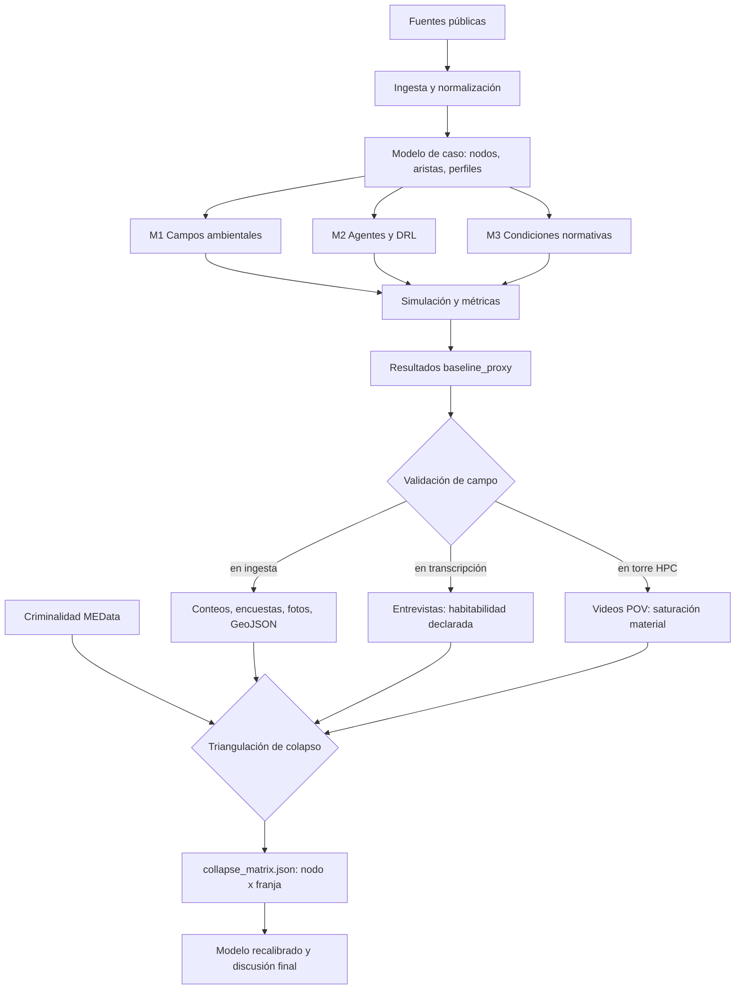

# Capítulo 2. Metodología y diseño computacional

## 2.1. Enfoque metodológico general

El diseño metodológico combina revisión filosófica, datos públicos, modelación computacional, visualización y una agenda explícita de validación de campo. La simulación no se presenta como reemplazo de la observación urbana ni como instrumento neutral de optimización. Su función es construir escenarios comparables para analizar cómo se articulan densidad peatonal, riesgo percibido, ruido, contaminación, iluminación, accesibilidad, atracción comercial y restricciones de trayectoria.

La investigación se encuentra en fase `baseline_proxy`. Esto significa que existe un pipeline funcional, datos públicos descargados, modelos derivados, simulaciones y salidas visuales; pero todavía no existe una jornada de campo suficiente para recalibrar el modelo. Esta distinción es metodológicamente central: todo resultado debe leerse como exploratorio hasta que `field_calibration_delta.json` deje de estar en `pending_no_capture`.

El método se organiza en seis momentos:

1. **Construcción del caso:** delimitación del corredor y selección de nodos, aristas, perfiles y escenarios horarios.
2. **Ingesta y derivación de datos:** descarga de fuentes públicas, normalización y generación de indicadores urbanos.
3. **Modelación:** construcción del grafo, agentes, campos ambientales, escenarios y métricas de trayectoria.
4. **Análisis:** cálculo de incertidumbre, estrés, entropía, desigualdad relativa y patrones de concentración.
5. **Trabajo de campo y captura multimodal:** observación situada en los nueve nodos y cuatro franjas, encuestas breves de seguridad percibida, entrevistas semiestructuradas sobre habitabilidad declarada, registro fotográfico, recorridos POV y videos de saturación.
6. **Triangulación y detección de colapso:** cruce de criminalidad MEData, encuestas, transcripciones de entrevistas y procesamiento de video en torre HPC con GPU, para producir la matriz de colapso fenomenológico (`collapse_matrix.json`) por nodo y franja.

El estado de cada momento se declara en su sección correspondiente. Al cierre de redacción de este documento, los momentos 1 a 4 están ejecutados, el momento 5 fue completado en campo y se encuentra en fase de ingesta, y el momento 6 está en preparación: las transcripciones las realiza un colaborador externo y los videos serán procesados con GPU en la torre HPC del autor.

## 2.2. Delimitación espacial y unidades de análisis

El caso se concentra en el corredor San Antonio–Junín–Parque Berrío–Plaza Botero, entendido como un eje de centralidad peatonal y transporte. El modelo actual contiene nueve nodos operativos:

1. `san_antonio_metro`
2. `parque_san_antonio`
3. `palacio_nacional`
4. `junin_paseo`
5. `oriental_cruce`
6. `parque_berrio`
7. `carabobo_cultural`
8. `plaza_botero`
9. `museo_antioquia`

Estos nodos no agotan la complejidad del centro; son una discretización mínima para ensayar el modelo. Las aristas representan relaciones de desplazamiento y fricción entre nodos. Los perfiles simulados son: transeúnte rápido, comprador, turista cultural, vendedor ambulante y persona con movilidad reducida. Los escenarios horarios son: pico mañana, franja media, pico tarde y noche.

## 2.3. Fuentes de datos, trazabilidad y estado de captura

El pipeline integra fuentes públicas descargadas y transformadas: MEData, SIATA/AMVA, DANE, Medellín Cómo Vamos, Metro de Medellín y geometría base de OpenStreetMap/Overpass (Alcaldía de Medellín, s. f.; Área Metropolitana del Valle de Aburrá, s. f.; Departamento Administrativo Nacional de Estadística, 2018; Haklay & Weber, 2008; Medellín Cómo Vamos & Invamer, 2024; Metro de Medellín, s. f.; OpenStreetMap contributors, 2026).

El archivo `source_status.json` reporta 19 fuentes intentadas, 15 descargadas y 4 fallidas. Las fallas registradas incluyen páginas de MEData con tiempo de espera y acceso 403 al geovisor DANE. Esta información no debe ocultarse: forma parte de la trazabilidad de la investigación y permite diferenciar datos efectivamente incorporados de datos no disponibles.

La evidencia pública actualmente integrada incluye, entre otros elementos:

- percepción ciudadana del centro: imagen favorable de 53.3% e imagen desfavorable de 44.5% según Medellín Cómo Vamos;
- asociaciones dominantes: comercio, inseguridad, informalidad, congestión y habitantes de calle;
- criminalidad agregada de comuna 10 con última fecha disponible en 2023-11;
- indicadores barriales de La Candelaria: densidad empresarial alta, bajo espacio público efectivo por habitante y fuerte concentración de suelo múltiple;
- datos ambientales SIATA/AMVA para PM2.5, PM10 y ruido, con limitaciones de georreferenciación y actualidad;
- geometría urbana aproximada desde OpenStreetMap/Overpass.

La captura que todavía falta es de otro tipo: conteo peatonal fino, permanencia, flujo direccional, ruido puntual, iluminación, obstáculos temporales y percepción de seguridad por subtramo. Esos datos no pueden inventarse desde el computador.

## 2.4. Operacionalización de variables

La traducción entre teoría y modelo requiere declarar variables, unidades y límites. La tabla siguiente resume la operacionalización actual:

| Dimensión | Variable operativa | Fuente actual | Estado | Límite principal |
| --- | --- | --- | --- | --- |
| Flujo peatonal | densidad/crowding | simulación + proxies | `baseline_proxy` | falta conteo por nodo y franja |
| Permanencia | `base_dwell` | supuestos del modelo | `pending_field` | falta muestreo con cronómetro |
| Riesgo/percepción | seguridad percibida | proxies + EPC agregada | `baseline_proxy` | falta encuesta situada |
| Ambiente | PM2.5/PM10 | SIATA/AMVA | parcial | desfase temporal y escala estación-corredor |
| Ruido | campo acústico | SIATA + PDE | parcial | falta medición puntual georreferenciada |
| Iluminación | lux nocturno | no capturado | `pending_field` | falta medición por nodo |
| Accesibilidad | nodos/aristas | grafo del caso | funcional | requiere validación de obstáculos reales |
| Libertad de ruta | entropía/divergencia | simulación | exploratorio | depende de supuestos de agentes |
| Criminalidad objetiva (C1) | bandera `c1_high` por franja, derivada de proyección horaria de hurto a persona | MEData criminalidad (serie histórica comuna 10) | precomputado en `c1_hourly_projection.json` | desfase temporal, escala comuna, no por nodo |
| Seguridad percibida situada (C2) | `security_score` 1–5 | encuesta breve en campo | pendiente de encuesta | dependiente de hora, observador y muestreo |
| Habitabilidad declarada (C3) | códigos `HABITABLE/EVITABLE/NO_DESEABLE/DIFICIL_DE_VIVIR` | entrevistas escritas codificadas en `investigacion/data/interim/YYYY-MM-DD/interviews/` | pendiente de codificación (Ollama qwen3:14b en torre HPC) | autoselección, deseabilidad social |
| Saturación material (C4) | densidad por frame y conteo YOLO11; umbral global p75 = 0.413 | videos POV / time-lapse procesados en torre HPC dual-GPU | procesado | encuadre, recorte, ausencia de afecto |

Esta tabla cumple una función de control: impide presentar todas las variables con el mismo grado de evidencia. Las cuatro últimas filas (C1–C4) son los insumos del cruce que produce la matriz de colapso fenomenológico discutida más abajo.

## 2.5. Modelo M-MASS y arquitectura de capas

La combinación de agentes, dinámica peatonal, redes y ciudad computacional se apoya en el modelo **M-MASS**, nomenclatura que designa una **Simulación Espacial Multi-Agente de Capas Múltiples** (*Multi-layer Multi-Agent Spatial Simulation*). Este acrónimo describe la integración de tres niveles de complejidad:

1.  **Multi-layer (Multi-capa):** Refiere a la superposición de los campos materiales ($M_1$), decisionales ($M_2$) y normativos ($M_3$). El modelo no solo calcula trayectorias físicas, sino que las hace circular a través de "mallas" de ruido, contaminación y visibilidad.
2.  **Multi-Agent (Multi-agente):** El uso de agentes autónomos con diferentes perfiles (comprador, turista, trabajador) que compiten y colaboran por el espacio, permitiendo que emerjan patrones de congestión no lineales.
3.  **Spatial Simulation (Simulación Espacial):** La ejecución del modelo sobre una topología real georreferenciada (grafo Junín-San Antonio), garantizando que las métricas resultantes tengan una base métrica y geográfica concreta.

La arquitectura M-MASS se apoya en literatura de modelos basados en agentes, ciencia urbana y dinámica social de peatones (Batty, 2013; Bonabeau, 2002; Epstein, 2006; Helbing & Molnár, 1995). Estas referencias orientan la arquitectura del prototipo, pero no eliminan la necesidad de validación situada.

El modelo se organiza según tres planos de la *symploké*:

- **$M_1$ material:** campos ambientales, densidad, ruido, PM2.5, visibilidad, geometría y obstáculos.
- **$M_2$ decisional/fenomenológico:** perfiles de agentes, preferencias, costos, recompensa, riesgo, tiempo y exposición.
- **$M_3$ normativo/socioespacial:** reglas implícitas, vigilancia, infraestructura, comercio, centralidad, informalidad y diseño urbano.

La integración de estas capas no busca afirmar que la ciudad sea un sistema cerrado. Al contrario, permite mostrar qué variables fueron incluidas, cuáles quedaron por fuera y qué supuestos gobiernan cada resultado.

## 2.6. Campos ambientales y PDE ($M_1$)

Para representar la materialidad ambiental se implementó un solucionador vectorizado de ecuaciones diferenciales parciales sobre mallas de alta resolución. En los experimentos ambientales se usó una cuadrícula 4K (4096x4096), equivalente a 16.7 millones de celdas. Esta escala computacional debe leerse como capacidad analítica del prototipo, no como garantía de exactitud empírica.

La distribución espacio-temporal del material particulado y de la presión acústica se aproxima mediante una ecuación de reacción-difusión:

$$ \frac{\partial u(x,t)}{\partial t} = D \nabla^2 u(x,t) - \kappa u(x,t) + S(x,t) $$

Donde $u(x,t)$ representa la concentración aproximada del estresor, $D$ el parámetro de difusión, $\kappa$ la tasa de decaimiento y $S(x,t)$ la distribución de fuentes emisoras. En el marco de los sistemas emergentes (Johnson, 2001), estos campos se interpretan como señales estigmérgicas negativas: condiciones ambientales que modifican la probabilidad de elegir una ruta sin necesidad de imponer una orden centralizada.

La salida `hpc_environmental_report.json` muestra valores pico muy altos para ruido y PM2.5. Esos valores deben tratarse como unidades internas del modelo o indicadores relativos de intensidad, no como mediciones ambientales listas para comparación normativa. Antes de cualquier afirmación sanitaria o regulatoria se requiere calibración con mediciones reales.

## 2.7. Agentes, perfiles y aprendizaje por refuerzo ($M_2$)

El transeúnte urbano se formaliza como un agente con información limitada, preferencias ponderadas y costos de desplazamiento. Para estimar políticas de navegación se entrenaron agentes mediante aprendizaje por refuerzo profundo (DRL), apoyado en la ecuación de Bellman (Bellman, 1957; Sutton & Barto, 2018):

$$ Q^*(s, a) = \mathbb{E} \left[ R(s, a) + \gamma \max_{a'} Q^*(s', a') \right] $$

La función de recompensa $R(s,a)$ codifica costos de tiempo, riesgo y exposición ambiental. La arquitectura `UrbanPhenomenologyDQN` incorpora capas densas, normalización y regularización (*LayerNorm* y *Dropout*) siguiendo prácticas comunes en redes profundas (Mnih et al., 2015). Técnicamente, estas capas estabilizan el entrenamiento y reducen sobreajuste; interpretativamente, permiten discutir la noción de filtrado perceptivo sin afirmar que reproduzcan la conciencia ni los *qualia* de los transeúntes.

Los perfiles no representan identidades completas. Son tipos analíticos para comparar sensibilidad a costos. Esta precaución es importante: una persona con movilidad reducida, un vendedor o un turista no se reducen a pesos en una función de recompensa. El modelo solo evalúa cómo ciertos supuestos modifican trayectorias.

## 2.8. Condiciones normativas y lectura crítica ($M_3$)

La integración de $M_1$ y $M_2$ se interpreta en el plano $M_3$: reglas, vigilancia, infraestructura, comercio, informalidad y hábitos de tránsito. La expresión “Panóptico de Flujo” se usa con cautela: no designa una entidad empírica cerrada, sino una lente inspirada en Foucault para describir cómo ciertas condiciones orientan el movimiento sin prohibirlo de forma explícita.

Esta capa es la más difícil de formalizar porque incluye poder, expectativa, vigilancia, costumbre y desigualdad. Por eso el modelo actual solo la aproxima mediante variables de control, riesgo, atracción y conectividad. La observación cualitativa de campo deberá corregir esa simplificación.

## 2.9. Métricas de análisis

Las métricas principales son:

- **Velocidad media:** indicador de fluidez simulada, no equivalente directo a comodidad.
- **Entropía de trayectorias:** medida de dispersión del repertorio de rutas; valores mayores sugieren mayor diversidad o desorden según contexto.
- **Divergencia de Kullback-Leibler:** diferencia entre una distribución de referencia y una distribución bajo fricción (Kullback & Leibler, 1951).
- **Gini de entropía:** desigualdad relativa entre perfiles respecto a diversidad de ruta.
- **Índice de presión:** relación entre cantidad de agentes y superficie de simulación.
- **Intervalos de confianza Monte Carlo:** estabilidad de resultados bajo repeticiones con variación aleatoria.

La divergencia KL se define como:

$$ D_{KL}(P \parallel Q) = \sum_{x \in \mathcal{X}} P(x) \log \left( \frac{P(x)}{Q(x)} \right) $$

Estas métricas no deben confundirse con juicios normativos automáticos. Un valor alto puede indicar restricción, diversidad, ruido o mala especificación, según el diseño del experimento. La interpretación exige contraste con observación y teoría.

## 2.9.1. Operacionalización del colapso fenomenológico

Las métricas anteriores describen comportamiento simulado. El colapso fenomenológico, en cambio, es una condición observable en la franja-evento (nodo × ventana horaria) y se construye por triangulación de cuatro fuentes empíricas independientes. La definición completa, con sus salvaguardas y supuestos de falsabilidad, se encuentra en `tesis/pendientes/colapso-fenomenologico.md`; aquí se resume su forma operacional.

Para cada celda $(n, w)$ —donde $n$ es uno de los nueve nodos del modelo y $w$ una de las cuatro franjas (`peak_am`, `midday`, `peak_pm`, `night`)— se evalúan cuatro condiciones binarias:

- **C1 — Carga objetiva de criminalidad.** Se cumple si la franja $w$ aparece marcada como `c1_high` en `c1_hourly_projection.json`. El cálculo se hace una sola vez sobre la **serie histórica completa** de hurto a persona de la comuna 10 publicada en MEData: el script `c1_project_hourly.py` proyecta los registros mensuales a las cuatro franjas mediante un supuesto distribucional documentado, calcula el corte por **percentil 75 de la serie histórica** y emite un mapa `c1_high_by_window` con un booleano por franja. El ensamblador `build_collapse_matrix.py` consulta ese mapa en lugar de recalcular la condición celda por celda. Esta decisión metodológica (documentada el 2026-05-07 en `tesis/pendientes/colapso-validacion-2026-05-07.md`) evita que el corte se desplace con cada subconjunto de datos y mantiene C1 como una propiedad estable del corredor en su escala disponible (comuna 10), reconociendo explícitamente que MEData no resuelve el detalle por nodo.
- **C2 — Seguridad percibida deprimida.** Se cumple si el promedio del `security_score` recogido en `field_counts_*.csv` para esa celda es ≤ 2/5 o si las notas de campo registran `RIESGO_PERCIBIDO` como código dominante. Esta condición está **pendiente** al cierre de redacción: depende del levantamiento de la encuesta breve situada por nodo y franja.
- **C3 — Habitabilidad declarada negativa.** Se cumple si las **entrevistas escritas** archivadas en `investigacion/data/interim/YYYY_MM_DD/interviews/` codifican mayoritariamente `EVITABLE`, `NO_DESEABLE` o `DIFICIL_DE_VIVIR` por encima de `HABITABLE`/`DESEABLE` en esa franja, según el esquema procesado por `code_interviews.py`. Se descartan deliberadamente las transcripciones automáticas de los videos POV: dichas transcripciones recogen ruido ambiente y comentarios del observador, no constituyen testimonio elicitado y no pueden tratarse como entrevista. Las salvaguardas para el manejo de testimonios —protocolo de entrevista con preguntas neutras antes de términos cargados, registro literal de la formulación, código `AMBIVALENTE` reservado para no forzar respuestas binarias, no tratar la convicción subjetiva como prueba— derivan de la teoría reconstructiva de la memoria desarrollada en el anexo A (especialmente §A.13.2 sobre el *misinformation effect* de Loftus 1993 y §A.17.2).
- **C4 — Saturación material.** Se cumple si los videos POV / time-lapse procesados en la torre HPC reportan un `saturation_index` por encima del **umbral global p75 = 0.413**, calculado sobre el conjunto total de videos procesados con YOLO11 en las dos GPUs disponibles (RTX 5070 Ti y RTX 2060). El umbral se fija de forma global, no por celda, para que la condición sea comparable entre nodos.

La regla de decisión es deliberadamente exigente: la celda se reporta como **colapso fenomenológico** solo si **al menos tres de las cuatro condiciones** se cumplen simultáneamente. Si se cumplen una o dos, se reporta como **fricción acumulada**. Si no se cumple ninguna, se reporta como **flujo ordinario**. Esta regla impide que un dato suelto se convierta en diagnóstico y obliga a la triangulación.

La salida de este cruce es la matriz `collapse_matrix.json` con 36 celdas (9 nodos × 4 franjas) y un campo de estado por celda. La regla **3-de-4** opera sobre esa malla y se evalúa por celda, lo que implica que basta con que una sola condición no se cumpla para que la franja-nodo deje de reportarse como colapso. La matriz se reconstruye al cierre de la fase de ingesta, conservando los `.bak.<timestamp>` de versiones previas para auditoría.

## 2.9.2. Tabla de fuentes de datos por criterio

| Criterio | Fuente primaria | Script de ingesta/derivación | Salida procesada | Estado |
| --- | --- | --- | --- | --- |
| C1 — Criminalidad | MEData (serie histórica hurto a persona, comuna 10) | `c1_project_hourly.py` | `investigacion/data/processed/c1_hourly_projection.json` (mapa `c1_high_by_window`) | precomputado, corte p75 fijo |
| C2 — Seguridad percibida | encuesta breve `security_score` 1–5 en campo | (pendiente, ingreso manual a `field_counts_*.csv`) | `investigacion/data/processed/field_observations_aggregate.csv` | pendiente de encuesta |
| C3 — Habitabilidad declarada | entrevistas **escritas** en `investigacion/data/interim/YYYY_MM_DD/interviews/` | `code_interviews.py` (esquema `HABITABLE/DESEABLE/EVITABLE/NO_DESEABLE/DIFICIL_DE_VIVIR/AMBIVALENTE`) | códigos agregados por celda en `data/processed/` | pendiente de codificación; transcripciones de video no se usan como testimonio |
| C4 — Saturación material | videos POV / time-lapse en `data/raw/video/` | `process_video.py` (YOLO11 dual-GPU) → `assign_videos_by_time.py` | `video_saturation_*.json` (umbral global p75 = 0.413) | procesado |
| Asignación espacial | EXIF de fotos + GPS + timestamps de video | `process_photos.py`, `assign_nodes.py` (haversine), `assign_videos_by_time.py` | `photo_node_assignments.json`, `photo_summary_*.json` | procesado |
| Audio (no usado como C3) | pista de audio de videos POV | `transcribe_audio.py` | transcripciones marcadas como ruido ambiente | descartado para C3 |
| Ensamblaje final | salidas C1–C4 anteriores | `build_collapse_matrix.py`, `inspect_matrix.py` | `collapse_matrix.json` | en construcción |

## 2.9.3. Operacionalización empírica de las capas M-MASS

Las secciones 2.5–2.8 definen las tres capas del modelo M-MASS ($M_1$ material, $M_2$ decisional/fenomenológico, $M_3$ normativo/socioespacial) en términos teóricos. Esta subsección documenta que cada capa cuenta ya con **fuentes de campo operativas**, ingestadas en la jornada de campo del 2026-05-05 y archivadas en `investigacion/data/interim/2026-05-05/`. La metodología no es un esquema vacío: las tres capas se alimentan de datos efectivamente recogidos, no de proxies hipotéticos.

La siguiente tabla cruza cada capa con su fuente de datos primaria y un ejemplo concreto extraído de la jornada del 2026-05-05 (archivos `m1_physical_counts.json`, `m2_phenomenological_observations.json`, `m3_heterotopy_signals.json` y `field_notes/field_notes_stev_2026-05-05.md`, sintetizados en `analysis_summary_2026-05-05.md`):

| Capa M-MASS | Fuente de datos operativa | Ejemplo del campo 2026-05-05 |
| --- | --- | --- |
| $M_1$ físico-ambiental | `photo_summary_*.json` (YOLO11) + `video_saturation_*.json` (HPC dual-GPU) + conteos POV de campo: obstáculos por cuadra, escala de indigencia 0-10, escala de consumo 0-10, ratio de turistas, presencia policial | `parque_san_antonio`: 6 vendedores ambulantes/cuadra, vandalismo 2/10; `junin_paseo`: indigencia 3/10, consumo 4/10; `plaza_botero`: ~5% turistas |
| $M_2$ agentes/experiencia | apreciaciones fenomenológicas (AF) auto-etnográficas del observador (Stev) registradas en `field_notes_stev_2026-05-05.md` + percepciones inferidas de las entrevistas escritas | Stev "debo tener mucho cuidado" en San Antonio (safety inferido 2/5); Stev "colapsa por eso" en plaza Botero; "tranquilidad en medio del ruido" en parque San Antonio |
| $M_3$ social/heterotopía | scoring de heterotopía por nodo (mezcla de usos, demografía, comercio formal/informal) en `m3_heterotopy_signals.json` | La Bastilla 5/5; parque San Antonio 4/5 (arte + ambulantes + paso); plaza Botero 4/5 (turista + local + presencia estatal); Junín 2/5 (mono-uso comercial); San Antonio 3/5 |

**Validez de las apreciaciones fenomenológicas en $M_2$.** Las AF del observador no son anecdóticas: constituyen **observación participante** en el sentido clásico de la fenomenología y la antropología urbana. La tradición fenomenológica husserliana (descripción del mundo de la vida, *Lebenswelt*) y la fenomenología de la percepción de Merleau-Ponty (cuerpo como medio de acceso al espacio vivido) sostienen que la experiencia situada del observador es una fuente legítima de conocimiento sobre la atmósfera, el miedo, la actitud *blasé* simmeliana y el colapso fenomenológico. Por eso las AF alimentan formalmente la capa $M_2$: entran al modelo como evidencia sobre la dimensión decisional/experiencial del corredor, articulando los pesos de riesgo, exposición y recompensa que la sección 2.7 deja abstractos.

**Distinción metodológica respecto a C3.** Es crucial separar dos roles distintos del material auto-etnográfico:

- Las AF **alimentan $M_2$** (capa decisional/fenomenológica del modelo) y se reportan en el capítulo 3 como **evidencia auto-etnográfica complementaria**, identificada como tal y atribuida al observador.
- Las AF **no se cuentan como C3** (testimonio de habitabilidad declarada) en la matriz de colapso. C3 exige entrevistas escritas elicitadas a terceros, codificadas según el esquema `HABITABLE/DESEABLE/EVITABLE/NO_DESEABLE/DIFICIL_DE_VIVIR/AMBIVALENTE` (ver §2.9.1 y §2.9.2). Confundir AF con testimonio incurriría en el sesgo del observador único que la triangulación 3-de-4 está diseñada para evitar.

Esta doble inscripción —AF válidas para $M_2$, AF excluidas de C3— preserva la triangulación sin descartar la riqueza descriptiva de la jornada de campo, y deja explícito que las tres capas del modelo M-MASS tienen ya, al cierre de redacción, fuentes empíricas operativas y ejemplos concretos por nodo.

## 2.9.4. Confiabilidad inter-observador (inter-rater reliability)

La validez de las apreciaciones fenomenológicas declarada en §2.9.3 exige una prueba complementaria: si la atmósfera de un nodo fuese una propiedad reducible a su materialidad, dos observadores entrenados independientes —recorriendo el mismo corredor el mismo día, con el mismo protocolo de campo— deberían converger en sus puntuaciones. Para someter ese supuesto a control, la jornada del 2026-05-05 fue ejecutada en paralelo por dos observadores (Stev y Jacob), quienes registraron de forma ciega `perceived_safety_score_1_5` y notas atmosféricas en cuatro nodos compartidos (`san_antonio_metro`, `parque_san_antonio`, `junin_paseo`, `parque_botero`).

Sobre los pares completos se calculó el coeficiente kappa de Cohen (Cohen, 1960; Landis & Koch, 1977) tras binarizar la escala 1–5 en `bajo` (<3) y `alto` (≥3):

$$ \kappa = \frac{p_o - p_e}{1 - p_e} $$

donde $p_o$ es la proporción de acuerdo observado y $p_e$ la proporción de acuerdo esperada por azar. Con $p_o = 0.50$ y $p_e = 0.50$ (ambos observadores con marginal 50/50 alto/bajo), el resultado es **kappa = 0.0**, valor que en la escala de Landis & Koch se interpreta como *poor agreement*, muy por debajo del umbral 0.40 habitualmente exigido para acuerdo aceptable. La divergencia más radical aparece en `parque_san_antonio` (Stev=4 alto / Jacob=2 bajo): los mismos elementos materiales —arte público, vendedores ambulantes, paso histórico— son leídos como *tranquilidad contemplativa* por un observador y como *paso del terror* por el otro.

**Lectura defensiva.** Este resultado no se interpreta como un fallo metodológico, sino como una **confirmación empírica de la tesis nuclear** de la investigación: la atmósfera urbana no es una propiedad geométrica ni un agregado estadístico de estresores, sino un fenómeno que se constituye en la articulación entre cuerpo, biografía y entorno. La fenomenología husserliana del *Lebenswelt* y la fenomenología de la percepción de Merleau-Ponty sostienen, precisamente, que el espacio vivido no preexiste al observador encarnado; el cuerpo es medio de acceso, no instrumento neutral. Que dos observadores cuidadosos, formados y atentos diverjan radicalmente en `parque_san_antonio` opera como evidencia de que el *mismo lugar* no existe sin observador. La subjetividad ineliminable es rasgo del objeto, no debilidad del método.

De esta lectura se desprenden cuatro decisiones metodológicas explícitas: (i) el reporte de kappa = 0.0 se documenta abiertamente como dato fenomenológico positivo; (ii) la triangulación 3-de-4 deja de ser opcional y pasa a ser estructuralmente necesaria, pues ningún observador único puede arrogarse la representación del nodo; (iii) C3 (testimonio escrito de quien habita el nodo) adquiere el papel de *desempate cualitativo* cuando dos AF divergen, papel que cumple por primera vez la entrevista a *Andrés* (vendedor, sub-zona Coltejer-Ayacucho) recogida por Jacob; y (iv) los nodos con divergencia binaria entre observadores reciben en el capítulo 3 la bandera **"fenomenológicamente disputado"**, exigiendo al menos un testimonio C3 in-situ para ser cerrados.

## 2.9.5. Análisis de sensibilidad y robustez

Una matriz de colapso construida sobre series cortas (C1 horario proyectado, C4 con $n \leq 2$ videos por celda, C3 con 15 entrevistas en total) sería metodológicamente irresponsable si se reportara sin estimación de incertidumbre. Por ello, el script `bootstrap_matrix.py` ejecuta tres variantes de análisis de robustez sobre la matriz baseline, cuyas salidas se archivan en `collapse_matrix_sensitivity.json` y `sensitivity_report.md`:

1. **V1 — Bootstrap clásico (1000 iteraciones).** Para cada celda $(n, w)$ se resamplea con reemplazo la serie horaria de C1 por franja, los `saturation_index` de C4 por celda, y la lista global de entrevistas C3 (preservando el tamaño muestral). En cada iteración se recomputan los percentiles y la regla 3-de-4, registrando la frecuencia con que la decisión baseline se sostiene.
2. **V2 — Sensibilidad de umbrales (25 escenarios).** Se barre el percentil de corte de C1 y de C4 sobre la cuadrícula $\{p70, p75, p80, p85, p90\} \times \{p70, p75, p80, p85, p90\}$, evaluando si la decisión es artefacto del p75 elegido en el baseline o sobrevive a deformaciones moderadas del criterio.
3. **V3 — Leave-one-out de entrevistas C3 (15 iteraciones).** Se quita cada entrevista una por una y se reevalúa la dimensión C3 para detectar celdas cuyo carácter negativo dominante depende de un único testigo.

Las celdas se clasifican como **robustas** si conservan la decisión baseline en ≥80% del bootstrap V1 *y* en ≥80% de los 25 escenarios V2; como **frágiles** si la decisión cae por debajo de 0.80 en al menos una de las dos variantes. Sobre las seis celdas reportadas en `friccion_acumulada` en el baseline, sólo dos cruzan ambos umbrales: **`junin_paseo|peak_am`** (V1=0.956, V2=0.880) y **`plaza_botero|midday`** (V1=0.970, V2=1.000). Las cuatro restantes —`san_antonio_metro|peak_am`, `parque_san_antonio|midday`, `junin_paseo|midday`, `parque_berrio|midday`— quedan en V2≈0.40 y se reportan en el capítulo 3 como **frágiles**, sensibles al desplazamiento del umbral. Esta separación entre celdas defendibles y frágiles es el pilar empírico de la presentación de resultados.

**Limitación honesta sobre la regla 3-de-4.** En el baseline actual C2 (`security_score` de campo) está ausente (`cells_with_data = 0`), por lo que la regla 3-de-4 opera de facto como **3-de-3 con C2 = False**. Esto sesga sistemáticamente las decisiones hacia `friccion_acumulada` antes que hacia `colapso_fenomenologico`: ninguna celda inconcluyente cruza siquiera el 30% de colapso bajo V2. La conclusión defensiva no es que el corredor "no colapse", sino que con la cobertura empírica disponible *aún no puede afirmarse el colapso* sin la encuesta situada de C2. Esta restricción se declara abiertamente en lugar de absorberse en el silencio del pipeline.

## 2.10. Pipeline HPC real ejecutado

La sección 2.7 describe el modelo M-MASS de simulación. Este apartado documenta el **pipeline HPC real** que produce los insumos C1–C4 de la matriz de colapso, distinto y previo a la simulación: opera sobre datos de campo reales (fotos EXIF-georreferenciadas, videos POV y entrevistas escritas) y se ejecuta en la torre `ubuntu-raid` del autor con dos GPUs en paralelo.

### 2.10.1. Hardware y orquestación

- **GPU 0:** NVIDIA RTX 5070 Ti (Blackwell, sm_120), modelo primario YOLO11x.
- **GPU 1:** NVIDIA RTX 2060 (Turing, sm_75), modelo secundario YOLO11s.
- **CPU/RAM:** 32 cores, 123 GiB.
- **Stack:** Docker Engine 29.1.3 con runtime `nvidia` por defecto, NVIDIA Container Toolkit 1.19.0, CDI specs en `/var/run/cdi/nvidia.yaml`. La asignación per-GPU se hace mediante `devices: ["nvidia.com/gpu=N"]` en `docker-compose.yml` para evitar el bug de eBPF device-filter detectado con `--gpus all` en kernel 6.17.
- **Cooperación entre workers:** cada video crea un lock en `investigacion/hpc/jobs/`; ambas GPUs leen de la misma cola sin solapamiento. Las fotos se distribuyen análogamente a través de `jobs_photos/`.

### 2.10.2. Scripts del pipeline

El directorio `investigacion/hpc/` contiene nueve scripts que cubren la cadena completa de ingesta-derivación-ensamblaje:

1. **`process_photos.py`** — extrae EXIF (timestamp, GPS) de cada foto, calcula descriptores agregados y emite `photo_summary_<basename>.json` por imagen.
2. **`process_video.py`** — muestrea frames de cada video, corre YOLO11 sobre la GPU asignada, calcula `saturation_index`, p50/p75/p90 de personas por frame y emite `video_saturation_<basename>.json`. La convención de nombres `NODE__WINDOW__YYYY-MM-DD__libre.mp4` permite ubicar la celda sin sidecar.
3. **`transcribe_audio.py`** — transcribe la pista de audio de los videos POV. Las transcripciones se conservan como ruido ambiente y **no** alimentan C3 (ver §2.9.1).
4. **`code_interviews.py`** — codifica entrevistas **escritas** (no transcripciones de video) según el esquema `HABITABLE/DESEABLE/EVITABLE/NO_DESEABLE/DIFICIL_DE_VIVIR/AMBIVALENTE` y agrega por celda nodo × franja para C3.
5. **`assign_nodes.py`** — asigna cada foto al nodo más cercano por distancia haversine sobre el GPS EXIF, y genera `photo_node_assignments.json`.
6. **`assign_videos_by_time.py`** — asigna videos a celdas (nodo × franja) cuando la convención de nombre o el sidecar no son suficientes, usando timestamp y proximidad espacial.
7. **`c1_project_hourly.py`** — proyecta la serie histórica MEData de hurto a persona de comuna 10 a las cuatro franjas horarias mediante un supuesto distribucional documentado, calcula el corte p75 sobre la serie completa y emite `c1_hourly_projection.json` con el mapa `c1_high_by_window`. Este es el script que materializa la decisión metodológica de C1: el corte se calcula una vez sobre la serie histórica, no celda a celda.
8. **`build_collapse_matrix.py`** — consume las salidas C1 (`c1_hourly_projection.json`), C2 (encuesta), C3 (entrevistas codificadas) y C4 (`video_saturation_*.json`), aplica la regla 3-de-4 por celda y emite `collapse_matrix.json`. Conserva la versión previa como `collapse_matrix.json.bak.<timestamp>` para auditoría diacrónica.
9. **`inspect_matrix.py`** — utilidad de revisión que imprime por consola el estado de cada celda, los criterios cumplidos y los archivos que alimentaron cada condición. Se usa para verificación manual antes de exponer la matriz a la visualización.

Scripts auxiliares no contados en los nueve principales pero presentes en el directorio: `make_sidecars.py` (genera `*.meta.json` para videos sin convención de nombre) y `update_video_metadata.py` (corrige metadatos en lote).

Adicionalmente, el reclamo de campo "tags repetidos" (presencia visible de grafiti y *signage* informal en `parque_san_antonio` y `junin_paseo`) se evaluó mediante un módulo OCR: `m3_signage_ocr.py` aplica `easyocr` (modelo en CPU, idiomas `es`/`en`) sobre las 34 fotos georreferenciadas de la jornada 2026-05-05 y emite `m3_signage_ocr.json`. El módulo extrae cadenas detectadas, frecuencias y nodo asignado por foto. El hallazgo —repetición de tags y rótulos comerciales en San Antonio y Junín— **confirma parcialmente** el reclamo de campo, con un caveat metodológico que se reporta abiertamente: las "fotos repetidas" en algunos buckets corresponden a **ráfagas fotográficas** del observador (varias capturas casi simultáneas del mismo plano), no necesariamente a múltiples ocurrencias independientes del mismo signo en el corredor. La interpretación del capítulo 3 lee este módulo como evidencia *cualitativa* de saturación de signage, no como conteo poblacional.

### 2.10.3. Diferencia respecto a M-MASS

El pipeline HPC y M-MASS no comparten datos en una sola dirección: el pipeline HPC produce la matriz empírica que **contrasta** la simulación M-MASS, no la alimenta. M-MASS (secciones 2.5–2.7) genera trayectorias y campos sintéticos; el pipeline HPC genera una malla de evidencia situada. Su cruce se discute en el capítulo 3.

### 2.10.4. Refinamiento geométrico de nodos (geometría v2)

La geometría v1 del modelo asigna cada foto al nodo canónico más cercano por distancia haversine sobre los nueve centroides de `case_model.json`. Esta discretización mínima es suficiente para la primera oleada, pero presenta dos limitaciones diagnosticadas durante la oleada 4: (i) `pasaje_la_bastilla`, una unidad fenomenológica narrada con fuerza en las notas de campo, no aparece como nodo y sus 12 fotos relevantes caen disueltas en los buckets adyacentes (`san_antonio_metro`, `junin_paseo`, `parque_berrio`) a pesar de localizarse a ~3.7 m del centroide reconstruido del pasaje; y (ii) las entrevistas Stev↔Jacob revelan **gradientes intra-nodo** que la asignación de un solo punto por nodo no puede capturar (la sub-zona Coltejer-Ayacucho dentro de Junín, narrada por Andrés; la "calle del consumo" adyacente a Plaza Botero, narrada por Jacob).

El script `refine_node_geometry.py` introduce una **geometría v2** con tres sub-zonas adicionales —`pasaje_la_bastilla`, `junin_coltejer_ayacucho`, `botero_calle_consumo`— bajo una regla de asignación con prioridad: una foto cae en una sub-zona si su distancia al centroide de ésta es ≤ 80 m (`SUBZONE_MAX_RADIUS_M`); en caso contrario se asigna al nodo canónico más cercano dentro del radio global de 400 m. La salida, archivada en `node_geometry_v2.json` y `photo_node_assignments_v2.json`, **no sobrescribe** los archivos v1 sino que coexiste como geometría alternativa para análisis comparativo.

**Resultado.** La v2 rescata `pasaje_la_bastilla` como nodo poblado con 12 fotos asignadas (distancia mínima al centroide ≈ 3.7 m), confirmando la unidad fenomenológica narrada en campo. Las dos sub-zonas restantes (`junin_coltejer_ayacucho` y `botero_calle_consumo`), en cambio, se documentan como **definidas pero vacías**: su geometría está fijada y referenciada cartográficamente, pero el muestreo fotográfico de la jornada 2026-05-05 no cubrió esos centroides dentro del radio de 80 m. Esto se reporta abiertamente como **limitación honesta de muestreo**, no como ausencia del fenómeno: las narrativas de Andrés y Jacob describen experiencialmente esas sub-zonas, pero el corpus visual aún no las documenta. Una jornada de captura focalizada en Coltejer-Ayacucho y en la calle adyacente a Botero queda registrada como tarea pendiente.

### 2.10.5. Validación cruzada texto↔imagen

El último componente del pipeline HPC es la triangulación entre los **reclamos cuantificables** producidos por los observadores en campo (notas Stev, entrevistas Jacob) y los **agregados visuales** derivados de YOLO11 sobre las fotos georreferenciadas (`m1_visual_aggregate.json`, `m3_visual_aggregate.json`). El procedimiento, documentado en `tesis/pendientes/cross-validation-text-image-2026-05-07.md` y archivado en JSON estructurado en `cross_validation.json`, sigue cuatro pasos: (i) extracción de reclamos cuantificables del campo por nodo y franja; (ii) selección de la métrica visual correspondiente cuando el pipeline COCO la soporta; (iii) clasificación en convergencia *alta*, *media* o *no evaluable*; (iv) resolución (parcial) de las divergencias inter-rater de §2.9.4 con el árbitro visual.

De los **10 reclamos** evaluados, **2 muestran convergencia alta** texto↔imagen y constituyen las anclas más fuertes del estudio: el riesgo vial declarado en `san_antonio_metro|peak_am` (safety = 2/5) converge con `vehicle_intensity = 0.378`, el máximo del corpus; y el "colapso/sofocante" reportado por Stev en `plaza_botero|midday` converge con `human_density_max = 30` y `saturation_max = 71`, también máximos del corpus. **2 reclamos muestran convergencia media** (turistas en Botero ≈5% vs proxy visual 3.6%; comercio informal en Junín, donde el visual disuelve la divergencia Stev↔Jacob al mostrar mono-uso formal *con* flujo portátil heterogéneo: 240 maletas y 102 bolsos en peak_am). Los **6 reclamos restantes son no evaluables** con el pipeline actual: vandalismo, indigencia, consumo de sustancias, presencia policial, y la atmósfera de `parque_san_antonio` (sin bucket visual asignado). Esta limitación se atribuye a las clases de COCO usadas por YOLO11 —que no detectan uniformes, grafiti ni indigencia— y no a una contradicción entre observador y datos.

La cross-validation también arbitra parcialmente las divergencias de §2.9.4: en Junín, ambos observadores describen facetas reales del nodo y el M3 score puede ajustarse a 3/5 sin invalidar a Stev; en `parque_san_antonio`, sin bucket visual disponible, el desempate queda diferido al testimonio C3 in-situ. El mensaje metodológico es explícito: **donde el pipeline tiene capacidad la convergencia es alta; donde no la hay, la limitación es del instrumento, no del reclamo de campo**.

## 2.11. Reproducibilidad y trazabilidad técnica

La reproducibilidad se apoya en tres elementos ya presentes en el repositorio:

- scripts de ingesta, derivación, modelado, simulación, análisis y publicación visual;
- archivos JSON de salida en `investigacion/outputs/`;
- documentación metodológica en `investigacion/docs/` y plantillas de campo.

Sin embargo, una tesis evaluable debe documentar todavía con más precisión:

- versiones de Python, PyTorch, NumPy y dependencias geoespaciales;
- disponibilidad o no de GPU/CUDA;
- semillas aleatorias usadas en simulaciones;
- tiempos aproximados de ejecución;
- parámetros sensibles: número de agentes, pasos, tamaño de malla, tasas de difusión, recompensas, pesos de riesgo y ruido;
- modo reducido para reproducir resultados en CPU.

Estos elementos pueden resolverse en el computador antes del trabajo de campo y deberían quedar como anexo técnico. Sin esa documentación, el pipeline puede funcionar, pero no ser suficientemente auditable por terceros.

## 2.12. Validación, sensibilidad y falsabilidad

El modelo debe someterse a cuatro tipos de prueba:

1. **Validación interna:** comprobar que los scripts producen salidas consistentes, que las métricas se calculan correctamente y que no hay errores de pipeline.
2. **Sensibilidad:** variar parámetros clave para observar cuánto cambian velocidad, entropía, concentración de rutas y desigualdad entre perfiles.
3. **Validación empírica:** comparar salidas con conteos, permanencias, mediciones y encuestas de campo.
4. **Triangulación de colapso:** cruzar las cuatro fuentes empíricas independientes (criminalidad, encuesta, entrevista, video) sobre la malla nodo × franja para producir y auditar `collapse_matrix.json`. Esta prueba no busca confirmar la simulación; busca decidir, celda por celda, si la convergencia mínima de tres condiciones se sostiene.

La validación interna y parte de la sensibilidad pueden hacerse ya en PC. La validación empírica y la triangulación requieren ingesta de campo y procesamiento de video en la torre HPC con GPU. Por tanto, el modelo debe ser falsable: si los conteos reales muestran flujos distintos, si la percepción de seguridad contradice los proxies, si el ruido puntual no corresponde a los campos simulados, o si las cuatro fuentes del colapso no convergen en ninguna celda, el modelo y la categoría deben recalibrarse o retraerse.

Esta validación no debe entenderse como simple confirmación numérica. En términos epistemológicos, la fase de campo debe producir conocimiento situado: cada conteo, medición o encuesta depende de hora, posición, instrumento, observador y protocolo. Esta cautela sigue la advertencia de Haraway (1995): no existe una mirada neutral “desde ninguna parte”; hay perspectivas parciales que deben declararse para ser discutibles.

## 2.13. Consideraciones éticas

La fase de campo y la fase de ingesta multimedia introducen obligaciones éticas adicionales. Las encuestas de seguridad percibida y las entrevistas sobre habitabilidad declarada deben evitar recoger datos personales identificables. Las fotografías y los videos POV deben centrarse en obstáculos, flujos agregados, geometría y condiciones espaciales, no en rostros ni en exposición de individuos vulnerables. Cualquier mención a habitantes de calle, informalidad o inseguridad debe tratarse como categoría urbana agregada, no como estigma de grupos.

El protocolo de campo y de procesamiento debe incluir:

- consentimiento verbal o escrito para encuestas y entrevistas;
- anonimización de observadores y participantes;
- no registro de rostros identificables sin autorización; cuando aparezcan en video, deben difuminarse antes del procesamiento o mantenerse fuera del entregable público;
- almacenamiento seguro de archivos (videos, fotos y audios crudos no publicables);
- uso académico limitado de los datos y supresión de fragmentos sensibles antes de cualquier difusión;
- posibilidad de no responder ni autorizar uso, sin consecuencia alguna;
- transcripción anonimizada por colaborador externo, bajo acuerdo de confidencialidad;
- procesamiento de video en torre HPC local del autor, sin envío a servicios de terceros.

## 2.14. Diagrama del método

## 2.15. Balance metodológico

El método es suficientemente robusto para una fase exploratoria: integra fuentes públicas, variables urbanas, simulación, lectura filosófica y un protocolo de campo cumplido. Lo que aún no puede sostenerse es la afirmación empírica fuerte sobre el corredor, porque el cruce de las cuatro fuentes del colapso (criminalidad, encuesta, entrevista, video) está en fase de ingesta. La fortaleza del trabajo está en declarar esta diferencia y convertirla en plan: primero baseline trazable, después campo realizado, ahora ingesta y triangulación, y solo entonces discusión final con la matriz de colapso a la vista.
