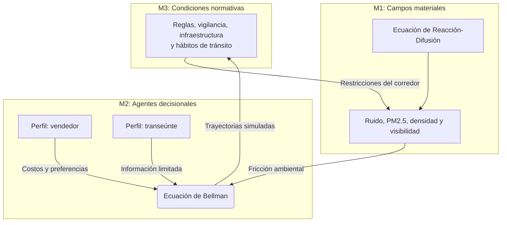

# Capítulo 2. Metodología y diseño computacional: formalización situada del corredor Junín-San Antonio

El diseño metodológico combina revisión filosófica, datos públicos, modelación computacional y una agenda explícita de validación de campo. La simulación no se presenta como reemplazo de la observación urbana ni como instrumento de optimización neutral. Su función es construir escenarios comparables para analizar cómo se articulan densidad peatonal, riesgo percibido, ruido, contaminación, iluminación, accesibilidad y atracción comercial.

El proyecto se encuentra en estado `baseline_proxy`: integra fuentes públicas descargadas y transformadas por el pipeline —MEData, SIATA/AMVA, DANE, Medellín Cómo Vamos, Metro de Medellín y geometría base de OpenStreetMap/Overpass— (Alcaldía de Medellín, s. f.; Área Metropolitana del Valle de Aburrá, s. f.; Departamento Administrativo Nacional de Estadística, 2018; Haklay & Weber, 2008; Medellín Cómo Vamos, 2025; Metro de Medellín, s. f.; OpenStreetMap contributors, 2026), pero todavía requiere captura situada para recalibrar conteos peatonales, permanencia, percepción de seguridad, ruido e iluminación. Por ello, los resultados se interpretan como evidencia exploratoria y no como medición definitiva del comportamiento urbano real.

La combinación de agentes, dinámica peatonal, redes y ciudad computacional se apoya en literatura de modelos basados en agentes, ciencia urbana y dinámica social de peatones (Batty, 2013; Bonabeau, 2002; Epstein, 2006; Helbing & Molnár, 1995). Estas referencias orientan la arquitectura del prototipo, pero no eliminan la necesidad de validación situada.

## 2.1. El *Lebenswelt* Formalizado: Campos Estigmérgicos y Ecuaciones Diferenciales (M1)

Para representar la materialidad del entorno urbano (el estrato $M_1$ de la *symploké*), se implementó un solucionador vectorizado de ecuaciones diferenciales parciales (PDE) sobre mallas de alta resolución. En los experimentos ambientales se usó una cuadrícula 4K (4096x4096), lo que permite explorar patrones espaciales finos de dispersión bajo supuestos controlados. Esta escala computacional debe leerse como capacidad analítica del prototipo, no como garantía de exactitud empírica.

La distribución espacio-temporal del material particulado (PM2.5) y la presión acústica se modela mediante ecuaciones de reacción-difusión:

$$ \frac{\partial u(x,t)}{\partial t} = D \nabla^2 u(x,t) - \kappa u(x,t) + S(x,t) $$

Donde $u(x,t)$ representa la concentración aproximada del estresor, $D$ el parámetro de difusión, $\kappa$ la tasa de decaimiento y $S(x,t)$ la distribución de fuentes emisoras. En el marco de los sistemas emergentes (Johnson, 2001), estos campos se interpretan como señales estigmérgicas negativas: condiciones ambientales que modifican la probabilidad de elegir una ruta sin necesidad de imponer una orden centralizada.

## 2.2. Intencionalidad Sintética y Subjetividades Moduladas (M2)

El transeúnte urbano se formaliza como un agente con información limitada, preferencias ponderadas y costos de desplazamiento. Para estimar políticas de navegación se entrenaron agentes mediante aprendizaje por refuerzo profundo (DRL), apoyado en la ecuación de Bellman (Bellman, 1957; Sutton & Barto, 2018):

$$ Q^*(s, a) = \mathbb{E} \left[ R(s, a) + \gamma \max_{a'} Q^*(s', a') \right] $$

La función de recompensa $R(s,a)$ codifica costos de tiempo, riesgo y exposición ambiental. La arquitectura `UrbanPhenomenologyDQN` incorpora capas densas, normalización y regularización (*LayerNorm* y *Dropout*) siguiendo prácticas comunes en redes profundas (Mnih et al., 2015). Técnicamente, estas capas estabilizan el entrenamiento y reducen sobreajuste; interpretativamente, permiten discutir la noción de filtrado perceptivo sin afirmar que reproduzcan la conciencia ni los *qualia* de los transeúntes.

En diálogo con Deleuze (1990), la figura del “dividual” se usa como metáfora crítica para describir cómo el agente queda representado por variables, pesos y respuestas estadísticas. Esta traducción computacional no agota al sujeto urbano; más bien, muestra qué se gana y qué se pierde cuando la experiencia se formaliza.

## 2.3. Arquitectura del Panóptico de Flujo (M3)

La integración de $M_1$ (campos físicos) y $M_2$ (agentes decisionales) se interpreta en el plano $M_3$: reglas, vigilancia, infraestructura, comercio, informalidad y hábitos de tránsito. La expresión “Panóptico de Flujo” no designa una entidad empírica cerrada, sino una lente analítica inspirada en Foucault (1975/2002) para describir cómo ciertas condiciones orientan el movimiento sin necesidad de prohibirlo directamente.

Para cuantificar diferencias entre trayectorias esperadas y trayectorias bajo fricción ambiental, se mide la divergencia de Kullback-Leibler ($D_{KL}$) entre una distribución de referencia ($P$) y una distribución simulada ($Q$) (Kullback & Leibler, 1951):

$$ D_{KL}(P \parallel Q) = \sum_{x \in \mathcal{X}} P(x) \log \left( \frac{P(x)}{Q(x)} \right) $$

La lectura de esta métrica es comparativa: valores mayores sugieren mayor desviación respecto a una referencia, pero no prueban por sí solos pérdida de libertad ni determinación social. Para fortalecer la inferencia se requiere contrastar el resultado con conteos, observación situada y percepción de usuarios.

El acoplamiento de estos tres estratos constituye la *symploké* metodológica del modelo M-MASS. Su valor no está en “resolver” el centro de Medellín, sino en producir una representación discutible, trazable y contrastable de las tensiones entre movilidad, ambiente y experiencia urbana.
