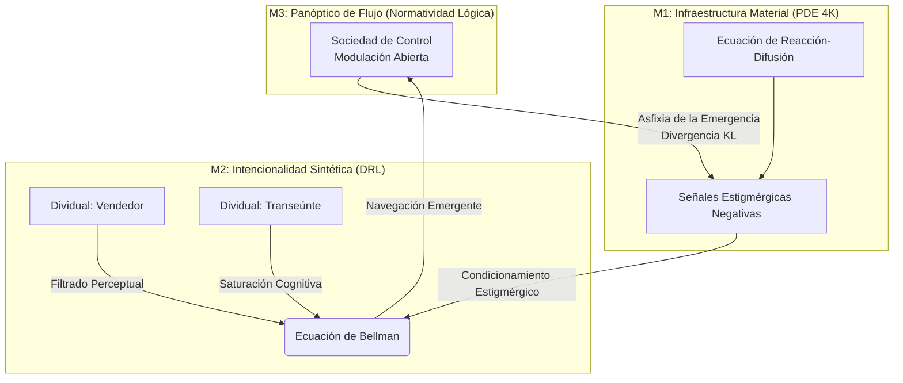

# Capítulo 2. Metodología y Diseño Computacional: El Supercómputo como Reducción Eidética y Control Biopolítico

El presente diseño metodológico rechaza la pretensión instrumental de las simulaciones de transporte tradicionales. No se persigue la optimización de flujos peatonales, sino la construcción de un aparato analítico capaz de operar una reducción eidética computacional (Husserl, 1936/1991). El supercómputo (HPC) se despliega aquí como un instrumento epistemológico para revelar la estructura biopolítica subyacente del corredor Junín-San Antonio, despojándolo de su contingencia empírica para exponer la lógica de las sociedades de control (Deleuze, 1990; Foucault, 1975/2002).

## 2.1. El *Lebenswelt* Formalizado: Campos Estigmérgicos y Ecuaciones Diferenciales (M1)

Para capturar la materialidad del entorno urbano (el estrato $M_1$ de la *symploké*), se implementó un solucionador masivo de Ecuaciones Diferenciales Parciales (PDE) sobre una cuadrícula de resolución 4K (16.7 millones de celdas). Este estrato no opera como un mero telón de fondo inerte, sino como la infraestructura de un Sistema Auto-Organizado y Emergente Multi-Agente (MASOES) (Aguilar, 2014).

La distribución espacio-temporal del material particulado (PM2.5) y la presión acústica se modela mediante ecuaciones de reacción-difusión:

$$ \frac{\partial u(x,t)}{\partial t} = D \nabla^2 u(x,t) - \kappa u(x,t) + S(x,t) $$

Donde $u(x,t)$ representa la concentración del estresor, $D$ el tensor de difusión, $\kappa$ la tasa de decaimiento y $S(x,t)$ la distribución de las fuentes emisoras. En el marco de los sistemas emergentes (Johnson, 2001), estos campos ambientales de alta resolución actúan como **señales estigmérgicas** negativas. Operan análogamente a las feromonas en la inteligencia de enjambre, condicionando de manera descentralizada la navegación de los agentes sin requerir un control jerárquico explícito.

## 2.2. Intencionalidad Sintética y Subjetividades Moduladas (M2)

El transeúnte urbano se formaliza no como una partícula regida por leyes de la física newtoniana, sino como una entidad intencional dotada de *qualia* computacionales. Se entrenaron políticas de navegación mediante Aprendizaje por Refuerzo Profundo (DRL), empleando la ecuación de Bellman para aproximar el valor esperado de la experiencia urbana:

$$ Q^*(s, a) = \mathbb{E} \left[ R(s, a) + \gamma \max_{a'} Q^*(s', a') \right] $$

La función de recompensa $R(s, a)$ codifica la fricción fenomenológica, penalizando la exposición a los gradientes estigmérgicos de ruido y PM2.5. La arquitectura de red neuronal subyacente (`UrbanPhenomenologyDQN`) incorpora capas de *LayerNorm* y *Dropout*, las cuales actúan analíticamente como mecanismos de filtrado perceptual. Estas capas simulan la saturación cognitiva ante un *Lebenswelt* agresivo: la necesidad imperiosa del individuo de descartar estímulos para lograr transitar el corredor.

En consonancia con Deleuze (1990), los agentes simulados abandonan la categoría de "individuos" para operar como "dividuales": entidades fragmentadas, estadísticamente moduladas por el espacio abierto que atraviesan. La red neuronal aprende a navegar la modulación constante del entorno de control urbano.

## 2.3. Arquitectura del Panóptico de Flujo (M3)

La integración de $M_1$ (campos físicos) y $M_2$ (agentes intencionales) culmina en la estructura normativa de $M_3$: el Panóptico de Flujo. Las disciplinas de los espacios cerrados (Foucault, 1975/2002) mutan aquí en un control fluido y desterritorializado. El sistema captura la interacción entre 100,000 entidades simultáneas para observar las transiciones de fase macroscópicas. 

Para cuantificar el grado de determinismo y la pérdida de libertad de ruta (la asfixia de la emergencia estigmérgica), se mide la divergencia de Kullback-Leibler ($D_{KL}$) entre la distribución de trayectorias ideales sin fricción ($P$) y las trayectorias efectivas bajo la coacción biopolítica del entorno ($Q$):

$$ D_{KL}(P \parallel Q) = \sum_{x \in \mathcal{X}} P(x) \log \left( \frac{P(x)}{Q(x)} \right) $$

Esta arquitectura metodológica permite que el modelo HPC trascienda la simulación mecánica y se convierta en una prueba de estrés analítica.

El acoplamiento de estos tres estratos constituye la *symploké* metodológica del modelo M-MASS. La simulación no reproduce la ciudad de Medellín para "resolverla" ni para optimizarla urbanísticamente, sino para precipitar artificialmente sus contradicciones empíricas hasta alcanzar el punto de la turbulencia ontológica.