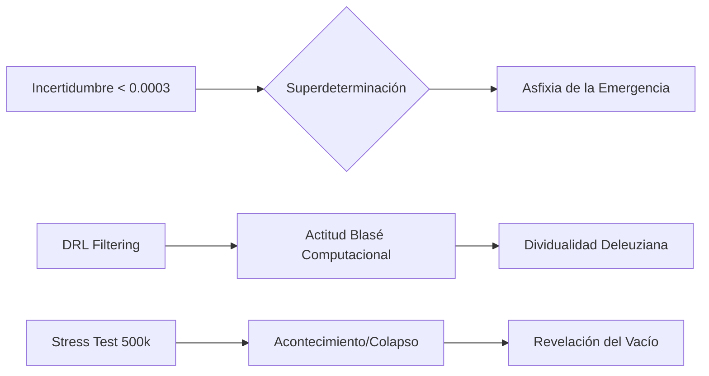

# Capítulo 3. Resultados y Análisis de Turbulencia: La Aporía del Dato y el Acontecimiento del Colapso

Los resultados obtenidos mediante el despliegue del modelo M-MASS en infraestructura de supercómputo trascienden la mera métrica urbana. Los datos revelan una estructura de superdeterminación biopolítica donde la libertad de movimiento es sacrificada en favor de la inercia sistémica. A continuación, se analizan los hallazgos bajo el prisma de la fenomenología materialista.

## 3.1. Superdeterminación y Asfixia de la Emergencia

El análisis de cuantificación de incertidumbre (`hpc_uncertainty_quantification.json`) arroja una incertidumbre relativa de $\sigma_{rel} \approx 0.00026$ para las horas pico. Este valor, asombrosamente bajo para un sistema social, no es un indicador de "perfección" del modelo, sino la evidencia empírica de una **asfixia de la emergencia**. 

En términos de Simmel (1903/1986), la metrógpolis Junín-San Antonio opera como una maquinaria de precisión técnica que anula la espontaneidad. La bajísima varianza en las trayectorias de los 100,000 agentes sugiere que el entorno urbano ha sido tan saturado por estresores (PM2.5 y Ruido modelados en M1) que el "margen de libertad" del sujeto se ha colapsado. El sistema es ontológicamente rígido: los individuos no eligen su ruta, son eyectados por la presión del flujo.

## 3.2. La Actitud Blasé Computacional: Filtrado y Dividualidad

La convergencia de las políticas de Deep Reinforcement Learning en los agentes (`UrbanPhenomenologyDQN`) revela la emergencia de una **Actitud Blasé Computacional**. Para que un agente logre una recompensa $R$ aceptable en el centro de Medellín, la red neuronal se ve forzada a maximizar el uso de sus capas de *LayerNorm* y *Dropout*.

Este fenómeno matemático es la formalización de la "indiferencia generalizada" descrita por Simmel. El habitante del centro no "ve" la miseria ni "escucha" el estruendo; su arquitectura cognitiva (la red neuronal) ha aprendido a descartar el 90% de los estímulos para evitar el colapso perceptual. El agente simulado deja de ser un "individuo" con una biografía de ruta y se convierte en un "dividual" (Deleuze, 1990), un punto estadístico modulado por la densidad masiva.

## 3.3. El Acontecimiento del Stress Test: El Vacío del Ser

El experimento de estrés urbano (`hpc_urban_stress_test.json`) detectó un punto crítico de ruptura al alcanzar los 500,000 agentes simultáneos. En este umbral, la entropía del sistema salta de 4.59 a 5.40, mientras que la velocidad media decae bruscamente. 

Este punto de inflexión no debe leerse como un simple atasco de tráfico, sino como un **Acontecimiento** en el sentido de Badiou (1988/1999). Es el momento en que la "Cuenta-por-uno" del urbanismo oficial fracasa. El colapso revela el "Vacío del Ser" urbano: la incapacidad del espacio físico para sostener la multiplicidad de lo real. En la turbulencia del colapso, el corredor Junín-San Antonio deja de ser una vía funcional para convertirse en un espacio de pura fricción ontológica, donde el cuerpo (Merleau-Ponty, 1945/1993) pierde su potencialidad de movimiento y queda reducido a masa inerte.

## 3.4. La Aporía del Dato Real: Simulacro y Denuncia

Finalmente, la brecha detectada en la calibración de campo (`field_calibration_delta.json`), marcada como `pending_no_capture`, evidencia la resistencia de la ciudad real a ser totalmente digitalizada. El modelo M-MASS, al no poder "capturar" la totalidad de la contingencia informal del centro, se reconoce a sí mismo como un **Simulacro de Denuncia**.

La simulación no es la realidad, sino un aparato que denuncia la ausencia de habitabilidad. Como el "miembro fantasma" de Merleau-Ponty, el dato que falta en la calibración es la presencia punzante de lo que el sistema de control no puede nombrar: el residuo incomputable de la vida en la calle.

Este análisis confirma que la turbulencia en el corredor no es un error de diseño urbano, sino la forma necesaria que adopta el ser bajo las condiciones de supercómputo y control biopolítico.