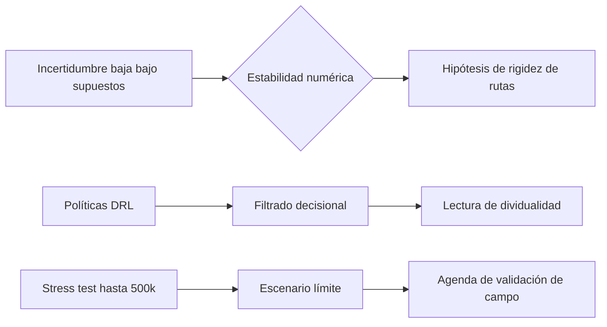

# Capítulo 3. Resultados y discusión: fricción, incertidumbre y escenarios de presión urbana

Los resultados del modelo M-MASS se presentan como una lectura exploratoria del corredor Junín-San Antonio. No sustituyen la observación directa ni autorizan conclusiones definitivas sobre todos los usuarios del centro de Medellín. Su aporte principal consiste en organizar datos públicos, supuestos de modelación y escenarios de simulación para discutir patrones de fricción ambiental, concentración de trayectorias y presión de flujo.

## 3.1. Superdeterminación y Asfixia de la Emergencia

El análisis de cuantificación de incertidumbre (`hpc_uncertainty_quantification.json`) arroja una incertidumbre relativa cercana a $\sigma_{rel} \approx 0.00026$ para la hora pico de la tarde en las condiciones simuladas. Este valor debe interpretarse con prudencia: indica estabilidad numérica del experimento bajo sus supuestos, no “perfección” del modelo ni prueba empírica de determinación social.

Como hipótesis interpretativa, la baja variación permite discutir una posible rigidez del sistema simulado: si muchos agentes comparten metas, costos y restricciones similares, las rutas tienden a concentrarse. En diálogo con Simmel (1903/1986), esto puede leerse como una formalización parcial de la vida metropolitana: el sujeto no desaparece, pero su margen práctico de decisión se estrecha cuando aumentan simultáneamente presión peatonal, ruido, riesgo percibido y atracción comercial.

## 3.2. La Actitud Blasé Computacional: Filtrado y Dividualidad

La convergencia de las políticas de aprendizaje por refuerzo en los agentes (`UrbanPhenomenologyDQN`) permite proponer la noción de **actitud blasé computacional** como una metáfora controlada. No se afirma que la red neuronal experimente indiferencia; se observa que el agente aprende a priorizar ciertas variables y a ignorar otras para minimizar costos dentro del entorno definido.

La analogía con Simmel ayuda a describir cómo, en espacios saturados, la selección de estímulos puede convertirse en una estrategia de tránsito. En términos de Deleuze (1990), el agente simulado aparece como “dividual” porque es tratado por el modelo como vector de atributos y decisiones. Esta lectura es útil críticamente, siempre que no se confunda la simplificación computacional con la totalidad de la experiencia humana.

## 3.3. El Acontecimiento del Stress Test: El Vacío del Ser

El experimento de estrés urbano (`hpc_urban_stress_test.json`) explora una curva de 100,000 a 500,000 agentes simultáneos. En ese rango, la entropía del sistema —entendida como medida de dispersión del estado simulado (Shannon, 1948)— aumenta de 4.59 a 5.40 y la velocidad media desciende de forma leve pero consistente hacia el extremo superior de la prueba. El punto de 500,000 agentes debe leerse como umbral interno del escenario ensayado, no como capacidad real verificada del corredor.

La lectura filosófica del “acontecimiento” (Badiou, 1988/1999) se conserva como interpretación: el estrés del modelo permite observar el momento en que la circulación deja de ser transparente y se vuelve problemática. Desde Merleau-Ponty (1945/1993), esta situación puede discutirse como una restricción del cuerpo vivido: moverse ya no depende solo de la intención, sino de un campo de obstáculos, densidades y mediaciones materiales.

## 3.4. La Aporía del Dato Real: Simulacro y Denuncia

La calibración de campo (`field_calibration_delta.json`) aparece en estado `pending_no_capture`. Este resultado no debe dramatizarse: significa que el pipeline está preparado para recibir observaciones situadas, pero aún no dispone de una jornada de campo suficiente para recalibrar nodos, aristas y escenarios. Esta limitación, lejos de debilitar automáticamente el trabajo, mejora su honestidad metodológica porque impide presentar proxies como si fueran mediciones directas.

La metáfora del “miembro fantasma” de Merleau-Ponty puede mantenerse como imagen filosófica de una ausencia significativa: el dato que falta recuerda que la vida de calle, la informalidad, el miedo, la pausa, el ruido puntual y la orientación corporal deben ser observados, no simplemente inferidos. En consecuencia, la tesis queda fortalecida si presenta la simulación como una fase analítica abierta a corrección empírica.

En síntesis, los resultados sugieren que el corredor puede ser analizado como un sistema de fricciones acumuladas. La tesis gana fuerza cuando evita declarar verdades cerradas y, en cambio, muestra con precisión qué patrones emergen del modelo, qué supuestos los producen y qué observaciones de campo faltan para confirmarlos, corregirlos o refutarlos.
