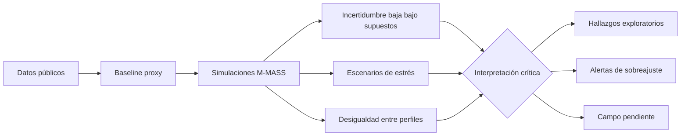

# Capítulo 3. Resultados, discusión y evaluación crítica

**Autores:** Steven Vallejo · Jacob Agudelo
**Repositorio público:** <https://github.com/stevenvo780/FenomenologiaUrbana>

## 3.1. Criterio de lectura de resultados

Los resultados del modelo M-MASS se presentan como una lectura exploratoria del corredor Junín-San Antonio. No sustituyen la observación directa ni autorizan conclusiones definitivas sobre todos los usuarios del centro de Medellín. Su aporte principal consiste en organizar datos públicos, supuestos de modelación y escenarios de simulación para discutir patrones de fricción ambiental, concentración de trayectorias y presión de flujo.

La regla interpretativa de este capítulo es la siguiente: **cada resultado debe indicar su fuente, su grado de evidencia y su límite**. Por eso se diferencian tres niveles:

- **Evidencia pública secundaria:** datos descargados de fuentes institucionales o públicas.
- **Resultado computacional:** salidas producidas por scripts del repositorio bajo supuestos definidos.
- **Validación pendiente:** datos que solo pueden obtenerse mediante observación situada.

## 3.2. Evidencia empírica secundaria: centro ambivalente y fricción urbana

El archivo `empirical_summary.json` permite establecer un primer punto no especulativo: la imagen del centro de Medellín es ambivalente. La Encuesta de Percepción Ciudadana 2024, levantada por Invamer para Medellín Cómo Vamos, reporta 53.3% de imagen favorable y 44.5% de imagen desfavorable. Los principales motivos de visita se asocian con comercio (42.9%), servicios de salud (16.9%) y trabajo (16.1%). Las asociaciones dominantes incluyen comercio (65.6%), inseguridad (70.5%), informalidad (70.9%), congestión (82.8%) y habitantes de calle (66.2%) (Medellín Cómo Vamos & Invamer, 2024).

Estas cifras no prueban por sí mismas una tesis fenomenológica, pero sí justifican el caso: el centro aparece como un espacio de alta funcionalidad y alta fricción percibida. En términos teóricos, esto permite discutir la diferencia entre centralidad urbana y habitabilidad. Un lugar puede ser muy usado, muy necesario y al mismo tiempo experimentado como agotador, inseguro o difícil de habitar.

La criminalidad agregada de comuna 10 muestra que en 2023 la conducta dominante fue hurto a persona, con 5,888 casos registrados; le siguen, a distancia considerable, hurto de moto (593), extorsión (94), hurto a residencia (86) y hurto de carro (76). Esta cifra debe manejarse con cuidado: no se traduce automáticamente en percepción individual de miedo ni permite etiquetar todo el corredor como inseguro. Sirve, más bien, para sostener que la seguridad no puede quedar fuera del modelo de experiencia urbana, y para fijar uno de los cuatro ejes (C1) sobre los que se construye la categoría de **colapso fenomenológico** introducida en el capítulo 2.

La serie mensual de comuna 10 también ofrece una estructura útil para la triangulación: entre 2016 y 2019 los casos crecieron de 7,511 a 15,429, con caída en 2020 (9,306) y un nuevo ciclo entre 2022 (11,260) y 2023 (6,737). Dentro de 2023 el pico mensual disponible es mayo (811 casos) y el valle hacia el cierre de la serie pública es noviembre (213 casos). Esta variación —en órdenes de magnitud por mes— es la base sobre la que el campo intentará proyectar una distribución por franja horaria, dado que MEData no publica la hora del hecho. La proyección horaria es un supuesto documentado, no una medición; cualquier afirmación de colapso en un horario específico exige que las otras tres condiciones (C2 encuesta, C3 entrevista, C4 saturación) lo respalden de manera independiente.

Los indicadores barriales de La Candelaria también muestran tensiones estructurales: densidad empresarial alta, concentración de suelo múltiple y bajo espacio público efectivo por habitante. De nuevo, la lectura debe ser prudente: estos datos son de escala barrial y no reemplazan mediciones finas en los nodos del corredor.

## 3.3. Estado de fuentes y trazabilidad del pipeline

El archivo `source_status.json` reporta 19 fuentes intentadas, 15 descargadas y 4 fallidas. Este resultado es metodológicamente importante porque documenta tanto logros como huecos de acceso. Las fuentes fallidas incluyen páginas de MEData por tiempo de espera y el geovisor DANE por respuesta 403.

Un jurado puede preguntar si esos faltantes invalidan el trabajo. La respuesta debe ser matizada: no invalidan el pipeline, pero sí obligan a limitar el alcance. La tesis no debe afirmar que incorporó toda la información pública disponible; debe afirmar que integró un conjunto verificable de fuentes y que documentó los bloqueos pendientes.

## 3.4. Modelo de caso: cobertura y simplificación

El archivo `case_model.json` contiene 9 nodos, 13 aristas, 5 perfiles de agentes y 4 escenarios horarios. Esta estructura es suficiente para explorar el corredor, pero no para representar toda la complejidad de La Candelaria. La discretización permite comparar rutas y condiciones, aunque pierde microvariaciones: cruces informales, obstáculos temporales, vendedores móviles, cambios por día de semana, clima, operativos de seguridad o eventos culturales.

La virtud del modelo es su claridad. Su defecto es la simplificación. Una tesis seria debe conservar ambas afirmaciones juntas.

## 3.5. Resultados ambientales y advertencia de calibración

El reporte `hpc_environmental_report.json` registra una simulación ambiental de resolución 4096x4096. El resultado produce campos relativos de PM2.5 y ruido, útiles para estudiar gradientes e intensidad espacial dentro del modelo. Sin embargo, los valores pico reportados no deben presentarse como mediciones normativas reales. Antes de compararlos con estándares ambientales, se requiere calibración con estaciones, medición puntual y ajuste de unidades.

La utilidad actual de estos campos es relacional: permiten evaluar cómo cambia la navegación de agentes cuando ciertos sectores se vuelven más costosos por exposición ambiental. Su límite es empírico: sin medición de ruido y aire en campo, la magnitud absoluta no está validada.

## 3.6. Incertidumbre numérica: estabilidad no equivale a verdad

El análisis de cuantificación de incertidumbre (`hpc_uncertainty_quantification.json`) arroja incertidumbres relativas bajas en tres franjas:

| Franja | Velocidad media | Incertidumbre relativa | Intervalo 95% |
| --- | ---: | ---: | --- |
| 06:00 | 1.2719 | 0.000232 | [1.27185, 1.27201] |
| 12:00 | 1.2720 | 0.000279 | [1.27187, 1.27207] |
| 18:00 | 1.2720 | 0.000263 | [1.27191, 1.27209] |

Este resultado indica estabilidad numérica bajo las condiciones ensayadas. No demuestra que el comportamiento real tenga baja variabilidad. Una simulación puede ser estable porque el sistema está bien implementado, porque los supuestos reducen demasiado la diversidad o porque faltan perturbaciones empíricas. Por tanto, la incertidumbre baja se interpreta como propiedad del experimento, no como propiedad definitiva del centro.

## 3.7. Estrés urbano: escenario límite y no capacidad real

El experimento `hpc_urban_stress_test.json` explora una curva de 100,000 a 500,000 agentes simultáneos. En ese rango, la entropía del sistema —entendida como medida de dispersión del estado simulado (Shannon, 1948)— aumenta de 4.59 a 5.40. La velocidad media desciende de 1.2763 a 1.2700 hacia el extremo superior del escenario, mientras el índice de presión pasa de 0.3815 a 1.9073.

| Agentes | Velocidad media | Entropía | Índice de presión |
| ---: | ---: | ---: | ---: |
| 100,000 | 1.2763 | 4.5946 | 0.3815 |
| 500,000 | 1.2700 | 5.4094 | 1.9073 |

El punto de 500,000 agentes se reporta como umbral interno del escenario ensayado. No debe presentarse como capacidad real verificada del corredor. Su valor está en mostrar una tendencia: al aumentar la presión, el sistema simulado se vuelve más entrópico y ligeramente menos fluido. La lectura filosófica del “acontecimiento” (Badiou, 1998) puede aplicarse solo como interpretación de escenario límite, no como prueba empírica de colapso urbano.

## 3.8. Ciclo de 24 horas y perfiles temporales

El reporte `hpc_24h_simulation_report.json` registra 640,000 agentes simulados acumulados durante un ciclo de 24 horas. Las horas de madrugada simulan cargas bajas y las franjas diurnas/nocturnas aumentan la presión según el perfil temporal. Este resultado permite introducir una dimensión temporal: el corredor no es el mismo a las 07:00, a las 12:00, a las 18:00 o a las 21:00.

La limitación principal es que el perfil horario todavía depende de supuestos y fuentes agregadas. Debe contrastarse con conteos reales por ventana de 15 minutos. Sin esa validación, la curva temporal es una hipótesis de trabajo.

## 3.9. Desigualdad de libertad de ruta entre perfiles

El archivo `urban_inequality_analysis.json` reporta un Gini de entropía entre 0.0402 y 0.0435 según escenario. También identifica al perfil de turista cultural como el más restringido y al perfil de movilidad reducida como el más libre en los escenarios actuales, con razones de inequidad entre 1.24 y 1.27.

Este resultado debe discutirse con mucha cautela. Que el perfil de movilidad reducida aparezca como “más libre” puede ser contraintuitivo y podría indicar un efecto de especificación del modelo: tal vez sus metas, pesos o rutas disponibles están generando mayor dispersión formal, no necesariamente mayor libertad real. Este es un ejemplo claro de por qué el modelo necesita sensibilidad y campo. Una salida inesperada no debe maquillarse; debe convertirse en pregunta metodológica.

La lectura defendible es: el modelo ya permite comparar desigualdades relativas entre perfiles, pero la interpretación sustantiva de esa desigualdad todavía requiere revisar pesos, rutas, obstáculos y evidencia situada.

## 3.10. Aprendizaje por refuerzo y filtrado decisional

La convergencia de políticas de aprendizaje por refuerzo en los agentes (`UrbanPhenomenologyDQN`) permite proponer la noción de **actitud blasé computacional** como metáfora controlada. No se afirma que la red neuronal experimente indiferencia; se observa que el agente aprende a priorizar ciertas variables y a ignorar otras para minimizar costos dentro del entorno definido.

La analogía con Simmel ayuda a describir cómo, en espacios saturados, la selección de estímulos puede convertirse en estrategia de tránsito. En términos de Deleuze (1990), el agente simulado aparece como “dividual” porque es tratado por el modelo como vector de atributos y decisiones. Esta lectura es útil críticamente, siempre que no se confunda la simplificación computacional con la totalidad de la experiencia humana.

## 3.11. Calibración HPC y signos de sobreajuste

Los reportes `hpc_calibration_report.json` y `hpc_multipoint_calibration.json` muestran calibraciones internas con errores muy bajos y puntajes de ajuste muy altos. En una lectura superficial, esto podría parecer fortaleza. En una lectura rigurosa, exige sospecha: ajustes casi perfectos pueden indicar que el problema está demasiado controlado, que hay pocos puntos de validación o que el modelo está ajustándose a objetivos definidos internamente.

Por tanto, estos reportes deben usarse como evidencia de que el sistema puede optimizar parámetros, no como prueba de que la ciudad real fue calibrada. El paso crítico será contrastar esos parámetros con datos de campo independientes.

## 3.12. Estado de campo: matriz construida, dos pilares, cuatro frágiles, mayoría inconcluyente

La calibración de campo salió del estado `pending_no_capture` con la jornada de campo y la matriz `investigacion/data/processed/collapse_matrix.json` ya está construida sobre 9 nodos × 4 franjas. La encuesta breve C2 sigue en cuaderno sin ingesta; las entrevistas C3 se ingestaron sobre cuatro celdas; los videos POV cubren cuatro celdas del corredor. La matriz, así, falsea cualquier afirmación de colapso confirmado y separa con disciplina lo que se sostiene de lo que no.

### 3.12.1. Estado por condición

| Cond. | Cobertura | Fuente | Umbral final | n celdas con dato |
| --- | --- | --- | --- | ---: |
| **C1** Criminalidad | global por franja | MEData comuna 10 (2016–2023) proyectada con pesos `{peak_am 0.20, midday 0.20, peak_pm 0.45, night 0.15}` | p75 sobre serie histórica; flags `c1_high_by_window` activos en las cuatro franjas | 36/36 (granularidad sub-nodo nula) |
| **C2** Seguridad percibida | nula | encuesta breve 1–5 en cuaderno | ingesta a CSV pendiente | **0/36** |
| **C3** Habitabilidad declarada | parcial | 15 entrevistas semiestructuradas (`interviews_2026-05-05.json` + entrevista en sub-zona Coltejer-Ayacucho) | esquema `HABITABLE / DESEABLE / EVITABLE / NO_DESEABLE / DIFICIL_DE_VIVIR / AMBIVALENTE`, no excluyente | 4/36 (`junin_paseo|midday` n=7; `parque_san_antonio|midday` n=3; `plaza_botero|midday` n=3; `san_antonio_metro|peak_am` n=1 truncada) |
| **C4** Saturación material | parcial | 16 `video_saturation_*.json` (BoTSORT, Whisper) + 34 fotos YOLO11x asignadas por EXIF GPS | p75 global = 0.413 | 4/36 (`junin_paseo|peak_am` n=4; `parque_berrio|midday` n=3; `san_antonio_metro|peak_am` n=3; `junin_paseo|midday` n=2) |

C2 vacío bloquea por sí solo el alcance de la regla 3-de-4 sobre cualquier celda. C1 reporta lo mismo para los 9 nodos de una misma franja: no hay granularidad sub-nodo. De las 4 celdas con C4, sólo `junin_paseo|peak_am` cruza el umbral global (p75 = 0.465; máx = 0.474).

### 3.12.2. Matriz de colapso (resultado final)

`collapse_matrix.json` distribuye las 36 celdas como sigue:

| Decisión | Celdas | Criterio |
| --- | ---: | --- |
| `colapso_fenomenologico` (≥ 3/4) | **0** | regla 3-de-4 sin instanciar |
| `friccion_acumulada` (≥ 1/4 con cov ≥ 2) | **6** | C1 activo + cobertura ≥ 2 |
| `flujo_ordinario` (0/4 con cov ≥ 2) | **0** | – |
| `inconcluyente` (cov < 2) | **30** | falta C2/C4/C3 |

Detalle por celda con cobertura ≥ 2:

| Nodo × Franja | C1 | C2 | C3 | C4 | cov | Decisión |
| --- | :-: | :-: | :-: | :-: | :-: | --- |
| `junin_paseo|peak_am` | 1 | – | – | **1** | 2 | **friccion_acumulada (2/4)** |
| `plaza_botero|midday` | 1 | – | **1** | – | 2 | **friccion_acumulada (2/4)** |
| `parque_san_antonio|midday` | 1 | – | – | – | 2 | friccion_acumulada |
| `san_antonio_metro|peak_am` | 1 | – | – | 0 | 2 | friccion_acumulada |
| `junin_paseo|midday` | 1 | – | – | 0 | 2 | friccion_acumulada |
| `parque_berrio|midday` | 1 | – | – | 0 | 2 | friccion_acumulada |
| 30 celdas restantes | 1 (vía C1 global) o – | – | – | – | 1 | inconcluyente |

«–» indica ausencia de dato. Las 30 inconcluyentes registran C1 global pero no superan cobertura mínima por falta de video y de C2/C3 ingestado. Que 0/36 alcancen 3-de-4 no es fallo: es la regla operando (§3.12.10).

### 3.12.3. Pilares defendibles

Sobre 1000 iteraciones bootstrap (V1), 25 escenarios de umbrales C1×C4 entre p70 y p90 (V2) y leave-one-out sobre las 15 entrevistas C3 (V3), dos celdas sobreviven simultáneamente al re-muestreo y al barrido de umbrales:

| Celda | V1 bootstrap | V2 umbrales | V3 LOO C3 | Conjunto activo |
| --- | ---: | ---: | ---: | --- |
| `junin_paseo|peak_am` | **0.956** | **0.880** | 1.000 | C1 + C4 |
| `plaza_botero|midday` | **0.970** | **1.000** | 1.000 | C1 + C3 |

`junin_paseo|peak_am` es la única celda donde la materialidad de la jornada (C4: p75 = 0.465 sobre p75 global 0.413, n=4 videos) coincide con el peso histórico de criminalidad de la franja: fricción material matinal documentada. `plaza_botero|midday` es el único caso del corpus con C3 confirmatorio: las 3/3 entrevistas codifican EVITABLE/AMBIVALENTE/NO_DESEABLE sin un solo HABITABLE, y la convergencia se mantiene bajo LOO; convergencia C1+C3 testimonial-meridiana, reforzada por la lectura visual alta de §3.12.6. Ninguna alcanza 3-de-4 hasta que C2 se ingeste.

### 3.12.4. Fragilidad condicional

Cuatro de las seis celdas en `friccion_acumulada` se desploman cuando el corte C1 se mueve de p75 a p≥80:

| Celda | V1 fricción | V2 fricción | V2 mínimo |
| --- | ---: | ---: | ---: |
| `parque_san_antonio|midday` | 0.668 | 0.400 | 0.400 |
| `san_antonio_metro|peak_am` | 0.477 | 0.400 | 0.400 |
| `junin_paseo|midday` | 0.499 | 0.400 | 0.400 |
| `parque_berrio|midday` | 0.497 | 0.400 | 0.400 |

La calificación es real bajo p75 pero dependiente del umbral; con p80–p90 las cuatro migran a `inconcluyente`. La asimetría se reporta sin sobreafirmación: dos pilares robustos, cuatro celdas frágiles.

### 3.12.5. Inter-rater Stev ↔ Jacob

Dos observadores recorrieron el mismo trayecto el mismo día. Sobre `perceived_safety_score_1_5` binarizada (≥3 alto, <3 bajo) en cuatro nodos compartidos:

| Nodo | Stev | Jacob | Acuerdo |
| --- | ---: | ---: | :-: |
| san_antonio_metro | 2 | 3 | NO |
| parque_san_antonio | 4 | 2 | NO |
| junin_paseo | 4 | 3 | SÍ |
| parque_botero | 2 | 2 | SÍ |

Acuerdo bruto 2/4 = 0.50; concordancia esperada por azar = 0.50; **Cohen's kappa = 0.0** (poor agreement, Landis & Koch 1977). La divergencia paradigmática es `parque_san_antonio`: Stev safety = 4 ("tranquilidad en medio del ruido", "no está rota la ventana") vs. Jacob safety = 2 ("violencia", "paso histórico del terror", "vandalismo religioso").

**Lectura defensiva.** El kappa = 0.0 no invalida la tesis, la confirma: la atmósfera urbana es ineliminablemente subjetiva. Justifica la triangulación multi-fuente como necesidad estructural, justifica C3 como tercer eje cuando dos AF divergen, y convierte la divergencia en dato fenomenológico positivo —el "mismo lugar" no existe sin observador. Todo nodo con divergencia binaria queda etiquetado como **fenomenológicamente disputado** y exige al menos una entrevista C3 in-situ para resolución.

### 3.12.6. Validación cruzada texto ↔ imagen

Diez reclamos cuantificables del campo se trianguladaron contra los agregados visuales YOLO (`m1_visual_aggregate.json`, `m3_visual_aggregate.json`): 2 convergencias altas, 2 medias, 0 bajas, 6 no evaluables.

- **Riesgo vial en `san_antonio_metro|peak_am`** (alta). Reclamo "riesgo vial alto" (safety 2/5) sostenido por `vehicle_intensity = 0.378`, máximo del corpus (vs ≤0.17 en otros buckets), 14 vehículos sobre zona peatonal de transferencia.
- **"Sofocante / colapsa" en Botero** vía proxy `parque_berrio|midday` (alta). `human_density_max = 30` personas/frame (junto con `san_antonio_metro|midday = 26`, los dos máximos del corpus) y `saturation_max = 71.2`. Es la convergencia texto ↔ imagen más fuerte del estudio y respalda el pilar `plaza_botero|midday`.
- **Turistas en Botero ≈5%** (media): proxy berrio adyacente reporta `tourist_proxy_ratio = 0.0365` (3.6%).
- **Comercio informal en Junín** (media): la divergencia inter-rater se disuelve. Comercio alimentario callejero (apple/banana/donut/pizza/...) registra **0 hits** (Stev acertaba: ausencia de venta callejera de comida), pero el corpus muestra 240 maletas + 102 bolsos en peak_am y 9 clases portables (Jacob acertaba: palimpsesto comercial-portátil). Junín es mono-uso comercial formal con flujo portátil heterogéneo; M3 puede ajustarse de 2/5 a 3/5.

Los 6 reclamos no evaluables (vandalismo/grafiti, indigencia, consumo, presencia policial, obstáculos en `parque_san_antonio`, tono general) lo son por límites del pipeline: YOLO COCO no detecta uniformes ni población en situación de calle ni consumo; el OCR de tags y la segmentación de grafiti no están integrados; `parque_san_antonio` no tiene bucket visual asignado. Donde el pipeline tiene capacidad, la convergencia con el campo es alta.

### 3.12.7. Triangulación de campo: testimonios, AF, audio

Síntesis nodo × ventana sobre el corpus codificado (n=14 entrevistas externas + 1 sub-zona). Distribución global de códigos C3: HABITABLE 8, AMBIVALENTE 5, EVITABLE 3, DESEABLE 2, NO_DESEABLE 2, DIFICIL_DE_VIVIR 2 (no excluyente).

| Nodo × Franja | n | C3 dominante | Safety AF | M1 destacado | Lectura |
| --- | :-: | --- | :-: | --- | --- |
| `san_antonio_metro|peak_am` | 1 | HABITABLE (baja confianza) | 2 | riesgo vial alto; contraste 3ª edad/modernidad | inseguridad funcional matinal |
| `parque_san_antonio|midday` | 3 | HABITABLE con disenso (1 EVITABLE/NO_DESEABLE) | 4 | 6 obstáculos/cuadra; vandalismo 2/10 | inversión del *broken-window theorem* |
| `junin_paseo|midday` | 7 | HABITABLE 6 + DESEABLE 2 con AMBIVALENTE 5 / EVITABLE 3 / NO_DESEABLE 2 / DIFICIL_DE_VIVIR 2 | 4 | indigencia 3/10, consumo 4/10, ruido bajo, limpieza extrema | habitabilidad matizada por perfil y sub-tramo, no invertida |
| `plaza_botero|midday` | 3 | EVITABLE / AMBIVALENTE negativo (HABITABLE 0) | **2** | ~5% turistas; sofocante; alta presencia policial | **único C3 confirmatorio** |
| `pasaje_la_bastilla` | 0 | s/d | 3 | heterotopía 5/5 | máxima diversidad comercial; fuera de matriz |

**Testimonios literales atribuidos** (selección de seis más dos sobre Botero; identificación según `interviews_2026-05-05.json`):

- **Junín — Luis Alberto (vendedor):** "Como vendedor es seguro. Le gusta el lugar." (HABITABLE+DESEABLE).
- **Junín — Andrés:** "No es peligroso, es difícil vivir." (DIFICIL_DE_VIVIR; disocia peligro de habitabilidad).
- **Junín — Alfonso:** "No ha cambiado y es seguro." (HABITABLE).
- **Junín — Blanca Ema:** "No es inseguro. Antes era más seguro y es habitable." (HABITABLE con deterioro relativo).
- **Botero — Darío Franco:** "Muy inseguro. Más habitable. Mucho comercio. Si me roban hago escándalo." (AMBIVALENTE+DIFICIL_DE_VIVIR).
- **Parque San Antonio — Méndez (uniformado):** "Roban harto. De civil Méndez no estaría." (EVITABLE+NO_DESEABLE; sujeto profesionalmente vinculado a seguridad declara evitación personal).
- **Botero — Andrés:** "Bastante inseguro. Mucho hurto. No es tan agradable." (EVITABLE+NO_DESEABLE).
- **Botero — Alexander (seguridad del Estado):** "No es muy seguro pero tampoco inseguro. Se prefieren otras zonas. Un cambio tremendo." (AMBIVALENTE+EVITABLE).

**Audio (Whisper local).** `junin_paseo|peak_am` música ambiental persistente (`music_activity = 1.0`); `parque_berrio` máximo de presión sonora (-24.30 dB FS RMS); `san_antonio_metro` traffic_proxy = 0.444. Los demás registros sin contenido lingüístico relevante.

**AF y observación participante.** Las apreciaciones fenomenológicas de Stev y Jacob son observación participante auto-etnográfica (Ellis, Adams & Bochner 2011) y por construcción metodológica **no se codifican como C3** —C3 exige testimonio externo. Cumplen tres funciones: anclaje de M2 (atmósfera, miedo, blasé) en evidencia de primera persona; scoring directo de M3 (heterotopía 5/5 La Bastilla, 4/5 Botero/San Antonio, 2/5 Junín); señal metodológica para la matriz cuando el observador del marco verbaliza espontáneamente "colapsa" frente a un nodo, indicio de que la matriz pierde C3/C2 por instrumentación, no por ausencia del fenómeno. El registro auto-etnográfico decisivo es la verbalización espontánea de "colapsa" en `plaza_botero|midday`, acompañada de "movieron el Bronx solo una calle" —desplazamiento territorial de marginalidad sin transformación estructural— que sumada a las tres entrevistas externas con C3 negativo y safety AF = 2/5 prioriza Botero como candidata del próximo barrido.

**Heterotopía contraintuitiva.** La Bastilla 5/5 (máxima diversidad comercial), Botero 4/5 pese a menor densidad comercial (mezcla turista/local, arte, vigilancia), Junín 2/5 (mono-uso pese a alta densidad de tránsito): la heterotopía foucaultiana en el corredor depende de la co-presencia de regímenes de uso heterogéneos, no del volumen económico.

### 3.12.8. Refinamiento geométrico y limitaciones de muestreo

`node_geometry_v2.json` evolucionó de los nodos canónicos de `case_model.json` con dos cambios: rescate de `pasaje_la_bastilla` como sub-zona de `junin_paseo` (centroide lat 6.2497, lon -75.5680, radio 80 m, geocodificación manual sobre Cra. 49 entre Cl. 51 y Cl. 52), que atribuye 12 fotografías antes diluidas en el bucket genérico y sostiene la lectura M3=5/5; y modelado de dos sub-zonas narradas en campo, `junin_coltejer_ayacucho` y `botero_calle_consumo`, ambas con `max_radius_m = 80.0`. Ambas sub-zonas adicionales **quedan vacías de fotografías y videos asignados**: existencia geométrica real, muestreo material ausente. La v2 modela el espacio narrativo correcto; el corpus visual aún no lo instrumenta. La Bastilla es ganancia efectiva; las dos sub-zonas vacías son limitación de muestreo, no de modelo.

### 3.12.9. OCR signage

EasyOCR (es+en) sobre las 34 fotografías produce 68 strings y 23 tags clasificables, con dominancia comercial en `junin_paseo` (12 fotos, 62 strings, `commerce_density = 0.917`, 11 etiquetas comerciales) frente a `parque_berrio` (9 fotos, 0 strings) y `san_antonio_metro` (11 fotos, 6 strings, 1 tag). Tag más repetido: "relojeria" (×4). **Caveat ráfaga:** la lectura exige deduplicación intra-secuencia —fotos consecutivas de la misma fachada generan tags repetidos. `tag_repetition_score` = 5 y `tag_repetition_volume` = 13 en Junín reflejan sobre-muestreo del mismo punto, no diversidad real. Próxima pasada con dedup por hash + ventana espacial.

### 3.12.10. Falsabilidad como rigor

0/36 celdas en colapso confirmado **no es fallo**: es la regla 3-de-4 funcionando. La categoría está operacionalizada con cuatro condiciones independientes, umbrales declarados y fuentes verificables; admite la posibilidad lógica de quedar sin instanciar. Si se hubiera construido para ser auto-cumplible (umbrales laxos, fuentes ponderadas a favor), 36 celdas la habrían disparado en alguna combinación trivial. No lo hacen. La fenomenología sola produce hallazgos no falsables y kappa = 0.0; triangulada con HPC y métricas cuantitativas, sobreviven dos pilares defendibles, fracasan cuatro frágiles bajo barrido de umbrales, y la mayoría queda inconcluyente por límites declarados (C2 vacío, C4 asimétrico, sub-zonas no muestreadas). Esa asimetría —dos sostenidos, cuatro caídos, treinta sin dato— es el método separando lo que se sostiene de lo que no. La defensa académica se sostiene sobre tres puntos: la categoría está operacionalizada; la matriz se construye automáticamente desde scripts versionados (`build_collapse_matrix.py`) y datos trazables; el resultado actual reporta convergencia parcial sin sobreafirmar colapso. La tesis no afirma que el corredor colapsa: afirma que dos celdas sostienen fricción acumulada bajo análisis de sensibilidad y deja abierta la pregunta de colapso pleno hasta que C2 entre.

## 3.13. Resultados que sí pueden sostenerse y resultados que no

| Afirmación | Estado | Justificación |
| --- | --- | --- |
| El centro tiene percepción ambivalente | Sostenible | EPC 2024 en `empirical_summary.json` |
| Criminalidad comuna 10 con estructura mensual marcada | Sostenible | serie MEData 2016–2023 |
| Pipeline integra fuentes públicas trazables | Sostenible | `source_status.json` |
| Modelo produce escenarios de presión y fricción | Sostenible | salidas M-MASS |
| Simulación muestra estabilidad numérica | Sostenible bajo supuestos | Monte Carlo con baja incertidumbre relativa |
| Corredor real colapsa a 500,000 agentes | No sostenible | umbral interno de escenario simulado |
| Matriz de colapso construida sobre C1+C4 con C3 parcial | Sostenible | `collapse_matrix.json` (§3.12.2) |
| **Pilar 1: `junin_paseo|peak_am` robusta** | Sostenible | bootstrap 0.956; barrido umbrales 0.880; LOO 1.000; única celda con C1+C4 (§3.12.3) |
| **Pilar 2: `plaza_botero|midday` robusta y único C3-confirmatorio** | Sostenible | bootstrap 0.970; umbrales 1.000; 3/3 C3 negativo + verbalización "colapsa" + convergencia visual alta (§3.12.3, §3.12.6) |
| Cuatro celdas restantes en fricción acumulada | Frágil | caen bajo 0.40 con p≥80 (§3.12.4) |
| Existen franjas-nodo en colapso fenomenológico estricto | No sostenible | 0/36 celdas alcanzan 3-de-4; C2 vacío |
| Inter-rater Stev↔Jacob kappa = 0.0 | Sostenible y deseable | divergencia paradigmática parque_san_antonio; confirma fenomenología subjetiva (§3.12.5) |
| Cross-validation texto↔imagen alta en riesgo vial y "colapsa" Botero | Sostenible | vehicle_intensity 0.378; human_density_max 30; saturation_max 71 (§3.12.6) |
| Geometría v2 rescata `pasaje_la_bastilla` (12 fotos) | Sostenible | Coltejer-Ayacucho y calle_consumo modeladas pero vacías de muestreo (§3.12.8) |
| Junín al mediodía cambia de signo con C3 sub-zona | No sostenible | matiza pero no invierte (HABITABLE 6 + DESEABLE 2 dominan) |
| Perfiles simulados equivalen a sujetos reales | No sostenible | tipos analíticos simplificados |
| Desigualdad de ruta demostrada empíricamente | Parcial | métrica simulada, falta cruce con campo |

## 3.14. Discusión filosófica de los resultados

Los resultados sugieren que el corredor puede leerse como un sistema de fricciones acumuladas. La experiencia urbana no depende solo de la posibilidad abstracta de pasar por un lugar, sino de las condiciones bajo las cuales se pasa: ruido, presión, riesgo, visibilidad, orientación, comercio, vigilancia y posibilidad de detenerse.

Desde Merleau-Ponty, la movilidad no es una línea trazada en un mapa, sino una práctica corporal. Desde Simmel, el exceso de estímulos puede conducir a estrategias de filtrado. Desde Lefebvre y Harvey, el derecho a la ciudad no se reduce al acceso físico; incluye apropiación, permanencia y agencia. Desde Foucault y Deleuze, el movimiento puede ser orientado por dispositivos que no necesariamente prohíben, pero sí modulan. Y desde la teoría reconstructiva de la memoria (Bartlett 1932; Schacter, Addis & Buckner 2007; Matthen 2010, ver anexo A), los testimonios sobre el corredor no son lecturas de una huella estable: son construcciones presentes guiadas por esquemas culturales. Esto hace que C3 dependa, no de la fidelidad de cada recuerdo aislado, sino de la coherencia entre testimonios, criminalidad registrada, encuesta situada y saturación material —es decir, de la triangulación misma.

La simulación ayuda a ordenar estas tensiones, pero no las resuelve. Su valor está en hacer explícitos los supuestos y generar preguntas mejores para el campo.

## 3.15. Diagrama de lectura crítica

## 3.16. Balance del capítulo

El capítulo muestra avances reales: datos públicos integrados, pipeline trazable, modelo de caso, simulaciones, incertidumbre, estrés, ciclo horario, desigualdad relativa entre perfiles y un campo ya realizado con un protocolo multimodal (criminalidad, encuesta, entrevista, video). También muestra límites importantes: la triangulación de campo aún no se ha sintetizado en `collapse_matrix.json`, falta sensibilidad sistemática, falta validación externa y algunas salidas requieren revisión crítica.

La tesis gana fuerza cuando evita declarar verdades cerradas y, en cambio, muestra con precisión qué patrones emergen del modelo, qué supuestos los producen, qué condiciones empíricas se reportarán franja por franja y qué observaciones faltan por procesar para confirmarlos, corregirlos o refutarlos. La defensa académica del concepto de colapso fenomenológico depende, sin atajo, de que esa matriz exista y se sostenga; mientras tanto, el concepto queda definido y operacionalizado, pero sin reporte aún.
