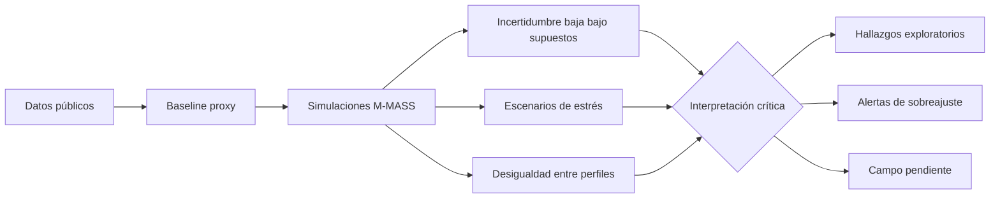

# Capítulo 3. Resultados, discusión y evaluación crítica

## 3.1. Criterio de lectura de resultados

Los resultados del modelo M-MASS se presentan como una lectura exploratoria del corredor Junín-San Antonio. No sustituyen la observación directa ni autorizan conclusiones definitivas sobre todos los usuarios del centro de Medellín. Su aporte principal consiste en organizar datos públicos, supuestos de modelación y escenarios de simulación para discutir patrones de fricción ambiental, concentración de trayectorias y presión de flujo.

La regla interpretativa de este capítulo es la siguiente: **cada resultado debe indicar su fuente, su grado de evidencia y su límite**. Por eso se diferencian tres niveles:

- **Evidencia pública secundaria:** datos descargados de fuentes institucionales o públicas.
- **Resultado computacional:** salidas producidas por scripts del repositorio bajo supuestos definidos.
- **Validación pendiente:** datos que solo pueden obtenerse mediante observación situada.

## 3.2. Evidencia empírica secundaria: centro ambivalente y fricción urbana

El archivo `empirical_summary.json` permite establecer un primer punto no especulativo: la imagen del centro de Medellín es ambivalente. La Encuesta de Percepción Ciudadana reporta 53.3% de imagen favorable y 44.5% de imagen desfavorable. Los principales motivos de visita se asocian con comercio (42.9%), servicios de salud (16.9%) y trabajo (16.1%). Las asociaciones dominantes incluyen comercio (65.6%), inseguridad (70.5%), informalidad (70.9%), congestión (82.8%) y habitantes de calle (66.2%).

Estas cifras no prueban por sí mismas una tesis fenomenológica, pero sí justifican el caso: el centro aparece como un espacio de alta funcionalidad y alta fricción percibida. En términos teóricos, esto permite discutir la diferencia entre centralidad urbana y habitabilidad. Un lugar puede ser muy usado, muy necesario y al mismo tiempo experimentado como agotador, inseguro o difícil de habitar.

La criminalidad agregada de comuna 10 muestra que en 2023 la conducta dominante fue hurto a persona, con 5,888 casos registrados. Esta cifra debe manejarse con cuidado: no se traduce automáticamente en percepción individual de miedo ni permite etiquetar todo el corredor como inseguro. Sirve, más bien, para sostener que la seguridad no puede quedar fuera del modelo de experiencia urbana.

Los indicadores barriales de La Candelaria también muestran tensiones estructurales: densidad empresarial alta, concentración de suelo múltiple y bajo espacio público efectivo por habitante. De nuevo, la lectura debe ser prudente: estos datos son de escala barrial y no reemplazan mediciones finas en los nodos del corredor.

## 3.3. Estado de fuentes y trazabilidad del pipeline

El archivo `source_status.json` reporta 19 fuentes intentadas, 15 descargadas y 4 fallidas. Este resultado es metodológicamente importante porque documenta tanto logros como huecos de acceso. Las fuentes fallidas incluyen páginas de MEData por tiempo de espera y el geovisor DANE por respuesta 403.

Un jurado puede preguntar si esos faltantes invalidan el trabajo. La respuesta debe ser matizada: no invalidan el pipeline, pero sí obligan a limitar el alcance. La tesis no debe afirmar que incorporó toda la información pública disponible; debe afirmar que integró un conjunto verificable de fuentes y que documentó los bloqueos pendientes.

## 3.4. Modelo de caso: cobertura y simplificación

El archivo `case_model.json` contiene 9 nodos, 13 aristas, 5 perfiles de agentes y 4 escenarios horarios. Esta estructura es suficiente para explorar el corredor, pero no para representar toda la complejidad de La Candelaria. La discretización permite comparar rutas y condiciones, aunque pierde microvariaciones: cruces informales, obstáculos temporales, vendedores móviles, cambios por día de semana, clima, operativos de seguridad o eventos culturales.

La virtud del modelo es su claridad. Su defecto es la simplificación. Una tesis seria debe conservar ambas afirmaciones juntas.

## 3.5. Resultados ambientales y advertencia de calibración

El reporte `hpc_environmental_report.json` registra una simulación ambiental de resolución 4096x4096. El resultado produce campos relativos de PM2.5 y ruido, útiles para estudiar gradientes e intensidad espacial dentro del modelo. Sin embargo, los valores pico reportados no deben presentarse como mediciones normativas reales. Antes de compararlos con estándares ambientales, se requiere calibración con estaciones, medición puntual y ajuste de unidades.

La utilidad actual de estos campos es relacional: permiten evaluar cómo cambia la navegación de agentes cuando ciertos sectores se vuelven más costosos por exposición ambiental. Su límite es empírico: sin medición de ruido y aire en campo, la magnitud absoluta no está validada.

## 3.6. Incertidumbre numérica: estabilidad no equivale a verdad

El análisis de cuantificación de incertidumbre (`hpc_uncertainty_quantification.json`) arroja incertidumbres relativas bajas en tres franjas:

| Franja | Velocidad media | Incertidumbre relativa | Intervalo 95% |
| --- | ---: | ---: | --- |
| 06:00 | 1.2719 | 0.000232 | [1.27185, 1.27201] |
| 12:00 | 1.2720 | 0.000279 | [1.27187, 1.27207] |
| 18:00 | 1.2720 | 0.000263 | [1.27191, 1.27209] |

Este resultado indica estabilidad numérica bajo las condiciones ensayadas. No demuestra que el comportamiento real tenga baja variabilidad. Una simulación puede ser estable porque el sistema está bien implementado, porque los supuestos reducen demasiado la diversidad o porque faltan perturbaciones empíricas. Por tanto, la incertidumbre baja se interpreta como propiedad del experimento, no como propiedad definitiva del centro.

## 3.7. Estrés urbano: escenario límite y no capacidad real

El experimento `hpc_urban_stress_test.json` explora una curva de 100,000 a 500,000 agentes simultáneos. En ese rango, la entropía del sistema —entendida como medida de dispersión del estado simulado (Shannon, 1948)— aumenta de 4.59 a 5.40. La velocidad media desciende de 1.2763 a 1.2700 hacia el extremo superior del escenario, mientras el índice de presión pasa de 0.3815 a 1.9073.

| Agentes | Velocidad media | Entropía | Índice de presión |
| ---: | ---: | ---: | ---: |
| 100,000 | 1.2763 | 4.5946 | 0.3815 |
| 500,000 | 1.2700 | 5.4094 | 1.9073 |

El punto de 500,000 agentes se reporta como umbral interno del escenario ensayado. No debe presentarse como capacidad real verificada del corredor. Su valor está en mostrar una tendencia: al aumentar la presión, el sistema simulado se vuelve más entrópico y ligeramente menos fluido. La lectura filosófica del “acontecimiento” (Badiou, 1988/1999) puede aplicarse solo como interpretación de escenario límite, no como prueba empírica de colapso urbano.

## 3.8. Ciclo de 24 horas y perfiles temporales

El reporte `hpc_24h_simulation_report.json` registra 640,000 agentes simulados acumulados durante un ciclo de 24 horas. Las horas de madrugada simulan cargas bajas y las franjas diurnas/nocturnas aumentan la presión según el perfil temporal. Este resultado permite introducir una dimensión temporal: el corredor no es el mismo a las 07:00, a las 12:00, a las 18:00 o a las 21:00.

La limitación principal es que el perfil horario todavía depende de supuestos y fuentes agregadas. Debe contrastarse con conteos reales por ventana de 15 minutos. Sin esa validación, la curva temporal es una hipótesis de trabajo.

## 3.9. Desigualdad de libertad de ruta entre perfiles

El archivo `urban_inequality_analysis.json` reporta un Gini de entropía entre 0.0402 y 0.0435 según escenario. También identifica al perfil de turista cultural como el más restringido y al perfil de movilidad reducida como el más libre en los escenarios actuales, con razones de inequidad entre 1.24 y 1.27.

Este resultado debe discutirse con mucha cautela. Que el perfil de movilidad reducida aparezca como “más libre” puede ser contraintuitivo y podría indicar un efecto de especificación del modelo: tal vez sus metas, pesos o rutas disponibles están generando mayor dispersión formal, no necesariamente mayor libertad real. Este es un ejemplo claro de por qué el modelo necesita sensibilidad y campo. Una salida inesperada no debe maquillarse; debe convertirse en pregunta metodológica.

La lectura defendible es: el modelo ya permite comparar desigualdades relativas entre perfiles, pero la interpretación sustantiva de esa desigualdad todavía requiere revisar pesos, rutas, obstáculos y evidencia situada.

## 3.10. Aprendizaje por refuerzo y filtrado decisional

La convergencia de políticas de aprendizaje por refuerzo en los agentes (`UrbanPhenomenologyDQN`) permite proponer la noción de **actitud blasé computacional** como metáfora controlada. No se afirma que la red neuronal experimente indiferencia; se observa que el agente aprende a priorizar ciertas variables y a ignorar otras para minimizar costos dentro del entorno definido.

La analogía con Simmel ayuda a describir cómo, en espacios saturados, la selección de estímulos puede convertirse en estrategia de tránsito. En términos de Deleuze (1990), el agente simulado aparece como “dividual” porque es tratado por el modelo como vector de atributos y decisiones. Esta lectura es útil críticamente, siempre que no se confunda la simplificación computacional con la totalidad de la experiencia humana.

## 3.11. Calibración HPC y signos de sobreajuste

Los reportes `hpc_calibration_report.json` y `hpc_multipoint_calibration.json` muestran calibraciones internas con errores muy bajos y puntajes de ajuste muy altos. En una lectura superficial, esto podría parecer fortaleza. En una lectura rigurosa, exige sospecha: ajustes casi perfectos pueden indicar que el problema está demasiado controlado, que hay pocos puntos de validación o que el modelo está ajustándose a objetivos definidos internamente.

Por tanto, estos reportes deben usarse como evidencia de que el sistema puede optimizar parámetros, no como prueba de que la ciudad real fue calibrada. El paso crítico será contrastar esos parámetros con datos de campo independientes.

## 3.12. Validación de campo pendiente

La calibración de campo (`field_calibration_delta.json`) aparece en estado `pending_no_capture`. Este resultado no debe dramatizarse ni minimizarse. Significa que el pipeline está preparado para recibir observaciones situadas, pero aún no dispone de una jornada suficiente para recalibrar nodos, aristas y escenarios.

La consecuencia académica es clara: la tesis puede defender una fase de diseño, baseline y simulación exploratoria; no puede defender todavía una validación empírica completa. Para avanzar, deben capturarse como mínimo:

- conteos peatonales por nodo cada 15 minutos;
- flujos direccionales por subtramo;
- tiempos de permanencia;
- ruido puntual;
- iluminación nocturna;
- seguridad percibida;
- obstáculos temporales y puntos de decisión.

## 3.13. Resultados que sí pueden sostenerse y resultados que no

| Afirmación | Estado | Justificación |
| --- | --- | --- |
| El centro tiene percepción ambivalente | Sostenible | EPC 2024 integrada en `empirical_summary.json` |
| El pipeline integra fuentes públicas trazables | Sostenible | `source_status.json` documenta fuentes y fallas |
| El modelo produce escenarios de presión y fricción | Sostenible | salidas M-MASS y scripts del repositorio |
| La simulación muestra estabilidad numérica | Sostenible bajo supuestos | Monte Carlo con baja incertidumbre relativa |
| El corredor real colapsa a 500,000 agentes | No sostenible | es umbral interno de escenario simulado |
| La experiencia real está calibrada | No sostenible todavía | `pending_no_capture` |
| Los perfiles simulados equivalen a sujetos reales | No sostenible | son tipos analíticos simplificados |
| La desigualdad de ruta está demostrada empíricamente | Parcial | métrica simulada, falta campo |

## 3.14. Discusión filosófica de los resultados

Los resultados sugieren que el corredor puede leerse como un sistema de fricciones acumuladas. La experiencia urbana no depende solo de la posibilidad abstracta de pasar por un lugar, sino de las condiciones bajo las cuales se pasa: ruido, presión, riesgo, visibilidad, orientación, comercio, vigilancia y posibilidad de detenerse.

Desde Merleau-Ponty, la movilidad no es una línea trazada en un mapa, sino una práctica corporal. Desde Simmel, el exceso de estímulos puede conducir a estrategias de filtrado. Desde Lefebvre y Harvey, el derecho a la ciudad no se reduce al acceso físico; incluye apropiación, permanencia y agencia. Desde Foucault y Deleuze, el movimiento puede ser orientado por dispositivos que no necesariamente prohíben, pero sí modulan.

La simulación ayuda a ordenar estas tensiones, pero no las resuelve. Su valor está en hacer explícitos los supuestos y generar preguntas mejores para el campo.

## 3.15. Diagrama de lectura crítica

## 3.16. Balance del capítulo

El capítulo muestra avances reales: datos públicos integrados, pipeline trazable, modelo de caso, simulaciones, incertidumbre, estrés, ciclo horario y desigualdad relativa entre perfiles. También muestra límites importantes: falta campo, falta sensibilidad sistemática, falta validación externa y algunas salidas requieren revisión crítica.

La tesis gana fuerza cuando evita declarar verdades cerradas y, en cambio, muestra con precisión qué patrones emergen del modelo, qué supuestos los producen y qué observaciones faltan para confirmarlos, corregirlos o refutarlos.
