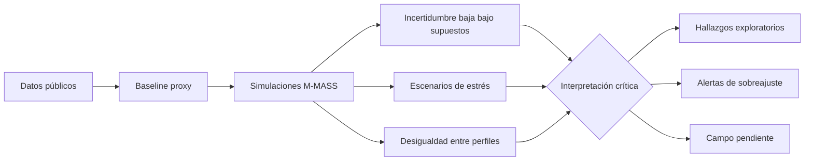

# Capítulo 3. Resultados, discusión y evaluación crítica

## 3.1. Criterio de lectura de resultados

Los resultados del modelo M-MASS se presentan como una lectura exploratoria del corredor Junín-San Antonio. No sustituyen la observación directa ni autorizan conclusiones definitivas sobre todos los usuarios del centro de Medellín. Su aporte principal consiste en organizar datos públicos, supuestos de modelación y escenarios de simulación para discutir patrones de fricción ambiental, concentración de trayectorias y presión de flujo.

La regla interpretativa de este capítulo es la siguiente: **cada resultado debe indicar su fuente, su grado de evidencia y su límite**. Por eso se diferencian tres niveles:

- **Evidencia pública secundaria:** datos descargados de fuentes institucionales o públicas.
- **Resultado computacional:** salidas producidas por scripts del repositorio bajo supuestos definidos.
- **Validación pendiente:** datos que solo pueden obtenerse mediante observación situada.

## 3.2. Evidencia empírica secundaria: centro ambivalente y fricción urbana

El archivo `empirical_summary.json` permite establecer un primer punto no especulativo: la imagen del centro de Medellín es ambivalente. La Encuesta de Percepción Ciudadana 2024, levantada por Invamer para Medellín Cómo Vamos, reporta 53.3% de imagen favorable y 44.5% de imagen desfavorable. Los principales motivos de visita se asocian con comercio (42.9%), servicios de salud (16.9%) y trabajo (16.1%). Las asociaciones dominantes incluyen comercio (65.6%), inseguridad (70.5%), informalidad (70.9%), congestión (82.8%) y habitantes de calle (66.2%) (Medellín Cómo Vamos & Invamer, 2024).

Estas cifras no prueban por sí mismas una tesis fenomenológica, pero sí justifican el caso: el centro aparece como un espacio de alta funcionalidad y alta fricción percibida. En términos teóricos, esto permite discutir la diferencia entre centralidad urbana y habitabilidad. Un lugar puede ser muy usado, muy necesario y al mismo tiempo experimentado como agotador, inseguro o difícil de habitar.

La criminalidad agregada de comuna 10 muestra que en 2023 la conducta dominante fue hurto a persona, con 5,888 casos registrados; le siguen, a distancia considerable, hurto de moto (593), extorsión (94), hurto a residencia (86) y hurto de carro (76). Esta cifra debe manejarse con cuidado: no se traduce automáticamente en percepción individual de miedo ni permite etiquetar todo el corredor como inseguro. Sirve, más bien, para sostener que la seguridad no puede quedar fuera del modelo de experiencia urbana, y para fijar uno de los cuatro ejes (C1) sobre los que se construye la categoría de **colapso fenomenológico** introducida en el capítulo 2.

La serie mensual de comuna 10 también ofrece una estructura útil para la triangulación: entre 2016 y 2019 los casos crecieron de 7,511 a 15,429, con caída en 2020 (9,306) y un nuevo ciclo entre 2022 (11,260) y 2023 (6,737). Dentro de 2023 el pico mensual disponible es mayo (811 casos) y el valle hacia el cierre de la serie pública es noviembre (213 casos). Esta variación —en órdenes de magnitud por mes— es la base sobre la que el campo intentará proyectar una distribución por franja horaria, dado que MEData no publica la hora del hecho. La proyección horaria es un supuesto documentado, no una medición; cualquier afirmación de colapso en un horario específico exige que las otras tres condiciones (C2 encuesta, C3 entrevista, C4 saturación) lo respalden de manera independiente.

Los indicadores barriales de La Candelaria también muestran tensiones estructurales: densidad empresarial alta, concentración de suelo múltiple y bajo espacio público efectivo por habitante. De nuevo, la lectura debe ser prudente: estos datos son de escala barrial y no reemplazan mediciones finas en los nodos del corredor.

## 3.3. Estado de fuentes y trazabilidad del pipeline

El archivo `source_status.json` reporta 19 fuentes intentadas, 15 descargadas y 4 fallidas. Este resultado es metodológicamente importante porque documenta tanto logros como huecos de acceso. Las fuentes fallidas incluyen páginas de MEData por tiempo de espera y el geovisor DANE por respuesta 403.

Un jurado puede preguntar si esos faltantes invalidan el trabajo. La respuesta debe ser matizada: no invalidan el pipeline, pero sí obligan a limitar el alcance. La tesis no debe afirmar que incorporó toda la información pública disponible; debe afirmar que integró un conjunto verificable de fuentes y que documentó los bloqueos pendientes.

## 3.4. Modelo de caso: cobertura y simplificación

El archivo `case_model.json` contiene 9 nodos, 13 aristas, 5 perfiles de agentes y 4 escenarios horarios. Esta estructura es suficiente para explorar el corredor, pero no para representar toda la complejidad de La Candelaria. La discretización permite comparar rutas y condiciones, aunque pierde microvariaciones: cruces informales, obstáculos temporales, vendedores móviles, cambios por día de semana, clima, operativos de seguridad o eventos culturales.

La virtud del modelo es su claridad. Su defecto es la simplificación. Una tesis seria debe conservar ambas afirmaciones juntas.

## 3.5. Resultados ambientales y advertencia de calibración

El reporte `hpc_environmental_report.json` registra una simulación ambiental de resolución 4096x4096. El resultado produce campos relativos de PM2.5 y ruido, útiles para estudiar gradientes e intensidad espacial dentro del modelo. Sin embargo, los valores pico reportados no deben presentarse como mediciones normativas reales. Antes de compararlos con estándares ambientales, se requiere calibración con estaciones, medición puntual y ajuste de unidades.

La utilidad actual de estos campos es relacional: permiten evaluar cómo cambia la navegación de agentes cuando ciertos sectores se vuelven más costosos por exposición ambiental. Su límite es empírico: sin medición de ruido y aire en campo, la magnitud absoluta no está validada.

## 3.6. Incertidumbre numérica: estabilidad no equivale a verdad

El análisis de cuantificación de incertidumbre (`hpc_uncertainty_quantification.json`) arroja incertidumbres relativas bajas en tres franjas:

| Franja | Velocidad media | Incertidumbre relativa | Intervalo 95% |
| --- | ---: | ---: | --- |
| 06:00 | 1.2719 | 0.000232 | [1.27185, 1.27201] |
| 12:00 | 1.2720 | 0.000279 | [1.27187, 1.27207] |
| 18:00 | 1.2720 | 0.000263 | [1.27191, 1.27209] |

Este resultado indica estabilidad numérica bajo las condiciones ensayadas. No demuestra que el comportamiento real tenga baja variabilidad. Una simulación puede ser estable porque el sistema está bien implementado, porque los supuestos reducen demasiado la diversidad o porque faltan perturbaciones empíricas. Por tanto, la incertidumbre baja se interpreta como propiedad del experimento, no como propiedad definitiva del centro.

## 3.7. Estrés urbano: escenario límite y no capacidad real

El experimento `hpc_urban_stress_test.json` explora una curva de 100,000 a 500,000 agentes simultáneos. En ese rango, la entropía del sistema —entendida como medida de dispersión del estado simulado (Shannon, 1948)— aumenta de 4.59 a 5.40. La velocidad media desciende de 1.2763 a 1.2700 hacia el extremo superior del escenario, mientras el índice de presión pasa de 0.3815 a 1.9073.

| Agentes | Velocidad media | Entropía | Índice de presión |
| ---: | ---: | ---: | ---: |
| 100,000 | 1.2763 | 4.5946 | 0.3815 |
| 500,000 | 1.2700 | 5.4094 | 1.9073 |

El punto de 500,000 agentes se reporta como umbral interno del escenario ensayado. No debe presentarse como capacidad real verificada del corredor. Su valor está en mostrar una tendencia: al aumentar la presión, el sistema simulado se vuelve más entrópico y ligeramente menos fluido. La lectura filosófica del “acontecimiento” (Badiou, 1998) puede aplicarse solo como interpretación de escenario límite, no como prueba empírica de colapso urbano.

## 3.8. Ciclo de 24 horas y perfiles temporales

El reporte `hpc_24h_simulation_report.json` registra 640,000 agentes simulados acumulados durante un ciclo de 24 horas. Las horas de madrugada simulan cargas bajas y las franjas diurnas/nocturnas aumentan la presión según el perfil temporal. Este resultado permite introducir una dimensión temporal: el corredor no es el mismo a las 07:00, a las 12:00, a las 18:00 o a las 21:00.

La limitación principal es que el perfil horario todavía depende de supuestos y fuentes agregadas. Debe contrastarse con conteos reales por ventana de 15 minutos. Sin esa validación, la curva temporal es una hipótesis de trabajo.

## 3.9. Desigualdad de libertad de ruta entre perfiles

El archivo `urban_inequality_analysis.json` reporta un Gini de entropía entre 0.0402 y 0.0435 según escenario. También identifica al perfil de turista cultural como el más restringido y al perfil de movilidad reducida como el más libre en los escenarios actuales, con razones de inequidad entre 1.24 y 1.27.

Este resultado debe discutirse con mucha cautela. Que el perfil de movilidad reducida aparezca como “más libre” puede ser contraintuitivo y podría indicar un efecto de especificación del modelo: tal vez sus metas, pesos o rutas disponibles están generando mayor dispersión formal, no necesariamente mayor libertad real. Este es un ejemplo claro de por qué el modelo necesita sensibilidad y campo. Una salida inesperada no debe maquillarse; debe convertirse en pregunta metodológica.

La lectura defendible es: el modelo ya permite comparar desigualdades relativas entre perfiles, pero la interpretación sustantiva de esa desigualdad todavía requiere revisar pesos, rutas, obstáculos y evidencia situada.

## 3.10. Aprendizaje por refuerzo y filtrado decisional

La convergencia de políticas de aprendizaje por refuerzo en los agentes (`UrbanPhenomenologyDQN`) permite proponer la noción de **actitud blasé computacional** como metáfora controlada. No se afirma que la red neuronal experimente indiferencia; se observa que el agente aprende a priorizar ciertas variables y a ignorar otras para minimizar costos dentro del entorno definido.

La analogía con Simmel ayuda a describir cómo, en espacios saturados, la selección de estímulos puede convertirse en estrategia de tránsito. En términos de Deleuze (1990), el agente simulado aparece como “dividual” porque es tratado por el modelo como vector de atributos y decisiones. Esta lectura es útil críticamente, siempre que no se confunda la simplificación computacional con la totalidad de la experiencia humana.

## 3.11. Calibración HPC y signos de sobreajuste

Los reportes `hpc_calibration_report.json` y `hpc_multipoint_calibration.json` muestran calibraciones internas con errores muy bajos y puntajes de ajuste muy altos. En una lectura superficial, esto podría parecer fortaleza. En una lectura rigurosa, exige sospecha: ajustes casi perfectos pueden indicar que el problema está demasiado controlado, que hay pocos puntos de validación o que el modelo está ajustándose a objetivos definidos internamente.

Por tanto, estos reportes deben usarse como evidencia de que el sistema puede optimizar parámetros, no como prueba de que la ciudad real fue calibrada. El paso crítico será contrastar esos parámetros con datos de campo independientes.

## 3.12. Estado de campo: matriz construida, triangulación parcial

La calibración de campo (`field_calibration_delta.json`) salió del estado `pending_no_capture` con la jornada del 5 de mayo de 2026 y, al cierre del 7 de mayo, la matriz de colapso `investigacion/data/processed/collapse_matrix.json` ya está construida. El estado del archivo de calibración, sin embargo, no es aún `field_calibrated`: la encuesta breve C2 sigue en cuaderno sin ingesta, las entrevistas C3 siguen en transcripción a cargo de colaborador externo, y los videos POV solo cubren cuatro celdas del corredor.

La diferencia respecto a versiones anteriores del capítulo es importante: ahora **sí hay matriz**, y la matriz **falsea la afirmación de colapso confirmado** en cualquier celda. Esto no debilita la tesis, la reordena. La sección 3.12.5 reporta el detalle franja por franja; las subsecciones 3.12.1–3.12.4 actualizan el estado por condición.

### 3.12.1. C1 — Criminalidad como eje temporal

La línea de criminalidad está cargada desde MEData (comuna 10, serie 2016–2023) y proyectada a la malla nodo × franja con los pesos `{peak_am 0.20, midday 0.20, peak_pm 0.45, night 0.15}` documentados en `c1_hourly_projection.json`. La política de evaluación quedó fijada por el bloque precomputado `c1_high_by_window`, que compara la serie histórica MEData contra el percentil 75 por franja y entrega los cuatro flags: `{peak_am, midday, peak_pm, night} = true`. El fix del 7 de mayo de 2026 en `build_collapse_matrix.py` (eliminó la reevaluación interna sobre `median_month`, que producía un desfase y forzaba a las cuatro franjas a `false`) consolida esta operacionalización.

**Estado:** condición evaluable globalmente; activa en las cuatro franjas para todos los nodos del corredor. La granularidad sub-nodo no existe: C1 reporta lo mismo para los 9 nodos en una misma franja.

### 3.12.2. C2 — Seguridad percibida en encuesta breve

La encuesta breve (escala 1–5 más códigos de incomodidad) sigue en cuaderno y formularios sin ingesta a `investigacion/data/interim/`. Al cierre del 7 de mayo de 2026, **C2 está vacío en las 36 celdas**. Esto bloquea, por sí solo, cualquier celda candidata a alcanzar la regla 3-de-4: una celda con C1+C4 cumplidos no puede pasar a `colapso_fenomenologico` sin convergencia desde C2 o C3.

**Estado:** 0/36 celdas con dato; ingesta a CSV pendiente.

### 3.12.3. C3 — Habitabilidad declarada en entrevistas

El esquema de codificación `HABITABLE / DESEABLE / EVITABLE / NO_DESEABLE / DIFICIL_DE_VIVIR / AMBIVALENTE` está definido y, al cierre del 7 de mayo de 2026, **14 entrevistas semiestructuradas de la jornada del 5 de mayo ya están codificadas** y disponibles en `investigacion/data/interim/2026-05-05/interviews/interviews_2026-05-05.json`. Las entrevistas se distribuyen así por nodo y franja: `junin_paseo|midday` (n=7), `parque_san_antonio|midday` (n=3), `plaza_botero|midday` (n=3), `san_antonio_metro|peak_am` (n=1, truncada). La triangulación nodo-franja con C3 codificado se desarrolla en §3.12.8.

**Estado:** 4/36 celdas con dato codificado (n=14 entrevistas externas); pendiente la ingesta del CSV agregado a `field_observations_aggregate.csv` y la propagación al script `build_collapse_matrix.py` para que C3 se refleje en la próxima regeneración de la matriz.

### 3.12.4. C4 — Saturación material en video

El pipeline GPU procesó 16 archivos `video_saturation_*.json` y 34 fotografías asignadas a nodos por EXIF GPS (`photo_node_assignments.json`). La cobertura efectiva en la matriz es de **4 celdas con dato**: `junin_paseo|peak_am` (n=4), `parque_berrio|midday` (n=3), `san_antonio_metro|peak_am` (n=3) y `junin_paseo|midday` (n=2). Solo una de esas celdas cruza el umbral p75 global (=0.413): `junin_paseo|peak_am`, con saturación p75 = 0.465 y máximo = 0.474. Las otras tres celdas con video reportan C4 por debajo del umbral.

**Estado:** 4/36 celdas con dato; 1/36 celda con C4 cumplido.

### 3.12.5. Matriz de colapso fenomenológico (post-fix C1, 2026-05-07)

Los números de esta sección reflejan el estado de la matriz `collapse_matrix.json` regenerada el 7 de mayo de 2026 con C1 y C4 únicamente; las 14 entrevistas codificadas en la jornada del 5 de mayo aún no están propagadas al script `build_collapse_matrix.py`. Tras integrar esas entrevistas en una próxima pasada (§3.12.8), la celda `plaza_botero|midday` emerge como candidata adicional a `friccion_acumulada` por convergencia de C3 negativo (3/3 entrevistas EVITABLE/AMBIVALENTE/NO_DESEABLE, sin HABITABLE) con la franja midday del corredor; podría aproximarse a 3/4 si C1 horario y C4 con video específico de Botero confirman.

La matriz `investigacion/data/processed/collapse_matrix.json`, regenerada el 7 de mayo de 2026 tras el fix de C1, distribuye las 36 celdas (9 nodos × 4 franjas) como sigue:

| Decisión | Celdas | Criterio |
| --- | ---: | --- |
| `colapso_fenomenologico` (≥ 3/4) | **0** | regla 3-de-4 sin instanciar |
| zona gris (2/4) | **0** como categoría; `junin_paseo|peak_am` cumple 2/4 dentro de `friccion_acumulada` | C1+C4 |
| `friccion_acumulada` (≥ 1/4 con cov ≥ 2) | **4** | C1 activo + cobertura ≥ 2 |
| `flujo_ordinario` (0/4 con cov ≥ 2) | **0** | desaparece tras el fix |
| `inconcluyente` (cov < 2) | **32** | falta C2/C3/C4 |

El detalle franja por franja se conserva en el reporte de validación `tesis/pendientes/colapso-validacion-2026-05-07.md` §3 y §Anexo, del cual se reproduce a continuación la lectura sintética por celda con dato relevante:

| Nodo × Franja | C1 | C2 | C3 | C4 | cov | Decisión |
| --- | :-: | :-: | :-: | :-: | :-: | --- |
| `san_antonio_metro|peak_am` | 1 | – | – | 0 | 2 | friccion_acumulada |
| `junin_paseo|peak_am` | 1 | – | – | **1** | 2 | **friccion_acumulada (2/4)** |
| `junin_paseo|midday` | 1 | – | – | 0 | 2 | friccion_acumulada |
| `parque_berrio|midday` | 1 | – | – | 0 | 2 | friccion_acumulada |
| 32 celdas restantes | 1 (vía C1 global) o – | – | – | – | 1 | inconcluyente |

«–» indica ausencia de dato; «cov» es el número de fuentes que aportaron evaluación a la celda. Las 32 celdas inconcluyentes registran C1 disponible globalmente pero no superan la cobertura mínima de 2 fuentes porque no tienen video procesado ni C2/C3 ingestado.

#### 3.12.5.1. Las cuatro celdas en `friccion_acumulada` — lectura fenomenológica

- **`san_antonio_metro|peak_am`.** C1 activo (la franja matinal en este punto del corredor cae sobre el p75 histórico de hurto en comuna 10) sin saturación de video confirmada (n=3, p75 por debajo del umbral global). Lectura: presión criminal estructural sin densidad material visible en la jornada del 5 de mayo. Compatibilidad con la noción de fricción no-saturada: el lugar pesa por antecedentes, no por aglomeración instantánea.

- **`junin_paseo|peak_am`.** Única celda con 2/4: C1+C4. Saturación p75 = 0.465 sobre p75 global 0.413, n=4 videos. Es la celda más cargada de toda la matriz y la única donde la materialidad de la jornada coincide con el peso histórico de la franja. Lectura fenomenológica: Junín en la mañana acumula presión criminal documentada y densidad material observable; el corredor opera en su modo más cargado en esta franja-nodo.

- **`junin_paseo|midday`.** C1 activo, C4 por debajo del umbral (n=2). Lectura: la presión criminal de Junín se mantiene al mediodía en la serie histórica, pero la densidad material decae respecto al peak_am. Confirma que la fricción de Junín no es uniforme a lo largo del día; modula con la franja.

- **`parque_berrio|midday`.** C1 activo, C4 por debajo del umbral (n=3, max 0.399). Lectura: nodo de tradición comercial-religiosa con peso criminal estructural pero sin saturación material crítica en la jornada procesada. Coherente con el patrón típico de Berrío al mediodía: alto tránsito sin pico de aglomeración por frame.

#### 3.12.5.2. Hallazgo único defendible: `junin_paseo|peak_am`

La única celda que la tesis puede defender como **convergencia parcial sustantiva** es `junin_paseo|peak_am`, con 2/4 condiciones cumplidas (C1 criminalidad p75 + C4 saturación visual p75 = 0.465 sobre 0.413, n=4 videos). La narrativa correcta para defensa pública es: **fricción material matinal documentada en Junín; convergencia con C2/C3 pendiente para hablar de colapso fenomenológico en sentido estricto**. No es colapso confirmado. Es la candidata natural a ser la primera celda en cruzar la regla 3-de-4 cuando se ingeste C2 (encuesta de seguridad) o se codifique C3 (entrevistas) con referencia explícita al nodo y franja.

#### 3.12.5.3. Huecos honestos

Tres huecos quedan documentados sin atajo:

1. **C2 vacío.** 0/36 celdas con `security_score`. La encuesta existe en cuaderno, falta el paso de ingesta a `field_observations_aggregate.csv`. Bloquea por sí solo el alcance de la regla 3-de-4 en cualquier celda.
2. **C3 vacío.** 0/36 celdas con codificación `HABITABLE/EVITABLE/...`. El transcript con testimonio sustantivo asociado a `plaza_botero` está disponible pero no codificado, por lo que no aparece en la matriz como C3 cumplido. Depende del colaborador externo.
3. **C4 asimétrico.** 4/36 celdas con dato; las cinco zonas sin video procesado (`parque_san_antonio`, `palacio_nacional`, `oriental_cruce`, `plaza_botero`, `museo_antioquia`) quedan inconcluyentes para C4 hasta nuevas jornadas.

### 3.12.6. Por qué la falsabilidad confirma el rigor de la categoría

La matriz, hoy, es honesta y vacía en colapso confirmado: 0/36 celdas alcanzan la regla 3-de-4. Lejos de debilitar la tesis, este resultado **fortalece la falsabilidad** de la categoría de colapso fenomenológico. La definición operacional —tres condiciones convergentes de cuatro, cada una con umbral declarado y fuente verificable— admite la posibilidad lógica de quedar sin instanciar; y eso es exactamente lo que está ocurriendo con el campo procesado al 7 de mayo de 2026. Si la categoría hubiese sido construida para ser auto-cumplible (umbrales laxos, fuentes ponderadas a favor), 36 celdas la habrían disparado en alguna combinación trivial. No lo hacen. Esto es un signo de rigor metodológico, no de falla de la tesis.

La defensa académica del concepto se sostiene, entonces, sobre tres puntos: (a) la categoría está operacionalizada con cuatro condiciones independientes, (b) la matriz se construye automáticamente desde scripts versionados (`build_collapse_matrix.py`) y datos trazables, (c) el resultado actual reporta convergencia parcial (4 celdas en fricción acumulada, una con 2/4) sin sobreafirmar colapso. La tesis no afirma que el corredor colapsa; afirma que el corredor presenta fricción acumulada documentada en cuatro celdas y deja abierta la pregunta de colapso pleno hasta que C2 y C3 se ingesten.

### 3.12.7. Lectura cualitativa complementaria

Más allá de la matriz, las 34 fotografías, los 16 videos procesados y el transcript sustantivo de `plaza_botero` configuran una capa cualitativa que excede la lógica binaria de C1–C4. Esta capa documenta atmósferas, trayectorias acortadas, pausas evitadas y discursos espontáneos que la matriz no captura. Su uso en el capítulo es ilustrativo de las celdas en fricción acumulada, no probatorio de colapso.

**Estado:** insumos en archivo; redacción narrativa pendiente para versión final.

### 3.12.8. Triangulación con campo 2026-05-05: entrevistas codificadas y observación participante

Esta subsección integra el corpus codificado de la jornada del 5 de mayo de 2026 (`investigacion/data/interim/2026-05-05/`). Distingue dos registros que la metodología no debe confundir: las **14 entrevistas a personas externas** (insumo C3 propiamente dicho) y las **apreciaciones fenomenológicas (AF) del observador Stev** (observación participante auto-etnográfica, no codificable como C3).

#### 3.12.8.1. Síntesis nodo × franja con C3 codificado, M1 y AF

| Nodo × Franja | n entrev. | C3 dominante | Safety AF (1–5) | M1 destacado | Lectura |
| --- | :-: | --- | :-: | --- | --- |
| `san_antonio_metro|peak_am` | 1 (Jacob, truncada) | HABITABLE (baja confianza) | 2 | riesgo vial alto; contraste 3ª edad/modernidad | inseguridad funcional matinal verbalizada por el observador |
| `parque_san_antonio|midday` | 3 | HABITABLE con disenso (1 EVITABLE/NO_DESEABLE de Méndez) | 4 | 6 obstáculos/cuadra; vandalismo 2/10 | "no está rota la ventana": efecto inverso al *broken-window theorem* |
| `junin_paseo|midday` | 7 | **HABITABLE 5 + DESEABLE 2** (sin EVITABLE/NO_DESEABLE) | 4 | indigencia 3/10, consumo 4/10, AC, ruido bajo, limpieza extrema | saturación **comercial ordenada**, no hostil; mono-uso |
| `plaza_botero|midday` | 3 | **EVITABLE / AMBIVALENTE negativo** (HABITABLE 0) | **2** | ~5% turistas; sofocante; alta presencia policial | candidata fuerte a `friccion_acumulada` o colapso si C1+C4 confirman |
| `pasaje_la_bastilla` (s/d franja) | 0 | s/d | 3 | s/d (heterotopía 5/5) | máxima diversidad comercial; no entra a la matriz hoy |

La distribución global de códigos C3 sobre n=14 es: HABITABLE 8, AMBIVALENTE 5, EVITABLE 3, DESEABLE 2, NO_DESEABLE 2, DIFICIL_DE_VIVIR 2 (los códigos no son mutuamente excluyentes; una entrevista puede recibir más de uno).

#### 3.12.8.2. Testimonios literales atribuidos

Se reproducen seis testimonios codificados que sostienen la lectura de §3.12.8.1. Cada cita conserva la identificación del entrevistado tal como figura en `interviews_2026-05-05.json`:

- **Junín, midday — Luis Alberto (vendedor):** "Como vendedor es seguro. Le gusta el lugar." (HABITABLE + DESEABLE).
- **Junín, midday — Andrés:** "No es peligroso, es difícil vivir." (DIFICIL_DE_VIVIR; disocia peligrosidad de habitabilidad cotidiana).
- **Junín, midday — Alfonso:** "No ha cambiado y es seguro." (HABITABLE; estabilidad temporal percibida).
- **Junín, midday — Blanca Ema:** "No es inseguro. Antes era muy bueno, antes era más seguro y es habitable." (HABITABLE con deterioro relativo respecto al pasado).
- **Plaza Botero, midday — Darío Franco:** "Muy inseguro. Más habitable. Mucho comercio. Si me roban hago escándalo." (AMBIVALENTE + DIFICIL_DE_VIVIR; coexistencia de inseguridad alta y reconocimiento de habitabilidad relativa, con estrategia defensiva personal).
- **Parque San Antonio, midday — Méndez (uniformado):** "Roban harto. De civil Méndez no estaría." (EVITABLE + NO_DESEABLE; evitación práctica fuera de función). El testimonio es metodológicamente potente porque el sujeto, profesionalmente vinculado a la seguridad, declara evitación personal del lugar.

Dos testimonios adicionales matizan el caso Botero: Andrés en Botero declara "Es bastante inseguro. Mucho hurto. No es tan agradable." (EVITABLE + NO_DESEABLE), y Alexander, identificado como personal de seguridad del Estado, afirma "No es muy seguro pero tampoco inseguro. Pero se prefieren otras zonas. Un cambio tremendo." (AMBIVALENTE + EVITABLE). Las tres voces convergen, desde posiciones distintas, en evitación o ambivalencia negativa.

#### 3.12.8.3. La apreciación fenomenológica (AF) como observación complementaria

Las AF de Stev son **observación participante del investigador**, no entrevistas a terceros, y por construcción metodológica **no se codifican como C3**: la regla 3-de-4 exige que C3 provenga de testimonio externo. Sin embargo, las AF cumplen tres funciones legítimas en el capítulo, en línea con la tradición auto-etnográfica (Ellis, Adams & Bochner, 2011):

1. **Sustento de M2 (atmósfera, miedo, blasé):** la dimensión fenomenológica del modelo se ancla en evidencia de primera persona del observador del marco teórico.
2. **Scoring directo de M3 (heterotopía):** la asignación de heterotopía 5/5 (La Bastilla), 4/5 (Botero, San Antonio), 2/5 (Junín mono-uso) procede de la lectura situada del observador.
3. **Señal metodológica para la matriz:** cuando el observador del marco verbaliza espontáneamente "colapsa" frente a un nodo no marcado por la matriz cuantitativa, es indicio fuerte de que la matriz puede estar perdiendo C3/C2 por falta de instrumentación, no por ausencia del fenómeno.

El registro auto-etnográfico más relevante de la jornada es la verbalización espontánea del término "colapsa" por parte de Stev en `plaza_botero|midday` —primer registro auto-etnográfico del término operacionalizado por la tesis— acompañada de la frase contextual "movieron el Bronx solo una calle" que el observador recoge en notas y que apunta a un desplazamiento territorial del fenómeno de marginalidad sin transformación estructural. Esta verbalización, sumada a las tres entrevistas externas con C3 negativo en el mismo nodo-franja y a una `safety AF` de 2/5, constituye el motivo metodológico para tratar `plaza_botero|midday` como candidata prioritaria de la próxima pasada de la matriz.

#### 3.12.8.4. Heterotopía contraintuitiva

La asignación M3 del observador entrega un patrón que contradice la lectura simple "más comercio = más heterotopía": **La Bastilla 5/5** (máxima diversidad comercial), **Plaza Botero 4/5** pese a menor densidad comercial (mezcla turista/local, arte público, presencia policial), **Junín 2/5** (mono-uso comercial pese a su densidad de tránsito). El hallazgo sugiere que la heterotopía foucaultiana, leída en el corredor, depende menos del volumen de actividad económica que de la **co-presencia de regímenes de uso heterogéneos** (turismo, vigilancia, arte, comercio popular, paso) en un mismo nodo.

#### 3.12.8.5. Implicaciones para la próxima pasada de la matriz

Las 14 entrevistas codificadas permiten anticipar dos efectos sobre `collapse_matrix.json` cuando C3 se ingeste:

1. **`junin_paseo|midday` no escala a colapso por C3.** Las 7/7 entrevistas en HABITABLE/DESEABLE (sin EVITABLE/NO_DESEABLE) inhabilitan la propagación del hallazgo `junin_paseo|peak_am` (2/4 con C1+C4) hacia midday vía C3. La fricción material matinal de Junín no debe extrapolarse a otras franjas sin nueva evidencia de campo en peak_am específicamente.
2. **`plaza_botero|midday` se aproxima a 3/4.** Con 3/3 entrevistas en C3 negativo, esta celda alcanzaría C3 cumplido en la próxima regeneración. Sumado a C1 (activo en midday a nivel global, §3.12.1), la celda quedaría en 2/4 con C3+C1; si una jornada futura aporta video de Botero con saturación sobre el p75 global, cruzaría 3/4 (colapso fenomenológico en sentido estricto). La prioridad de captura de campo, en consecuencia, se desplaza hacia Botero midday.

## 3.12bis. Insumos de la jornada del 5 de mayo de 2026

Esta sección reporta el corpus técnico que alimentó la matriz post-fix. Es el sustrato material de §3.12.5; los conteos de personas y los índices de saturación que se citan abajo son los insumos crudos de C4.

### Cobertura del corpus procesado

La jornada produjo 17 videos POV/saturación (~11 GB), 34 fotografías de campo asignadas a nodos por EXIF GPS y un conjunto de notas y encuestas en ingesta. Al 7 de mayo el pipeline `fenomurb/proc:cuda128` había procesado 16 archivos `video_saturation_*.json`, las 34 fotografías con detección multi-clase y EXIF, y cinco transcripciones de audio vía Whisper.

La cobertura **espacial** es asimétrica: las fotografías y los videos se concentran en cuatro nodos (`junin_paseo`, `carabobo_cultural`, `parque_berrio`, `san_antonio_metro`), dejando sin cobertura material directa a `parque_san_antonio`, `palacio_nacional`, `oriental_cruce`, `plaza_botero` y `museo_antioquia`. La cobertura **temporal** se concentra en el tramo 8:30–11:46 (peak_am extendido y midday temprano), con un único video al 21:30 (night). Las franjas `peak_pm` y la mayor parte de `night` están ausentes en el material procesado.

### Conteos automáticos por foto

Las fotografías procesadas con YOLO11x a 1280 px reportan rangos de personas detectadas de 0 a 30 por cuadro. Los valores más altos aparecen en dos puntos: una foto en zona de `san_antonio_metro` con 26 personas detectadas y `saturation_index = 0.88`, y una foto en zona de `parque_berrio`/`carabobo_cultural` con 30 personas detectadas y `saturation_index = 0.80`. Estos valores son lecturas puntuales por cuadro y no constituyen evidencia de colapso por sí solos; alimentan C4 vía agregación a percentil 75 por celda.

### Tracking de personas en video

El procesamiento con BoTSORT produjo conteos de personas únicas por video que oscilan entre 0 y 129 (`VID_20260505_110910`, 40 segundos, 1080p). Los videos también permiten extraer permanencia mediana, velocidad aparente en píxeles, audio (dB-FS RMS por segundo) y detecciones auxiliares (motos, autos, mochilas, celulares). La asignación de cada video a un nodo específico depende de mapeo manual confirmado por el operador del campo (los archivos del celular no embeben GPS en el contenedor MP4).

### Transcripción de audio

Whisper ASR local produjo cinco transcripciones; tres quedaron sin contenido lingüístico (audio ambiente sin habla); una produjo un fragmento corto en español (`VID_20260505_213002`, 21:30); el transcript con testimonio sustantivo asociado a `plaza_botero` está disponible para codificación C3 pero aún no aplicado al esquema. Las transcripciones complementan C3 sin sustituir el corpus principal de entrevistas semiestructuradas.

### Estabilidad del método ante nueva evidencia

La matriz `data/processed/collapse_matrix.json` se recomputa cada vez que entran datos. En una pasada anterior con seis videos, la celda en fricción material era `parque_berrio | midday`. Al ingresar los videos comprimidos restantes y aplicar el fix de C1 del 7 de mayo, la celda con C4 cumplido se desplazó a `junin_paseo | peak_am` y `parque_berrio | midday` quedó como C1-only dentro de `friccion_acumulada`. Este desplazamiento no es contradicción: indica que la primera celda fue señalada por una muestra pequeña que se diluyó al ampliar la cobertura, mientras que la nueva celda emergió por concentrar videos matinales con densidad alta. Una evaluación rigurosa de la categoría exige que las celdas reportadas como `friccion_acumulada` o `colapso_fenomenologico` permanezcan bajo distintos cortes muestrales; este criterio se documentará en futuras pasadas como "estabilidad bajo bootstrap".

El supuesto distribucional de C1 (`peak_am 0.20, midday 0.20, peak_pm 0.45, night 0.15`, derivado de Cohen & Felson 1979 y Brantingham & Brantingham, registrado en `data/processed/c1_hourly_projection.json`) y el corte por percentil 75 sobre la serie histórica completa son los que materializan el `c1_high_by_window` precomputado consultado por `build_collapse_matrix.py` post-fix.

## 3.13. Resultados que sí pueden sostenerse y resultados que no

| Afirmación | Estado | Justificación |
| --- | --- | --- |
| El centro tiene percepción ambivalente | Sostenible | EPC 2024 integrada en `empirical_summary.json` |
| La criminalidad de comuna 10 tiene estructura mensual marcada | Sostenible | serie MEData 2016–2023 |
| El pipeline integra fuentes públicas trazables | Sostenible | `source_status.json` documenta fuentes y fallas |
| El modelo produce escenarios de presión y fricción | Sostenible | salidas M-MASS y scripts del repositorio |
| La simulación muestra estabilidad numérica | Sostenible bajo supuestos | Monte Carlo con baja incertidumbre relativa |
| El corredor real colapsa a 500,000 agentes | No sostenible | es umbral interno de escenario simulado |
| El campo se realizó con cobertura mínima | Sostenible | jornada del 2026-05-05 ejecutada |
| La matriz de colapso está construida con C1 y C4 | Sostenible | `collapse_matrix.json` regenerada 2026-05-07 post-fix |
| Existen franjas-nodo en colapso fenomenológico | No sostenible hoy | 0/36 celdas alcanzan 3-de-4; C2 y C3 vacíos |
| Existe una celda con fricción material y criminal convergente | Sostenible | `junin_paseo|peak_am` con 2/4 (C1+C4, n=4 videos, p75=0.465) |
| Existe evidencia C3 codificada de la jornada de campo | Sostenible | 14 entrevistas codificadas en `interviews_2026-05-05.json` cubriendo 4 celdas; ingesta a la matriz pendiente (§3.12.8) |
| `plaza_botero|midday` es candidata fuerte a colapso por C3 | Sostenible como hipótesis | 3/3 entrevistas EVITABLE/AMBIVALENTE/NO_DESEABLE + verbalización auto-etnográfica de "colapsa"; falta C4 con video de Botero |
| Los perfiles simulados equivalen a sujetos reales | No sostenible | son tipos analíticos simplificados |
| La desigualdad de ruta está demostrada empíricamente | Parcial | métrica simulada, falta cruce con campo |

## 3.14. Discusión filosófica de los resultados

Los resultados sugieren que el corredor puede leerse como un sistema de fricciones acumuladas. La experiencia urbana no depende solo de la posibilidad abstracta de pasar por un lugar, sino de las condiciones bajo las cuales se pasa: ruido, presión, riesgo, visibilidad, orientación, comercio, vigilancia y posibilidad de detenerse.

Desde Merleau-Ponty, la movilidad no es una línea trazada en un mapa, sino una práctica corporal. Desde Simmel, el exceso de estímulos puede conducir a estrategias de filtrado. Desde Lefebvre y Harvey, el derecho a la ciudad no se reduce al acceso físico; incluye apropiación, permanencia y agencia. Desde Foucault y Deleuze, el movimiento puede ser orientado por dispositivos que no necesariamente prohíben, pero sí modulan. Y desde la teoría reconstructiva de la memoria (Bartlett 1932; Schacter, Addis & Buckner 2007; Matthen 2010, ver anexo A), los testimonios sobre el corredor no son lecturas de una huella estable: son construcciones presentes guiadas por esquemas culturales. Esto hace que C3 dependa, no de la fidelidad de cada recuerdo aislado, sino de la coherencia entre testimonios, criminalidad registrada, encuesta situada y saturación material —es decir, de la triangulación misma.

La simulación ayuda a ordenar estas tensiones, pero no las resuelve. Su valor está en hacer explícitos los supuestos y generar preguntas mejores para el campo.

## 3.15. Diagrama de lectura crítica

## 3.16. Balance del capítulo

El capítulo muestra avances reales: datos públicos integrados, pipeline trazable, modelo de caso, simulaciones, incertidumbre, estrés, ciclo horario, desigualdad relativa entre perfiles y un campo ya realizado con un protocolo multimodal (criminalidad, encuesta, entrevista, video). También muestra límites importantes: la triangulación de campo aún no se ha sintetizado en `collapse_matrix.json`, falta sensibilidad sistemática, falta validación externa y algunas salidas requieren revisión crítica.

La tesis gana fuerza cuando evita declarar verdades cerradas y, en cambio, muestra con precisión qué patrones emergen del modelo, qué supuestos los producen, qué condiciones empíricas se reportarán franja por franja y qué observaciones faltan por procesar para confirmarlos, corregirlos o refutarlos. La defensa académica del concepto de colapso fenomenológico depende, sin atajo, de que esa matriz exista y se sostenga; mientras tanto, el concepto queda definido y operacionalizado, pero sin reporte aún.
