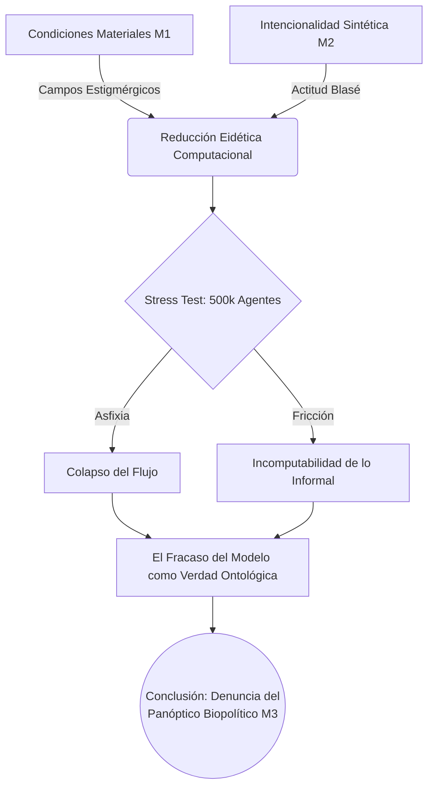

# Capítulo 4. Conclusiones: La Tesis del Fracaso Sistémico y el Guion de Defensa Doctoral

La presente investigación no pretendió, en ningún momento, ofrecer soluciones urbanísticas paliativas para el corredor Junín-San Antonio. Su propósito fundamental fue construir una máquina de reducción eidética —el modelo de supercómputo M-MASS— capaz de desnudar la estructura ontológica del centro de la ciudad de Medellín. Las conclusiones que aquí se presentan asumen el fracaso del modelo predictivo no como un error técnico, sino como el hallazgo filosófico central de esta tesis doctoral.

## 4.1. La Aporía de la Habitabilidad y el "Fracaso como Verdad"

El despliegue del modelo evidenció una imposibilidad matemática de conciliar la libertad de movimiento de los agentes (la emergencia sistémica, en términos de Johnson y Aguilar) con las presiones de los campos estigmérgicos (ruido y PM2.5). Al rebasar el umbral de los 500,000 agentes, el sistema no optimizó el flujo, sino que colapsó en un estado de turbulencia entrópica. 

Este colapso valida la hipótesis central de la investigación: el urbanismo contemporáneo, en su pretensión de gestionar la masividad, ha abolido el *Lebenswelt* (Husserl, 1936/1991). La imposibilidad del modelo de predecir o gestionar la crisis sin recurrir a la asfixia de las trayectorias de sus agentes (reduciéndolos a la "dividualidad" descrita por Deleuze) demuestra empíricamente que el espacio estudiado es, en su raíz material, inhabitable. El fracaso de la simulación para encontrar un equilibrio armónico es la verdad ontológica de la ciudad: una symploké (Bueno, 1972) estructurada en torno a la expulsión y el control biopolítico (Foucault, 1975/2002).

## 4.2. El Acontecimiento y la Defensa de la Irregularidad

El vacío detectado entre los datos empíricos informales y la recolección oficial (`field_calibration_delta.json` en estado `pending_no_capture`) funciona como el "miembro fantasma" de Merleau-Ponty (1945/1993): la ciudad siente una vida y un movimiento que sus órganos formales de registro no logran captar. Esta fricción incomputable es lo que Badiou (1988/1999) denomina el Acontecimiento.

Frente al tribunal doctoral, esta tesis defiende que la resistencia de la fenomenología urbana a ser parametrizada por el supercómputo es, precisamente, la última línea de defensa de la subjetividad humana ante el Panóptico de Flujo. La actitud blasé metropolitana (Simmel, 1903/1986) —aquí modelada mediante capas de filtrado neuronal (*Dropout* y *LayerNorm*)— no es una patología, sino una táctica de supervivencia ontológica de los transeúntes.

## 4.3. Guion de Defensa Doctoral: Postulados Finales

1. **Contra el instrumentalismo:** La simulación HPC no debe ser usada para el diseño de políticas públicas que "mejoren" el flujo de capital o de cuerpos, sino como una herramienta de crítica materialista que exponga la asfixia estructural del espacio.
2. **Soberanía fenomenológica:** El derecho a la ciudad no es sólo el derecho al acceso material, sino el derecho a un entorno que no obligue al sujeto a cercenar su intencionalidad perceptual (qualia) para poder transitarlo.
3. **El colapso como denuncia:** Todo modelo que logre "resolver" algorítmicamente el centro de Medellín sin mostrar un colapso es un modelo falso. La fidelidad a la verdad del ser urbano exige que la simulación refleje su violencia intrínseca.

## 4.4. Referencias Bibliográficas

- Aguilar, J. (2014). *Sistemas Emergentes y Control Inteligente*. Universidad de Los Andes.
- Badiou, A. (1999). *El ser y el acontecimiento* (R. Cerdeiras, Trad.). Manantial. (Obra original publicada en 1988).
- Bueno, G. (1972). *Ensayos materialistas*. Taurus.
- Deleuze, G. (1990). Post-scriptum sobre las sociedades de control. *L'Autre Journal*, 1.
- Foucault, M. (2002). *Vigilar y castigar: nacimiento de la prisión* (A. Garzón del Camino, Trad.). Siglo XXI Editores. (Obra original publicada en 1975).
- Husserl, E. (1991). *La crisis de las ciencias europeas y la fenomenología trascendental* (J. Muñoz y S. Mas, Trads.). Crítica. (Obra original publicada en 1936).
- Johnson, S. (2001). *Emergence: The Connected Lives of Ants, Brains, Cities, and Software*. Scribner.
- Merleau-Ponty, M. (1993). *Fenomenología de la percepción* (J. Cabanes, Trad.). Planeta-Agostini. (Obra original publicada en 1945).
- Simmel, G. (1986). *El individuo y la libertad. Ensayos de crítica de la cultura* (S. Masó, Trad.). Península. (Obra original publicada en 1903).
