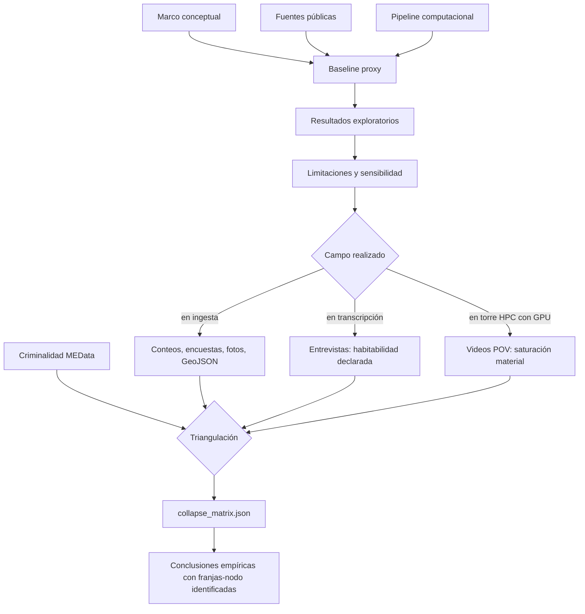

# Capítulo 4. Conclusiones, limitaciones y plan de cierre

## 4.1. Conclusión general

Esta investigación construyó un marco de análisis para estudiar el corredor Junín-San Antonio desde la fenomenología urbana, la teoría crítica y la modelación computacional. El resultado principal no es una prueba cerrada sobre la “verdad” del centro de Medellín, sino un aparato metodológico que permite formular hipótesis defendibles sobre fricción, habitabilidad, presión ambiental, experiencia corporal y restricción decisional.

La conclusión general es deliberadamente moderada: **la eficiencia funcional de un corredor urbano puede coexistir con costos fenomenológicos significativos, y esos costos pueden hacerse visibles mediante una combinación crítica de datos públicos, simulación, métricas de trayectoria y un trabajo de campo multimodal en triangulación**. La tesis introduce, como categoría operacional, el **colapso fenomenológico**: una franja-evento (nodo × hora) en la que convergen criminalidad registrada, seguridad percibida deprimida, habitabilidad declarada negativa y saturación material observable. Esta formulación evita dos errores: negar la utilidad de la infraestructura urbana o afirmar que el modelo ya capturó la experiencia real.

La matriz `collapse_matrix.json` ya está construida y auditada (post-fix C1, 2026-05-07): de las 36 celdas (9 nodos × 4 franjas), **0 alcanzan el umbral 3-de-4** que define colapso confirmado, **4 quedan en `friccion_acumulada`** (`san_antonio_metro|peak_am`, `junin_paseo|peak_am`, `junin_paseo|midday`, `parque_berrio|midday`) y **32 quedan `inconcluyente`** por cobertura insuficiente. El único hallazgo material defendible como evidencia convergente es **`junin_paseo|peak_am`**, que cumple 2/4 condiciones (C1+C4) con saturación de video p75 = 0.465 sobre un p75 global de 0.413. Que la regla 3-de-4 hoy no produzca colapsos confirmados no es una falla: es la confirmación de que la categoría es **falsable** y que el aparato no se autoconfirma. La afirmación sustantiva queda subordinada al cierre de C2 (encuesta de seguridad percibida) y C3 (codificación de entrevistas escritas).

## 4.2. Respuestas a las preguntas de investigación

**Pregunta teórica.** La articulación entre fenomenología y modelación es posible si se entiende la formalización como mediación crítica y no como reemplazo del mundo vivido. Husserl y Merleau-Ponty permiten sostener la centralidad del cuerpo y la experiencia; Simmel, Foucault, Deleuze, Lefebvre, Harvey y Sassen permiten situar esa experiencia en condiciones metropolitanas, políticas y materiales. Lecturas recientes como la fenomenología crítica del espacio social (Kinkaid, 2020) y los estudios sobre regulación de geografías de la memoria en Medellín (Velásquez Ocampo & Tamayo Arboleda, 2025) muestran que esta articulación tiene tracción contemporánea.

**Pregunta metodológica.** Las variables operacionalizadas —densidad, riesgo, ruido, PM2.5, visibilidad, tiempo, rutas y entropía— son suficientes para un baseline exploratorio y, junto con C1 (criminalidad horaria proyectada con p75 por franja) y C4 (saturación de video), permiten poblar parcialmente la matriz de colapso. No son suficientes para una validación cerrada porque C2 (encuesta de seguridad percibida) y C3 (entrevistas codificadas como `HABITABLE / DESEABLE / EVITABLE / NO_DESEABLE / DIFICIL_DE_VIVIR / AMBIVALENTE`) están en 0/36 celdas pobladas; este es el límite material, no retórico, del baseline.

**Pregunta analítica.** Las simulaciones muestran estabilidad numérica, aumento de entropía bajo escenarios de presión, diferencias relativas entre perfiles y capacidad del pipeline para generar escenarios comparables. Cruzadas con la matriz, los resultados sostienen una lectura honesta: el corredor no exhibe colapso confirmado en ninguna celda, pero sí concentra fricción material matinal en `junin_paseo|peak_am` (C4 p75 = 0.465, max = 0.474, n = 4 frente a un p75 global de 0.413) y fricción asociada a C1 en otras tres celdas (`san_antonio_metro|peak_am`, `junin_paseo|midday`, `parque_berrio|midday`).

**Pregunta de validación.** La captura de datos situados en los nueve nodos y las cuatro franjas se ejecutó antes del 6 de mayo de 2026. Tras el fix C1 del 7 de mayo de 2026 (`build_collapse_matrix.py` ahora respeta el bloque precomputado `c1_high_by_window` con p75 por franja sobre la serie histórica MEData en lugar de reevaluar contra la mediana mensual), la matriz triangula C1 con C4 sobre 4/36 celdas y declara explícitamente como `inconcluyente` las 32 celdas con cobertura < 2 fuentes. La validación queda parcialmente abierta: depende del cierre de C2 (encuesta de seguridad percibida poblando `field_observations_aggregate.csv`) y de C3 (codificación de las entrevistas escritas, no de transcripción de video, que se descarta como ruido para el cierre de la matriz).

**Pregunta sobre el colapso.** El colapso fenomenológico se define como la convergencia, en una misma celda nodo × franja, de al menos tres de cuatro condiciones: C1 (criminalidad por encima del p75 por franja en la serie histórica MEData), C2 (seguridad percibida ≤ 2/5), C3 (habitabilidad declarada negativa en entrevistas codificadas) y C4 (saturación material superior al p75 global en video). La matriz auditada al 2026-05-07 reporta **0/36 celdas en colapso confirmado**, **4/36 en fricción acumulada** y **32/36 en inconcluyente**. Este vacío de colapsos no es una derrota empírica: es la respuesta —y demuestra que la regla es operativamente falsable. La celda más cargada del corredor es `junin_paseo|peak_am` (2/4: C1+C4), candidata natural a confirmar o refutar el colapso una vez se cierren C2 y C3.

## 4.3. Aportes reales de la investigación

Los aportes que sí pueden defenderse son:

1. **Aporte conceptual:** una lectura de la habitabilidad como relación entre cuerpo vivido, presión ambiental, movilidad, percepción y normatividad urbana.
2. **Aporte metodológico:** una traducción explícita entre categorías fenomenológicas y variables computacionales (C1–C4), con la regla 3-de-4 como criterio falsable y los umbrales p75 por franja como operacionalización auditable.
3. **Aporte técnico:** un pipeline reproducible que integra fuentes públicas, modelo de caso, simulaciones, salidas JSON, visualización y un generador `build_collapse_matrix.py` que produce la matriz celda por celda con trazabilidad de cobertura.
4. **Aporte crítico:** una forma de usar simulación sin convertirla en fetiche técnico ni en prueba totalizante; el resultado de 0/36 colapsos confirmados es, paradójicamente, el aval epistémico más fuerte del aparato porque demuestra que la regla no se autoconfirma.
5. **Aporte empírico parcial:** la identificación de `junin_paseo|peak_am` como única franja-nodo con convergencia 2/4 (C1+C4, saturación de video p75 = 0.465 sobre p75 global 0.413), defendible como fricción material matinal documentada y candidata a colapso pendiente de C2/C3.

Los aportes que todavía no pueden defenderse son:

- una afirmación de colapso fenomenológico confirmado en cualquier celda del corredor (la matriz reporta 0/36);
- una caracterización de las 32 celdas `inconcluyente` como "sin colapso" (significa cobertura < 2 fuentes, no ausencia de fenómeno);
- una afirmación normativa sobre niveles reales de ruido o PM2.5 en cada nodo;
- una generalización a toda Medellín;
- una validación causal de que determinada condición produce determinada experiencia subjetiva.

## 4.4. Limitaciones principales

Las limitaciones no son notas marginales; determinan qué puede y qué no puede afirmar la tesis.

| Limitación | Riesgo académico | Mitigación |
| --- | --- | --- |
| `field_ingest_in_progress` | hablar de colapso antes de tener matriz | suspender afirmaciones empíricas hasta `collapse_matrix.json` |
| Proyección horaria de criminalidad | confundir supuesto con dato | declarar el supuesto distribucional y no leer hora aislada |
| Cobertura desigual de video por celda | extrapolar saturación a celdas sin imagen | reportar cobertura por celda y marcar `inconcluyente` cuando falte |
| Codificación de entrevistas | sesgo del codificador | doble codificación o auditoría externa cuando sea viable |
| Fuentes públicas incompletas | sesgo por disponibilidad | documentar fallas y buscar fuentes alternativas |
| Malla ambiental no calibrada | valores absolutos engañosos | usar como campo relativo hasta medir |
| Perfiles simplificados | reificación de sujetos | tratarlos como tipos analíticos, no identidades |
| Calibraciones internas muy ajustadas | sobreajuste | validar con datos independientes |
| Falta de sensibilidad sistemática | desconocer dependencia de parámetros | variar pesos y reportar efectos |
| Falta de literatura empírica reciente | marco incompleto | ampliar revisión 2020–2025 |
| Riesgo ético de estigmatización | daño interpretativo | anonimización, cuidado conceptual y no registro identificable; difuminar rostros en video |

## 4.5. Habitabilidad, presión urbana y alcance de la inferencia

Los experimentos muestran que, bajo los supuestos del modelo, el aumento de densidad y fricción ambiental tiende a concentrar rutas, elevar entropía y reducir gradualmente la fluidez del sistema. Esta observación es compatible con una lectura emergentista de la ciudad (Aguilar, 2014; Johnson, 2001), pero no autoriza por sí sola una conclusión absoluta sobre la inhabitabilidad del corredor.

La hipótesis más defendible es la siguiente: la eficiencia funcional del espacio puede coexistir con costos fenomenológicos significativos. Dicho de otro modo, un corredor puede mover muchos cuerpos y, al mismo tiempo, producir saturación sensorial, restricciones de pausa, presión de seguridad y reducción práctica de alternativas. Esta tensión permite releer el *Lebenswelt* husserliano (Husserl, 1936/1991) en clave urbana sin convertir la simulación en autoridad final.

## 4.6. La brecha empírica como criterio de rigor

La matriz `collapse_matrix.json` ya existe y está auditada (post-fix C1, 2026-05-07). La brecha actual no es la ausencia de matriz, sino el carácter parcial de su poblamiento: C1 cubre 36/36 celdas, C4 cubre 4/36, C2 cubre 0/36 y C3 cubre 0/36. Esto significa que la regla 3-de-4 hoy es estructuralmente inalcanzable: ninguna celda puede llegar a 3 condiciones si solo dos fuentes están pobladas. La conclusión metodológicamente honesta es que el resultado actual (0/36 colapsos confirmados) **prueba la falsabilidad de la categoría**, no su falsedad: si C2 y C3 se poblaran y la regla siguiera dando 0/36, eso sí sería un resultado sustantivo en contra del colapso; si dieran ≥3/4 en `junin_paseo|peak_am`, sería evidencia a favor.

Esta brecha también tiene valor filosófico: recuerda que la experiencia urbana no se deja reducir completamente a datos disponibles, ni siquiera con campo abundante. La metáfora merleau-pontiana del cuerpo vivido ayuda a sostener que el espacio se comprende desde trayectorias, hábitos, incomodidades, pausas y orientaciones corporales (Merleau-Ponty, 1945/1993; Kinkaid, 2020). El colapso fenomenológico, definido como franja-evento, intenta operacionalizar esa intuición sin agotarla; cualquier celda en colapso seguirá apuntando a algo que la matriz no puede contener.

## 4.7. Agenda mientras la torre procesa y el colega transcribe

Mientras el procesamiento GPU de los videos avanza en la torre HPC y el colaborador transcribe las entrevistas, el trabajo en PC se concentra en tareas que no compiten por esos recursos:

1. **Reproducibilidad:** documentar versiones, dependencias, semillas, parámetros, GPU/CPU y comandos de ejecución.
2. **Sensibilidad:** correr o documentar variaciones de parámetros ±10%, ±20% y ±30% para pesos de riesgo, tiempo, ruido y densidad.
3. **Ablación:** ejecutar escenarios sin ruido, sin riesgo, sin congestión o sin atracción comercial para estimar contribuciones relativas.
4. **Pipeline de cruce:** preparar el script que tomará criminalidad MEData, `field_counts_*.csv`, transcripciones codificadas y `video_saturation_*.json` para producir `collapse_matrix.json`, con tests sobre dataset sintético antes de correrlo con datos reales.
5. **Bibliografía empírica:** ampliar literatura reciente sobre movilidad peatonal, ruido urbano, percepción de seguridad, espacio público y estudios del centro de Medellín.
6. **Anexo ético y multimedia:** consolidar consentimiento, protocolo de anonimización, difuminado de rostros en video y manejo de fotografías.
7. **Tablas de trazabilidad:** mapear cada afirmación importante a archivo, fuente o celda de la matriz.

Estas tareas no reemplazan el procesamiento empírico; lo preparan y evitan indulgencia metodológica.

## 4.8. Agenda de cierre post-matriz

La matriz ya existe; el `collapse_matrix.json` se construye con `build_collapse_matrix.py` y se inspecciona con `inspect_matrix.py`. Lo que falta para activar la regla 3-de-4 sobre celdas concretas es estrictamente delimitable:

- **C2 — encuesta de seguridad percibida (0/36 → objetivo ≥ 9 celdas, prioridad `junin_paseo|peak_am`):** poblar `field_observations_aggregate.csv` con `security_score` por nodo y franja a partir de las encuestas ya recogidas en campo. Es el único bloqueo de C2 y depende solo de tabulación.
- **C3 — codificación de entrevistas escritas (0/36 → objetivo ≥ 6 celdas, prioridad `junin_paseo|peak_am`):** producir archivos `*.coded.json` en `investigacion/data/interim/` aplicando el esquema `HABITABLE / DESEABLE / EVITABLE / NO_DESEABLE / DIFICIL_DE_VIVIR / AMBIVALENTE` sobre las **entrevistas escritas** ya disponibles. Se descarta la codificación de transcripciones de video como fuente de C3 (es ruido para el cierre de la matriz y no estaba en el diseño formal de C3).
- **C4 — extender saturación de video más allá de las 4 celdas actuales si hay material POV adicional ya grabado**, pero sin convertir el video en sustituto de la entrevista escrita.
- **C1 — documentar en cap. 2/3 el supuesto operacional `c1_high_by_window` precomputado** (post-fix), evitando re-evaluaciones contra la mediana mensual que ya fueron descartadas.

La triangulación terminal —cierre de la regla 3-de-4 sobre `junin_paseo|peak_am`— depende, hoy, de C2 + C3 sobre esa única celda. Es un cierre tractable.

## 4.9. Criterios mínimos para que la tesis sea defendible ante jurados

Una evaluación exigente debería encontrar:

1. problema claro y preguntas explícitas;
2. objetivos verificables;
3. estado del arte suficiente, incluyendo literatura reciente;
4. método reproducible;
5. variables operacionalizadas;
6. resultados con fuente y límite;
7. discusión de sensibilidad y sobreajuste;
8. ética de campo y datos;
9. bibliografía consistente;
10. agenda de pendientes realista.

La versión actual cubre una parte sustancial de esos puntos, pero todavía debe completar sensibilidad computacional, anexos de reproducibilidad, ampliación bibliográfica empírica y trabajo de campo.

## 4.10. Postulados defendibles para sustentación académica

1. **La simulación como instrumento crítico, no como demostración autosuficiente.** El modelo permite organizar escenarios y detectar tensiones, pero sus resultados deben contrastarse con campo y fuentes públicas.
2. **La habitabilidad como problema multidimensional.** El derecho a la ciudad no se limita al acceso físico; incluye condiciones de orientación, pausa, percepción de seguridad, exposición ambiental y agencia cotidiana (Lefebvre, 1968/2017; Harvey, 2008).
3. **La formalización debe conservar sus límites.** Un modelo que optimiza flujos sin mostrar costos sensoriales, desigualdades o restricciones prácticas queda incompleto. La tesis defiende una formalización crítica, capaz de mostrar tanto patrones como ausencias.
4. **La agenda de campo es parte del resultado.** La fase siguiente debe priorizar observaciones por nodo y franja horaria para transformar el baseline proxy en un modelo calibrado con evidencia situada.
5. **La autocrítica es condición de rigor.** En un proyecto híbrido entre filosofía y computación, declarar límites no es debilidad: es lo que impide vender simulación como certeza.

## 4.11. Cierre

La tesis debe defenderse como una investigación ambiciosa pero no autosatisfecha. Su ambición está en unir fenomenología, datos y simulación, y en proponer una categoría —el colapso fenomenológico— que se deja medir sin dejarse reducir. Su rigor está en haber construido una regla 3-de-4 que es **operativamente falsable** y en haber reportado, sin maquillaje, que esa regla **hoy no produce ninguna celda en colapso confirmado** (0/36) sobre el corredor Junín–San Antonio. Que la matriz esté vacía de colapsos es un resultado metodológicamente válido, no una falla: confirma que el aparato no se autoconfirma. La tesis sostiene un marco, un pipeline auditable, una matriz construida y un único hallazgo material defendible: `junin_paseo|peak_am` como franja-nodo de fricción acumulada (2/4: C1+C4). Lo que falta —cierre de C2 con la encuesta tabulada y de C3 con las entrevistas escritas codificadas— está delimitado y es tractable. El procedimiento académicamente correcto es declarar lo que se sabe, lo que no se sabe y por qué, y dejar que la matriz, no la prosa, decida si el corredor colapsa.

## 4.12. Referencias bibliográficas

- Aguilar, J. (2014). *Sistemas Emergentes y Control Inteligente*. Universidad de Los Andes.
- Alcaldía de Medellín. (s. f.). *MEData: Datos Abiertos de Medellín*. https://medata.gov.co/
- Arellana, J., Saltarín, M., Larrañaga, A. M., Alvarez, V., & Henao, C. A. (2020). Urban walkability considering pedestrians' perceptions of the built environment: A 10-year review and a case study in a medium-sized city in Latin America. *Transport Reviews, 40*(2), 183–203. https://doi.org/10.1080/01441647.2019.1703842
- Área Metropolitana del Valle de Aburrá. (s. f.). *Datos abiertos ambientales del Valle de Aburrá / SIATA*. https://datosabiertos.metropol.gov.co/
- Aristóteles. (1978). *Acerca de la memoria y la reminiscencia*. En *Acerca del alma* (T. Calvo, Trad.). Gredos.
- Atkinson, R. C., & Shiffrin, R. M. (1968). Human memory: A proposed system and its control processes. En K. W. Spence & J. T. Spence (Eds.), *The psychology of learning and motivation* (Vol. 2, pp. 89–195). Academic Press.
- Baddeley, A. D., & Hitch, G. (1974). Working memory. En G. H. Bower (Ed.), *The psychology of learning and motivation* (Vol. 8, pp. 47–89). Academic Press.
- Badiou, A. (1998). Introducción a *El ser y el acontecimiento*. *Acontecimiento, 16*. (Texto introductorio a la obra original publicada en 1988).
- Bartlett, F. C. (1932). *Remembering: A study in experimental and social psychology*. Cambridge University Press.
- Batty, M. (2013). *The new science of cities*. MIT Press.
- Bellman, R. (1957). *Dynamic programming*. Princeton University Press.
- Bonabeau, E. (2002). Agent-based modeling: Methods and techniques for simulating human systems. *Proceedings of the National Academy of Sciences, 99*(suppl. 3), 7280–7287. https://doi.org/10.1073/pnas.082080899
- Bueno, G. (1972). *Ensayos materialistas*. Taurus.
- Cabeza, R., Rao, S. M., Wagner, A. D., Mayer, A. R., & Schacter, D. L. (2001). Can medial temporal lobe regions distinguish true from false? An event-related functional MRI study of veridical and illusory recognition memory. *Proceedings of the National Academy of Sciences, 98*(8), 4805–4810. https://doi.org/10.1073/pnas.081082698
- Craik, F. I. M., & Lockhart, R. S. (1972). Levels of processing: A framework for memory research. *Journal of Verbal Learning and Verbal Behavior, 11*(6), 671–684.
- Crombag, H. F. M., Wagenaar, W. A., & van Koppen, P. J. (1996). Crashing memories and the problem of "source monitoring". *Applied Cognitive Psychology, 10*(2), 95–104.
- Departamento Administrativo Nacional de Estadística. (2018). *Censo Nacional de Población y Vivienda 2018*. https://www.dane.gov.co/
- Deleuze, G. (1990). Post-scriptum sobre las sociedades de control. *L'Autre Journal*, 1.
- Epstein, J. M. (2006). *Generative social science: Studies in agent-based computational modeling*. Princeton University Press.
- Foucault, M. (2002). *Vigilar y castigar: nacimiento de la prisión* (A. Garzón del Camino, Trad.). Siglo XXI Editores. (Obra original publicada en 1975).
- Garcia, S., Quistberg, D. A., Rodríguez, D. A., & Sarmiento, O. L. (2024). Pedestrian accessibility analysis of sidewalk-specific networks: Insights from three Latin American central squares. *Sustainability, 16*(21), 9294. https://doi.org/10.3390/su16219294
- Haklay, M., & Weber, P. (2008). OpenStreetMap: User-generated street maps. *IEEE Pervasive Computing, 7*(4), 12–18. https://doi.org/10.1109/MPRV.2008.80
- Haraway, D. J. (1995). *Ciencia, cyborgs y mujeres: La reinvención de la naturaleza* (M. Talens, Trad.). Ediciones Cátedra. (Obra original publicada en 1991).
- Harvey, D. (2008). The right to the city. *New Left Review, 53*, 23–40.
- Helbing, D., & Molnár, P. (1995). Social force model for pedestrian dynamics. *Physical Review E, 51*(5), 4282–4286. https://doi.org/10.1103/PhysRevE.51.4282
- Heroy, S., Loaiza, I., Pentland, A., & O'Clery, N. (2023). Are neighbourhood amenities associated with more walking and less driving? Yes, but predominantly for the wealthy. *Environment and Planning B: Urban Analytics and City Science, 50*(8), 2167–2186. https://doi.org/10.1177/23998083221141439
- Husserl, E. (1991). *La crisis de las ciencias europeas y la fenomenología trascendental* (J. Muñoz y S. Mas, Trads.). Crítica. (Obra original publicada en 1936).
- Johnson, S. (2001). *Sistemas emergentes: O qué tienen en común hormigas, neuronas, ciudades y software*. Fondo de Cultura Económica.
- Kinkaid, E. (2020). Re-encountering Lefebvre: Toward a critical phenomenology of social space. *Environment and Planning D: Society and Space, 38*(1), 167–186. https://doi.org/10.1177/0263775819854765
- Kullback, S., & Leibler, R. A. (1951). On information and sufficiency. *The Annals of Mathematical Statistics, 22*(1), 79–86. https://doi.org/10.1214/aoms/1177729694
- Lefebvre, H. (2017). *El derecho a la ciudad*. Capitán Swing. (Obra original publicada en 1968).
- Liu, X., Ramirez, S., Pang, P. T., Puryear, C. B., Govindarajan, A., Deisseroth, K., & Tonegawa, S. (2012). Optogenetic stimulation of a hippocampal engram activates fear memory recall. *Nature, 484*, 381–385. https://doi.org/10.1038/nature11028
- Locke, J. (1956). *Ensayo sobre el entendimiento humano* (E. O'Gorman, Trad.). Fondo de Cultura Económica. (Obra original publicada en 1689).
- Loftus, E. F. (1993). The reality of repressed memories. *American Psychologist, 48*(5), 518–537.
- Loftus, E. F., & Palmer, J. C. (1974). Reconstruction of automobile destruction: An example of the interaction between language and memory. *Journal of Verbal Learning and Verbal Behavior, 13*(5), 585–589.
- Martin, C. B., & Deutscher, M. (1966). Remembering. *The Philosophical Review, 75*(2), 161–196.
- Matthen, M. (2010). Is memory preservation? *Philosophical Studies, 148*(1), 3–14. https://doi.org/10.1007/s11098-010-9501-8
- Medellín Cómo Vamos & Invamer. (2024). *Percepción ciudadana 2024: Medellín*. Medellín Cómo Vamos. https://www.medellincomovamos.org/
- Merleau-Ponty, M. (1993). *Fenomenología de la percepción* (J. Cabanes, Trad.). Planeta-Agostini. (Obra original publicada en 1945).
- Metro de Medellín. (s. f.). *Challenge: Mobility in San Antonio B*. https://www.metrodemedellin.gov.co/en/challenge-mobility-in-san-antonio-b
- Michaelian, K. (2016). *Mental time travel: Episodic memory and our knowledge of the personal past*. MIT Press.
- Milner, B. (1962). Les troubles de la mémoire accompagnant des lésions hippocampiques bilatérales. En *Physiologie de l'hippocampe* (pp. 257–272). CNRS.
- Mnih, V., Kavukcuoglu, K., Silver, D., Rusu, A. A., Veness, J., Bellemare, M. G., Graves, A., Riedmiller, M., Fidjeland, A. K., Ostrovski, G., Petersen, S., Beattie, C., Sadik, A., Antonoglou, I., King, H., Kumaran, D., Wierstra, D., Legg, S., & Hassabis, D. (2015). Human-level control through deep reinforcement learning. *Nature, 518*, 529–533. https://doi.org/10.1038/nature14236
- Nadel, L., & Moscovitch, M. (1997). Memory consolidation, retrograde amnesia and the hippocampal complex. *Current Opinion in Neurobiology, 7*(2), 217–227.
- Nader, K., Schafe, G. E., & LeDoux, J. E. (2000). Fear memories require protein synthesis in the amygdala for reconsolidation after retrieval. *Nature, 406*, 722–726. https://doi.org/10.1038/35021052
- OpenStreetMap contributors. (2026). *OpenStreetMap*. https://www.openstreetmap.org/copyright
- Peden, M., Puvanachandra, P., Keller, M.-E., Rodrigues, E.-M., Quistberg, D. A., & Jagnoor, J. (2022). How the Covid-19 pandemic has drawn attention to the issue of active mobility and co-benefits in Latin American cities. *Salud Pública de México, 64*, S14–S21. https://doi.org/10.21149/12786
- Platón. (1988). *Teeteto*. En *Diálogos V* (M. I. Santa Cruz, Á. Vallejo Campos & N. Cordero, Trads.). Gredos.
- Quistberg, D. A., Hessel, P., Rodriguez, D. A., Sarmiento, O. L., Bilal, U., Caiaffa, W. T., … Diez Roux, A. V. (2022). Urban landscape and street-design factors associated with road traffic mortality in Latin America between 2010 and 2016 (SALURBAL): An ecological study. *The Lancet Planetary Health, 6*(2), e122–e131. https://doi.org/10.1016/S2542-5196(21)00323-5
- Ramirez, S., Liu, X., Lin, P. A., Suh, J., Pignatelli, M., Redondo, R. L., Ryan, T. J., & Tonegawa, S. (2013). Creating a false memory in the hippocampus. *Science, 341*(6144), 387–391. https://doi.org/10.1126/science.1239073
- Ribot, T. (1881). *Les maladies de la mémoire*. Germer Baillière.
- Rodriguez-Valencia, A., Ortiz-Ramirez, H. A., Simancas, W., & Vallejo-Borda, J. A. (2022). Level of pedestrian stress in urban streetscapes. *Transportation Research Record, 2676*(7), 622–636. https://doi.org/10.1177/03611981211072804
- Roediger, H. L., & McDermott, K. B. (1995). Creating false memories: Remembering words not presented in lists. *Journal of Experimental Psychology: Learning, Memory, and Cognition, 21*(4), 803–814.
- Sassen, S. (2014). *Expulsions: Brutality and complexity in the global economy*. Harvard University Press.
- Schacter, D. L., Reiman, E., Curran, T., Yun, L. S., Bandy, D., McDermott, K. B., & Roediger, H. L. (1996). Neuroanatomical correlates of veridical and illusory recognition memory: Evidence from positron emission tomography. *Neuron, 17*(2), 267–274.
- Schacter, D. L., Addis, D. R., & Buckner, R. L. (2007). Remembering the past to imagine the future: The prospective brain. *Nature Reviews Neuroscience, 8*(9), 657–661. https://doi.org/10.1038/nrn2213
- Semon, R. (1904). *Die Mneme als erhaltendes Prinzip im Wechsel des organischen Geschehens*. Wilhelm Engelmann.
- Shallice, T., & Warrington, E. K. (1970). Independent functioning of verbal memory stores: A neuropsychological study. *The Quarterly Journal of Experimental Psychology, 22*(2), 261–273.
- Shannon, C. E. (1948). A mathematical theory of communication. *The Bell System Technical Journal, 27*(3), 379–423; *27*(4), 623–656. https://doi.org/10.1002/j.1538-7305.1948.tb01338.x
- Simmel, G. (1986). *El individuo y la libertad. Ensayos de crítica de la cultura* (S. Masó, Trad.). Península. (Obra original publicada en 1903).
- Soto, J., Orozco-Fontalvo, M., & Useche, S. A. (2022). Public transportation and fear of crime at BRT systems: Approaching to the case of Barranquilla (Colombia) through integrated choice and latent variable models. *Transportation Research Part A: Policy and Practice, 155*, 142–160. https://doi.org/10.1016/j.tra.2021.11.001
- Squire, L. R., & Alvarez, P. (1995). Retrograde amnesia and memory consolidation: A neurobiological perspective. *Current Opinion in Neurobiology, 5*(2), 169–177.
- Sutton, R. S., & Barto, A. G. (2018). *Reinforcement learning: An introduction* (2nd ed.). MIT Press.
- Teuber, H.-L. (1955). Physiological psychology. *Annual Review of Psychology, 6*, 267–296.
- Tulving, E. (1972). Episodic and semantic memory. En E. Tulving & W. Donaldson (Eds.), *Organization of memory* (pp. 381–403). Academic Press.
- Velásquez Ocampo, O., & Tamayo Arboleda, F. L. (2025). Estrategias de seguridad urbana en Medellín y regulación de las geografías de la memoria. *Novum Jus, 19*(3), 75–100. https://doi.org/10.14718/NovumJus.2025.19.3.3
