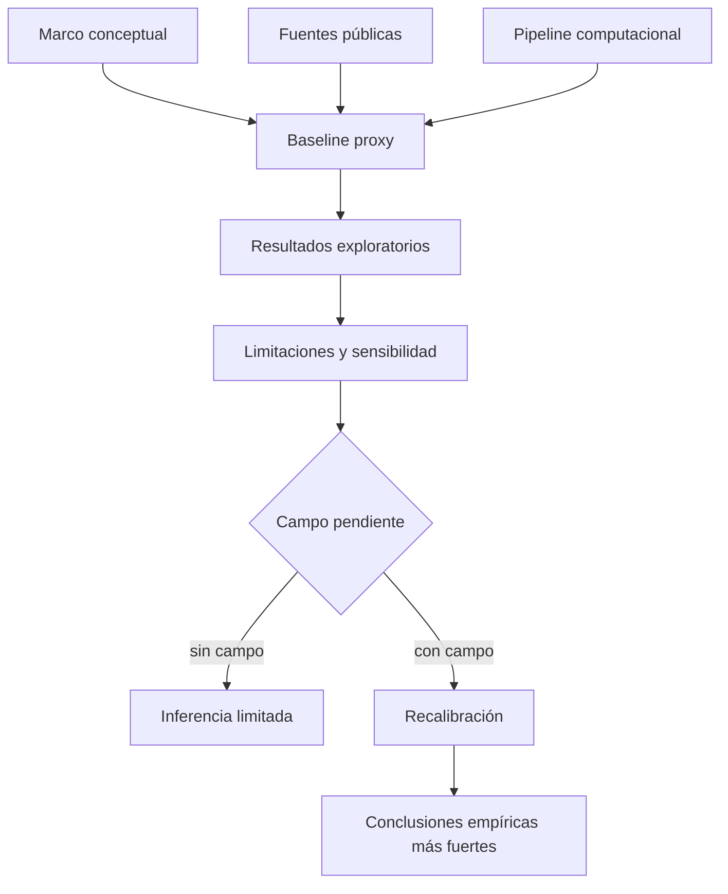

# Capítulo 4. Conclusiones, limitaciones y plan de cierre

## 4.1. Conclusión general

Esta investigación construyó un marco de análisis para estudiar el corredor Junín-San Antonio desde la fenomenología urbana, la teoría crítica y la modelación computacional. El resultado principal no es una prueba cerrada sobre la “verdad” del centro de Medellín, sino un aparato metodológico que permite formular hipótesis defendibles sobre fricción, habitabilidad, presión ambiental, experiencia corporal y restricción decisional.

La conclusión general es deliberadamente moderada: **la eficiencia funcional de un corredor urbano puede coexistir con costos fenomenológicos significativos, y esos costos pueden hacerse visibles mediante una combinación crítica de datos públicos, simulación, métricas de trayectoria y trabajo de campo pendiente**. Esta formulación evita dos errores: negar la utilidad de la infraestructura urbana o afirmar que el modelo ya capturó la experiencia real.

La contribución del modelo M-MASS consiste en integrar datos públicos, agentes simulados, campos ambientales y métricas de trayectorias en una representación trazable. Su límite principal también queda claro: mientras el estado de campo continúe como `pending_no_capture`, los resultados deben presentarse como baseline proxy y no como validación empírica completa.

## 4.2. Respuestas a las preguntas de investigación

**Pregunta teórica.** La articulación entre fenomenología y modelación es posible si se entiende la formalización como mediación crítica y no como reemplazo del mundo vivido. Husserl y Merleau-Ponty permiten sostener la centralidad del cuerpo y la experiencia; Simmel, Foucault, Deleuze, Lefebvre, Harvey y Sassen permiten situar esa experiencia en condiciones metropolitanas, políticas y materiales.

**Pregunta metodológica.** Las variables actualmente operacionalizadas —densidad, riesgo, ruido, PM2.5, visibilidad, tiempo, rutas y entropía— son suficientes para un baseline exploratorio. No son suficientes para una validación definitiva porque faltan conteos peatonales, permanencia, seguridad percibida, ruido puntual, iluminación y obstáculos reales.

**Pregunta analítica.** Las simulaciones muestran estabilidad numérica, aumento de entropía bajo escenarios de presión, diferencias relativas entre perfiles y capacidad del pipeline para generar escenarios comparables. Estos resultados son útiles para orientar preguntas de campo, pero no deben presentarse como diagnóstico cerrado.

**Pregunta de validación.** La fase siguiente requiere capturar datos situados en los nueve nodos del corredor y en cuatro franjas horarias. Solo con esa información podrá evaluarse si los proxies actuales son razonables, insuficientes o erróneos.

## 4.3. Aportes reales de la investigación

Los aportes que sí pueden defenderse son:

1. **Aporte conceptual:** una lectura de la habitabilidad como relación entre cuerpo vivido, presión ambiental, movilidad, percepción y normatividad urbana.
2. **Aporte metodológico:** una traducción explícita entre categorías fenomenológicas y variables computacionales, con advertencias sobre sus límites.
3. **Aporte técnico:** un pipeline reproducible que integra fuentes públicas, modelo de caso, simulaciones, salidas JSON y visualización.
4. **Aporte crítico:** una forma de usar simulación sin convertirla en fetiche técnico ni en prueba totalizante.
5. **Aporte operativo:** un protocolo de campo ya definido para pasar de baseline proxy a calibración empírica.

Los aportes que todavía no pueden defenderse son:

- una calibración empírica completa del corredor;
- una medición real de libertad de ruta;
- una afirmación normativa sobre niveles reales de ruido o PM2.5 en cada nodo;
- una generalización a toda Medellín;
- una validación causal de que determinada condición produce determinada experiencia subjetiva.

## 4.4. Limitaciones principales

Las limitaciones no son notas marginales; determinan qué puede y qué no puede afirmar la tesis.

| Limitación | Riesgo académico | Mitigación |
| --- | --- | --- |
| `pending_no_capture` | confundir proxy con evidencia real | ejecutar jornada de campo y recalibrar |
| Fuentes públicas incompletas | sesgo por disponibilidad | documentar fallas y buscar fuentes alternativas |
| Malla ambiental no calibrada | valores absolutos engañosos | usar como campo relativo hasta medir |
| Perfiles simplificados | reificación de sujetos | tratarlos como tipos analíticos, no identidades |
| Calibraciones internas muy ajustadas | sobreajuste | validar con datos independientes |
| Falta de sensibilidad sistemática | desconocer dependencia de parámetros | variar pesos y reportar efectos |
| Falta de literatura empírica reciente | marco incompleto | ampliar revisión 2020–2025 |
| Riesgo ético de estigmatización | daño interpretativo | anonimización, cuidado conceptual y no registro identificable |

## 4.5. Habitabilidad, presión urbana y alcance de la inferencia

Los experimentos muestran que, bajo los supuestos del modelo, el aumento de densidad y fricción ambiental tiende a concentrar rutas, elevar entropía y reducir gradualmente la fluidez del sistema. Esta observación es compatible con una lectura emergentista de la ciudad (Aguilar, 2014; Johnson, 2001), pero no autoriza por sí sola una conclusión absoluta sobre la inhabitabilidad del corredor.

La hipótesis más defendible es la siguiente: la eficiencia funcional del espacio puede coexistir con costos fenomenológicos significativos. Dicho de otro modo, un corredor puede mover muchos cuerpos y, al mismo tiempo, producir saturación sensorial, restricciones de pausa, presión de seguridad y reducción práctica de alternativas. Esta tensión permite releer el *Lebenswelt* husserliano (Husserl, 1936/1991) en clave urbana sin convertir la simulación en autoridad final.

## 4.6. La brecha empírica como criterio de rigor

El estado `pending_no_capture` de `field_calibration_delta.json` debe asumirse como una advertencia metodológica, no como un defecto que haya que ocultar. Señala que la tesis todavía requiere observación situada para contrastar conteos peatonales, permanencia, ruido, iluminación, obstáculos temporales y seguridad percibida.

Esta brecha también tiene valor filosófico: recuerda que la experiencia urbana no se deja reducir completamente a datos disponibles. La metáfora merleau-pontiana del cuerpo vivido ayuda a sostener que el espacio se comprende desde trayectorias, hábitos, incomodidades, pausas y orientaciones corporales (Merleau-Ponty, 1945/1993). Sin embargo, esa lectura debe ir acompañada de evidencia empírica y no reemplazarla.

## 4.7. Agenda de trabajo que sí puede hacerse en el PC

Antes de salir a campo, todavía hay tareas importantes que pueden completarse en el computador:

1. **Reproducibilidad:** documentar versiones, dependencias, semillas, parámetros, GPU/CPU y comandos de ejecución.
2. **Sensibilidad:** correr o documentar variaciones de parámetros ±10%, ±20% y ±30% para pesos de riesgo, tiempo, ruido y densidad.
3. **Ablación:** ejecutar escenarios sin ruido, sin riesgo, sin congestión o sin atracción comercial para estimar contribuciones relativas.
4. **Prueba del pipeline de campo:** crear un dataset sintético de ejemplo, correr ingesta/agregación/calibración y documentar la salida esperada sin presentarla como dato real.
5. **Bibliografía empírica:** ampliar literatura reciente sobre movilidad peatonal, ruido urbano, percepción de seguridad, espacio público y estudios del centro de Medellín.
6. **Anexo ético:** redactar consentimiento, protocolo de anonimización y guía de manejo de fotografías.
7. **Tablas de trazabilidad:** mapear cada afirmación importante a archivo, fuente o pendiente.

Estas tareas no reemplazan el campo, pero fortalecen el documento y evitan indulgencia metodológica.

## 4.8. Agenda de campo pendiente

La fase empírica debe mantener `pending_no_capture` hasta que existan datos reales. El mínimo defendible sería:

- cuatro franjas horarias: 07:00–09:00, 12:00–14:00, 17:00–19:00 y 20:00–22:00;
- nueve nodos observados;
- conteos por ventanas de 15 minutos;
- flujo direccional por subtramos críticos;
- permanencia con cronómetro;
- ruido puntual por nodo;
- iluminación nocturna;
- encuesta breve de seguridad percibida;
- registro de obstáculos temporales y puntos de decisión;
- notas fenomenológicas por franja.

La tesis no debe cerrar esta brecha con lenguaje; debe cerrarla con datos.

## 4.9. Criterios mínimos para que la tesis sea defendible ante jurados

Una evaluación exigente debería encontrar:

1. problema claro y preguntas explícitas;
2. objetivos verificables;
3. estado del arte suficiente, incluyendo literatura reciente;
4. método reproducible;
5. variables operacionalizadas;
6. resultados con fuente y límite;
7. discusión de sensibilidad y sobreajuste;
8. ética de campo y datos;
9. bibliografía consistente;
10. agenda de pendientes realista.

La versión actual cubre una parte sustancial de esos puntos, pero todavía debe completar sensibilidad computacional, anexos de reproducibilidad, ampliación bibliográfica empírica y trabajo de campo.

## 4.10. Postulados defendibles para sustentación académica

1. **La simulación como instrumento crítico, no como demostración autosuficiente.** El modelo permite organizar escenarios y detectar tensiones, pero sus resultados deben contrastarse con campo y fuentes públicas.
2. **La habitabilidad como problema multidimensional.** El derecho a la ciudad no se limita al acceso físico; incluye condiciones de orientación, pausa, percepción de seguridad, exposición ambiental y agencia cotidiana (Lefebvre, 1968/2017; Harvey, 2008).
3. **La formalización debe conservar sus límites.** Un modelo que optimiza flujos sin mostrar costos sensoriales, desigualdades o restricciones prácticas queda incompleto. La tesis defiende una formalización crítica, capaz de mostrar tanto patrones como ausencias.
4. **La agenda de campo es parte del resultado.** La fase siguiente debe priorizar observaciones por nodo y franja horaria para transformar el baseline proxy en un modelo calibrado con evidencia situada.
5. **La autocrítica es condición de rigor.** En un proyecto híbrido entre filosofía y computación, declarar límites no es debilidad: es lo que impide vender simulación como certeza.

## 4.11. Cierre

La tesis debe defenderse como una investigación ambiciosa pero no autosatisfecha. Su ambición está en unir fenomenología, datos y simulación; su rigor está en reconocer que esa unión todavía requiere validación. El proyecto ya puede sostener un marco, un pipeline y resultados exploratorios. No debe fingir que completó el trabajo empírico. La tarea siguiente es convertir el `pending_no_capture` en datos situados y permitir que esos datos corrijan el modelo, incluso si contradicen algunas intuiciones iniciales.

## 4.12. Referencias bibliográficas

- Aguilar, J. (2014). *Sistemas Emergentes y Control Inteligente*. Universidad de Los Andes.
- Alcaldía de Medellín. (s. f.). *MEData: Datos Abiertos de Medellín*. https://medata.gov.co/
- Área Metropolitana del Valle de Aburrá. (s. f.). *Datos abiertos ambientales del Valle de Aburrá / SIATA*. https://datosabiertos.metropol.gov.co/
- Badiou, A. (1999). *El ser y el acontecimiento* (R. Cerdeiras, Trad.). Manantial. (Obra original publicada en 1988).
- Batty, M. (2013). *The new science of cities*. MIT Press.
- Bellman, R. (1957). *Dynamic programming*. Princeton University Press.
- Bonabeau, E. (2002). Agent-based modeling: Methods and techniques for simulating human systems. *Proceedings of the National Academy of Sciences, 99*(suppl. 3), 7280–7287. https://doi.org/10.1073/pnas.082080899
- Bueno, G. (1972). *Ensayos materialistas*. Taurus.
- Departamento Administrativo Nacional de Estadística. (2018). *Censo Nacional de Población y Vivienda 2018*. https://www.dane.gov.co/
- Deleuze, G. (1990). Post-scriptum sobre las sociedades de control. *L'Autre Journal*, 1.
- Epstein, J. M. (2006). *Generative social science: Studies in agent-based computational modeling*. Princeton University Press.
- Foucault, M. (2002). *Vigilar y castigar: nacimiento de la prisión* (A. Garzón del Camino, Trad.). Siglo XXI Editores. (Obra original publicada en 1975).
- Haklay, M., & Weber, P. (2008). OpenStreetMap: User-generated street maps. *IEEE Pervasive Computing, 7*(4), 12–18. https://doi.org/10.1109/MPRV.2008.80
- Harvey, D. (2008). The right to the city. *New Left Review, 53*, 23–40.
- Helbing, D., & Molnár, P. (1995). Social force model for pedestrian dynamics. *Physical Review E, 51*(5), 4282–4286. https://doi.org/10.1103/PhysRevE.51.4282
- Husserl, E. (1991). *La crisis de las ciencias europeas y la fenomenología trascendental* (J. Muñoz y S. Mas, Trads.). Crítica. (Obra original publicada en 1936).
- Johnson, S. (2001). *Emergence: The Connected Lives of Ants, Brains, Cities, and Software*. Scribner.
- Kullback, S., & Leibler, R. A. (1951). On information and sufficiency. *The Annals of Mathematical Statistics, 22*(1), 79–86. https://doi.org/10.1214/aoms/1177729694
- Lefebvre, H. (2017). *El derecho a la ciudad*. Capitán Swing. (Obra original publicada en 1968).
- Medellín Cómo Vamos. (2025). *Encuesta de Percepción Ciudadana 2024: Informe metodológico*. https://www.medellincomovamos.org/
- Merleau-Ponty, M. (1993). *Fenomenología de la percepción* (J. Cabanes, Trad.). Planeta-Agostini. (Obra original publicada en 1945).
- Metro de Medellín. (s. f.). *Challenge: Mobility in San Antonio B*. https://www.metrodemedellin.gov.co/en/challenge-mobility-in-san-antonio-b
- Mnih, V., Kavukcuoglu, K., Silver, D., Rusu, A. A., Veness, J., Bellemare, M. G., Graves, A., Riedmiller, M., Fidjeland, A. K., Ostrovski, G., Petersen, S., Beattie, C., Sadik, A., Antonoglou, I., King, H., Kumaran, D., Wierstra, D., Legg, S., & Hassabis, D. (2015). Human-level control through deep reinforcement learning. *Nature, 518*, 529–533. https://doi.org/10.1038/nature14236
- OpenStreetMap contributors. (2026). *OpenStreetMap*. https://www.openstreetmap.org/copyright
- Sassen, S. (2014). *Expulsions: Brutality and complexity in the global economy*. Harvard University Press.
- Shannon, C. E. (1948). A mathematical theory of communication. *The Bell System Technical Journal, 27*(3), 379–423; *27*(4), 623–656. https://doi.org/10.1002/j.1538-7305.1948.tb01338.x
- Simmel, G. (1986). *El individuo y la libertad. Ensayos de crítica de la cultura* (S. Masó, Trad.). Península. (Obra original publicada en 1903).
- Sutton, R. S., & Barto, A. G. (2018). *Reinforcement learning: An introduction* (2nd ed.). MIT Press.
