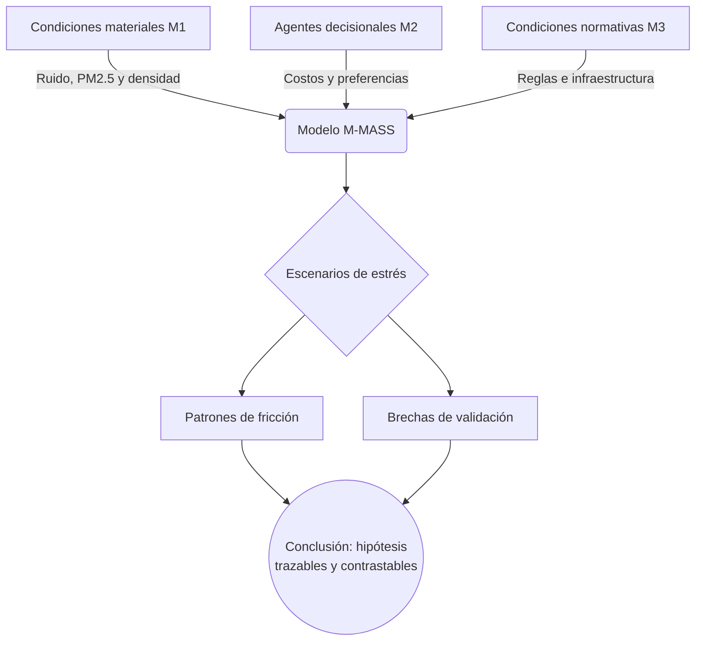

# Capítulo 4. Conclusiones y agenda de validación

Esta investigación construyó un marco de análisis para estudiar el corredor Junín-San Antonio desde la fenomenología urbana, la teoría crítica y la modelación computacional. El resultado principal no es una prueba cerrada sobre la “verdad” del centro de Medellín, sino un aparato metodológico que permite formular hipótesis defendibles sobre fricción, habitabilidad, presión ambiental y restricción decisional.

La contribución del modelo M-MASS consiste en integrar datos públicos, agentes simulados, campos ambientales y métricas de trayectorias en una representación trazable. Su límite principal también queda claro: mientras el estado de campo continúe como `pending_no_capture`, los resultados deben presentarse como baseline proxy y no como validación empírica completa.

## 4.1. Habitabilidad, presión urbana y alcance de la inferencia

Los experimentos muestran que, bajo los supuestos del modelo, el aumento de densidad y fricción ambiental tiende a concentrar rutas, elevar entropía y reducir gradualmente la fluidez del sistema. Esta observación es compatible con una lectura emergentista de la ciudad (Aguilar, 2014; Johnson, 2001), pero no autoriza por sí sola una conclusión absoluta sobre la inhabitabilidad del corredor.

La hipótesis más defendible es la siguiente: la eficiencia funcional del espacio puede coexistir con costos fenomenológicos significativos. Dicho de otro modo, un corredor puede mover muchos cuerpos y, al mismo tiempo, producir saturación sensorial, restricciones de pausa, presión de seguridad y reducción práctica de alternativas. Esta tensión permite releer el *Lebenswelt* husserliano (Husserl, 1936/1991) en clave urbana sin convertir la simulación en autoridad final.

## 4.2. La brecha empírica como criterio de rigor

El estado `pending_no_capture` de `field_calibration_delta.json` debe asumirse como una advertencia metodológica, no como un defecto que haya que ocultar. Señala que la tesis todavía requiere observación situada para contrastar conteos peatonales, permanencia, ruido, iluminación, obstáculos temporales y seguridad percibida.

Esta brecha también tiene valor filosófico: recuerda que la experiencia urbana no se deja reducir completamente a datos disponibles. La metáfora merleau-pontiana del cuerpo vivido ayuda a sostener que el espacio se comprende desde trayectorias, hábitos, incomodidades, pausas y orientaciones corporales (Merleau-Ponty, 1945/1993). Sin embargo, esa lectura debe ir acompañada de evidencia empírica y no reemplazarla.

## 4.3. Postulados defendibles para sustentación académica

1. **La simulación como instrumento crítico, no como demostración autosuficiente.** El modelo permite organizar escenarios y detectar tensiones, pero sus resultados deben contrastarse con campo y fuentes públicas.
2. **La habitabilidad como problema multidimensional.** El derecho a la ciudad no se limita al acceso físico; incluye condiciones de orientación, pausa, percepción de seguridad, exposición ambiental y agencia cotidiana (Lefebvre, 1968/2017; Harvey, 2008).
3. **La formalización debe conservar sus límites.** Un modelo que optimiza flujos sin mostrar costos sensoriales, desigualdades o restricciones prácticas queda incompleto. La tesis defiende una formalización crítica, capaz de mostrar tanto patrones como ausencias.
4. **La agenda de campo es parte del resultado.** La fase siguiente debe priorizar observaciones por nodo y franja horaria para transformar el baseline proxy en un modelo calibrado con evidencia situada.

## 4.4. Referencias Bibliográficas

- Aguilar, J. (2014). *Sistemas Emergentes y Control Inteligente*. Universidad de Los Andes.
- Alcaldía de Medellín. (s. f.). *MEData: Datos Abiertos de Medellín*. https://medata.gov.co/
- Área Metropolitana del Valle de Aburrá. (s. f.). *Datos abiertos ambientales del Valle de Aburrá / SIATA*. https://datosabiertos.metropol.gov.co/
- Badiou, A. (1999). *El ser y el acontecimiento* (R. Cerdeiras, Trad.). Manantial. (Obra original publicada en 1988).
- Batty, M. (2013). *The new science of cities*. MIT Press.
- Bellman, R. (1957). *Dynamic programming*. Princeton University Press.
- Bonabeau, E. (2002). Agent-based modeling: Methods and techniques for simulating human systems. *Proceedings of the National Academy of Sciences, 99*(suppl. 3), 7280–7287. https://doi.org/10.1073/pnas.082080899
- Bueno, G. (1972). *Ensayos materialistas*. Taurus.
- Departamento Administrativo Nacional de Estadística. (2018). *Censo Nacional de Población y Vivienda 2018*. https://www.dane.gov.co/
- Deleuze, G. (1990). Post-scriptum sobre las sociedades de control. *L'Autre Journal*, 1.
- Epstein, J. M. (2006). *Generative social science: Studies in agent-based computational modeling*. Princeton University Press.
- Foucault, M. (2002). *Vigilar y castigar: nacimiento de la prisión* (A. Garzón del Camino, Trad.). Siglo XXI Editores. (Obra original publicada en 1975).
- Haklay, M., & Weber, P. (2008). OpenStreetMap: User-generated street maps. *IEEE Pervasive Computing, 7*(4), 12–18. https://doi.org/10.1109/MPRV.2008.80
- Harvey, D. (2008). The right to the city. *New Left Review, 53*, 23–40.
- Helbing, D., & Molnár, P. (1995). Social force model for pedestrian dynamics. *Physical Review E, 51*(5), 4282–4286. https://doi.org/10.1103/PhysRevE.51.4282
- Husserl, E. (1991). *La crisis de las ciencias europeas y la fenomenología trascendental* (J. Muñoz y S. Mas, Trads.). Crítica. (Obra original publicada en 1936).
- Johnson, S. (2001). *Emergence: The Connected Lives of Ants, Brains, Cities, and Software*. Scribner.
- Kullback, S., & Leibler, R. A. (1951). On information and sufficiency. *The Annals of Mathematical Statistics, 22*(1), 79–86. https://doi.org/10.1214/aoms/1177729694
- Lefebvre, H. (2017). *El derecho a la ciudad*. Capitán Swing. (Obra original publicada en 1968).
- Medellín Cómo Vamos. (2025). *Encuesta de Percepción Ciudadana 2024: Informe metodológico*. https://www.medellincomovamos.org/
- Merleau-Ponty, M. (1993). *Fenomenología de la percepción* (J. Cabanes, Trad.). Planeta-Agostini. (Obra original publicada en 1945).
- Metro de Medellín. (s. f.). *Challenge: Mobility in San Antonio B*. https://www.metrodemedellin.gov.co/en/challenge-mobility-in-san-antonio-b
- Mnih, V., Kavukcuoglu, K., Silver, D., Rusu, A. A., Veness, J., Bellemare, M. G., Graves, A., Riedmiller, M., Fidjeland, A. K., Ostrovski, G., Petersen, S., Beattie, C., Sadik, A., Antonoglou, I., King, H., Kumaran, D., Wierstra, D., Legg, S., & Hassabis, D. (2015). Human-level control through deep reinforcement learning. *Nature, 518*, 529–533. https://doi.org/10.1038/nature14236
- OpenStreetMap contributors. (2026). *OpenStreetMap*. https://www.openstreetmap.org/copyright
- Sassen, S. (2014). *Expulsions: Brutality and complexity in the global economy*. Harvard University Press.
- Shannon, C. E. (1948). A mathematical theory of communication. *The Bell System Technical Journal, 27*(3), 379–423; *27*(4), 623–656. https://doi.org/10.1002/j.1538-7305.1948.tb01338.x
- Simmel, G. (1986). *El individuo y la libertad. Ensayos de crítica de la cultura* (S. Masó, Trad.). Península. (Obra original publicada en 1903).
- Sutton, R. S., & Barto, A. G. (2018). *Reinforcement learning: An introduction* (2nd ed.). MIT Press.
