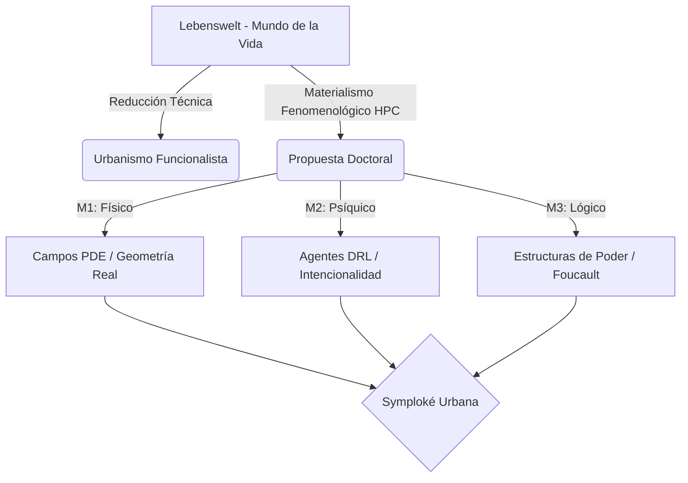

# Capítulo 1: Fundamentación Epistémica y el Giro Materialista de la Fenomenología Urbana

## 1.1. La Crisis del Espacio Vivido y la Matematización del Lebenswelt
Esta investigación se ancla en la denuncia de Edmund Husserl (1936/1970) sobre la sustitución del **Mundo de la Vida (Lebenswelt)** por una subestructura matemática de idealidades. El urbanismo contemporáneo en Medellín ha reducido el corredor Junín-San Antonio a un "grafo de transporte" donde el sujeto desaparece. Nuestra propuesta es una **Fenomenología Materialista** que utiliza la computación de alto rendimiento (HPC) no para profundizar la abstracción, sino para capturar la multidimensionalidad de la presencia urbana.

## 1.2. El Materialismo Filosófico y la Symploké Urbana
Siguiendo a **Gustavo Bueno (1972)**, entendemos el espacio urbano no como un escenario neutro, sino como una **Symploké**: un entrelazamiento de materialidades físicas ($M_1$), experiencias subjetivas ($M_2$) y estructuras lógicas de poder ($M_3$). La "atmósfera" no es una sensación poética inefable; es una configuración material de fuerzas que puede y debe ser analizada científicamente.

## 1.3. Ontología Matemática y el Acontecimiento de Badiou
Para **Alain Badiou (1988)**, la ontología es la matemática. La simulación de 100,000 agentes es el dispositivo para realizar la "cuenta-por-uno" de lo múltiple caótico del centro. El **Acontecimiento Urbano** es el punto de colapso fenomenológico (Stress Test) donde el orden técnico falla y revela la verdad del vacío habitacional.

## 1.4. El Dispositivo Biopolítico y el Panoptismo de Flujo
Michel Foucault (1975) define el dispositivo como un mecanismo que organiza los cuerpos. El corredor Junín-San Antonio funciona como un **Panóptico de Flujo**. La arquitectura del cañón comercial fuerza una direccionalidad y penaliza la detención, imponiendo una "docilidad" al cuerpo transeúnte. La "Turbulencia Fenomenológica" es la medida material de la resistencia de la intencionalidad frente a este dispositivo.

## 1.5. Conocimientos Situados y Cuerpo Vívido
Basándonos en **Donna Haraway (1988)** y **Maurice Merleau-Ponty (1945)**, rechazamos la neutralidad del dato. El cuerpo es el vehículo del ser-en-el-mundo; por tanto, la agresión del ruido y la contaminación resuelta por el modelo no es un dato de salud, sino una ruptura del esquema corporal y de la soberanía fenomenológica.

