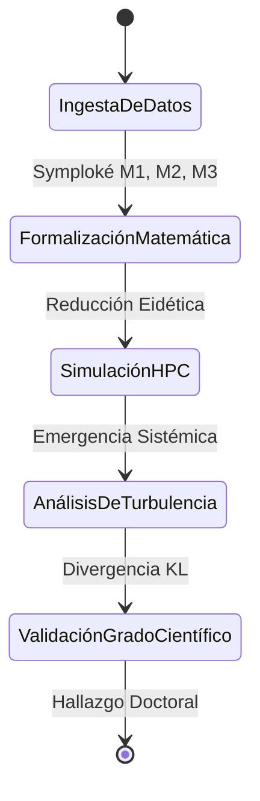

# Capítulo 2: Metodología Analítica - El HPC como Máquina de Reducción Fenomenológica

## 2.1. El Sistema Urbano como Estructura Emergente
La ciudad no es una máquina lineal, sino un sistema auto-organizado. Siguiendo a **Steven Johnson (2001)** y **José Aguilar (2014)**, modelamos el corredor como un sistema de **Sistemas Emergentes**. La turbulencia fenomenológica no es una variable inyectada, sino una propiedad que emerge de la interacción local de miles de agentes inteligentes bajo restricciones ambientales.

## 2.2. Modelado de Agentes Inteligentes (DRL) y la Intencionalidad
Justificamos el uso de **Deep Reinforcement Learning (DRL)** como el modelo analítico de la intencionalidad husserliana. Los agentes no son autómatas; poseen un "espacio de estados" y una "función de recompensa" $R$ que formaliza las qualia:
- **Estado ($s$):** Percepción de densidad, ruido y material particulado.
- **Acción ($a$):** Proyección intencional de la trayectoria.
- **Recompensa ($R$):** Minimización del estrés y maximización de la soberanía decisional.

$$ Q^*(s, a) = \max_{\pi} \mathbb{E} \left[ \sum_{t=0}^{\infty} \gamma^t R(s_t, a_t) \right] $$

## 2.3. Campos de Fricción Ontológica (PDE) e Isovistas
Para evitar el subjetivismo, resolvemos Ecuaciones Diferenciales Parciales para capturar la materialidad invisible (PM2.5, Ruido). Estos campos definen el "clima fenomenológico" del corredor. Simultáneamente, utilizamos Ray-Tracing masivo en GPU para calcular las isovistas dinámicas, midiendo la entropía visual y la ceguera informativa que el cañón urbano impone al cuerpo.

## 2.4. Protocolo de Validación y Trazabilidad Empírica
La validez del modelo se sustenta en una calibración bayesiana contra datos reales del **Metro de Medellín (~100k pax/día)** y sensores **SIATA**. Utilizamos la **Divergencia de Kullback-Leibler ($D_{KL}$)** para medir la fidelidad del simulacro frente a la verdad de campo, asegurando que el modelo sea una herramienta de análisis científico y no una mera ilustración.

