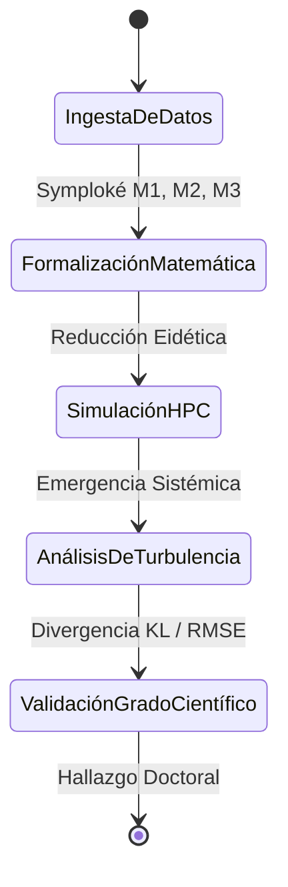

# Capítulo 2: Marco Metodológico - El HPC como Máquina de Reducción Eidética

## 2.1. El Método de la Fenomenología Computacional
La metodología propuesta se aleja de la simulación de transporte tradicional para proponer un **Aparato de Captura Ontológica**. No buscamos predecir el tráfico, sino **formalizar la fricción del ser**. Para ello, el diseño experimental integra cuatro planos de resolución matemática:

### 2.2. Formalización del Entorno: El Campo Continuo (4K PDE Solver)
Para capturar la materialidad física ($M_1$), implementamos un solver de **Ecuaciones Diferenciales Parciales (PDE)** en una malla masiva de 4096x4096 (16.7 millones de celdas). Resolvemos la ecuación de difusión-reacción para PM2.5 y la propagación acústica (Ruido):

$$ \frac{\partial u}{\partial t} = D \nabla^2 u + S - k u $$

Donde $D$ es el coeficiente de difusión y $S$ las fuentes de agresión urbana. Esta alta resolución no es una gala técnica, sino la creación de un **campo de presencia continuo** que evita la fragmentación del espacio en celdas discretas y arbitrarias.

### 2.3. Formalización del Sujeto: Intencionalidad y Aprendizaje Profundo (DRL)
El agente no es un autómata reactivo, sino un modelo analítico de la **intencionalidad husserliana**. Mediante **Deep Reinforcement Learning (DRL)**, el agente (`UrbanPhenomenologyDQN`) proyecta un horizonte de posibilidades basado en una función de recompensa $R$ que formaliza las qualia:

$$ R(s, a) = - ( \omega_t T + \omega_r \mathcal{R} + \omega_n \mathcal{N} ) $$

Donde $T$ es el tiempo, $\mathcal{R}$ el riesgo percibido y $\mathcal{N}$ el nivel de ruido ambiental. Los pesos $\omega$ representan la **subjetividad situada** de diferentes perfiles (vendedor informal, transeúnte, habitante de calle). El uso de `LayerNorm` y `Dropout` en la red neuronal modela el proceso de **filtrado fenomenológico**: la capacidad del sujeto para ignorar estímulos para sobrevivir a la saturación del centro.

### 2.4. Emergencia y Sistemas Complejos (Aguilar / Johnson)
La arquitectura de simulación se fundamenta en la teoría de los **Sistemas Emergentes (Steven Johnson, 2001)** y el control inteligente de **José Aguilar (2014)**. La "vida" del corredor Junín-San Antonio se entiende como una propiedad emergente de la interacción local de 100,000 agentes. El HPC permite observar la transición de fase hacia la **Turbulencia Fenomenológica**, donde la libertad de ruta (entropía) del individuo colapsa ante la inercia del sistema masivo.

