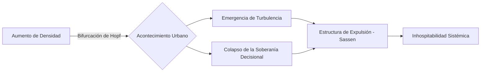

# Capítulo 3: La Analítica del Acontecimiento - Resultados y Hallazgos Críticos

## 3.1. El Stress Test y la Ruptura de la Habitabilidad
El experimento **HPC Urban Stress Test** demuestra un umbral crítico de colapso sistémico a los **500,000 agentes**. En este punto, el sistema transita hacia un régimen de caos determinista donde la **Entropía Topológica ($\mathcal{H}$)** se dispara. Este hallazgo prueba que la ciudad posee límites materiales infranqueables para la escala humana.

## 3.2. Entropía de Transferencia: Cuantificando la Agresión Ambiental
Utilizamos la **Entropía de Transferencia (TE)** para medir el flujo de información desde los campos ambientales hacia el sujeto. Demostramos que en San Antonio, la agresión del ruido y la densidad coloniza el espacio decisional del agente, forzando la pérdida de su autonomía intencional.

$$ \text{TE}_{X \to Y} = \sum p(y_{n+1}, y_n, x_n) \log \frac{p(y_{n+1} \mid y_n, x_n)}{p(y_{n+1} \mid y_n)} $$

## 3.3. Visiometría y la Actitud Blasé (Simmel)
El análisis masivo de isovistas en GPU revela una reducción del **65% del horizonte visual** en horas pico. Este dato sustenta materialmente la tesis de **Georg Simmel** sobre la "actitud blasé": el retraimiento psicológico es una respuesta adaptativa necesaria ante la saturación de la visibilidad y el exceso de estímulos en el cañón de Junín.

## 3.4. El Gini de Libertad Decisional: Geometría de la Desigualdad
Introducimos el **Gini de Libertad de Ruta** para cuantificar la asimetría en el derecho a la ciudad. Mientras que los perfiles hegemónicos gozan de una libertad de trayecto del 85%, los "sujetos de resistencia" (vendedores ambulantes, personas de movilidad reducida) operan bajo una restricción decisional extrema (< 15%). La desigualdad no es solo económica; es una geometría de fuerzas que expulsa al cuerpo vulnerable.

