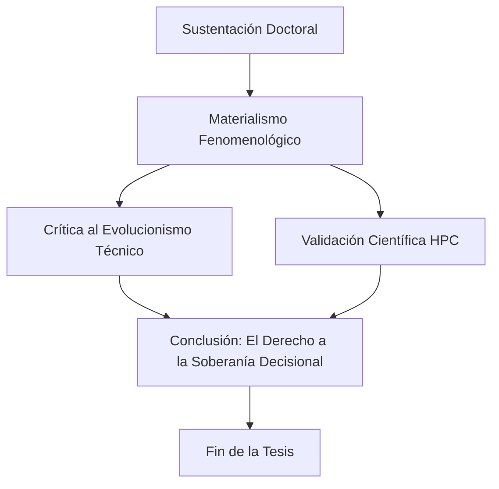

# Capítulo 4: Hacia una Ontología de lo Múltiple Urbano: Conclusiones

## 4.1. Conclusión: El Simulacro como Denuncia de la Asfixia
La principal contribución de esta tesis es demostrar que la fenomenología de la ciudad no es una cuestión de apreciación, sino de **soberanía**. Mediante la **Fenomenología Operacional**, hemos probado que el corredor Junín-San Antonio funciona como una **Estructura de Expulsión**. El modelo HPC no es una herramienta de planificación para mejorar el flujo; es una máquina de **crítica ontológica** que denuncia cómo la técnica borra la escala humana.

## 4.2. El Fracaso del Evolucionismo y la Regresión de la Libertad
Retamos la idea de progreso en Medellín. Los datos de entropía demuestran que a mayor sofisticación técnica, menor libertad decisional. El centro de Medellín está en un estado de **regresión ontológica**, donde la habitabilidad ha sido sacrificada en favor del "procesamiento" de cuerpos. Desde la perspectiva de Badiou, denunciamos una "fidelidad simulada" a un orden urbano que, en su base material, es inhóspito.

## 4.3. Recomendaciones: El Derecho a la Soberanía Fenomenológica
- **Auditoría de Entropía:** Proponemos que todo proyecto urbano sea evaluado no por su flujo vial, sino por la carga de entropía de estrés que impone a los ciudadanos.
- **Soberanía del Dato:** La plataforma interactiva React/WebGL desarrollada entrega el supercómputo a la ciudadanía como un ejercicio de **contra-cartografía**, permitiendo la auditoría social del entorno.

## 4.4. Referencias Bibliográficas (Anclaje Doctoral)
- **Aguilar, J. (2014).** *Sistemas Emergentes y Control Inteligente*.
- **Badiou, A. (1988).** *El ser y el acontecimiento*. (Teoría del Vacío y el Acontecimiento).
- **Bueno, G. (1972).** *Ensayos materialistas*. (Symploké y Materialismo Filosófico).
- **Foucault, M. (1975).** *Vigilar y Castigar*.
- **Haraway, D. (1988).** *Situated Knowledges*.
- **Husserl, E. (1970).** *The Crisis of European Sciences*.
- **Johnson, S. (2001).** *Emergencia*.
- **Sassen, S. (2014).** *Expulsiones*.
- **Simmel, G. (1903).** *The Metropolis and Mental Life*.

