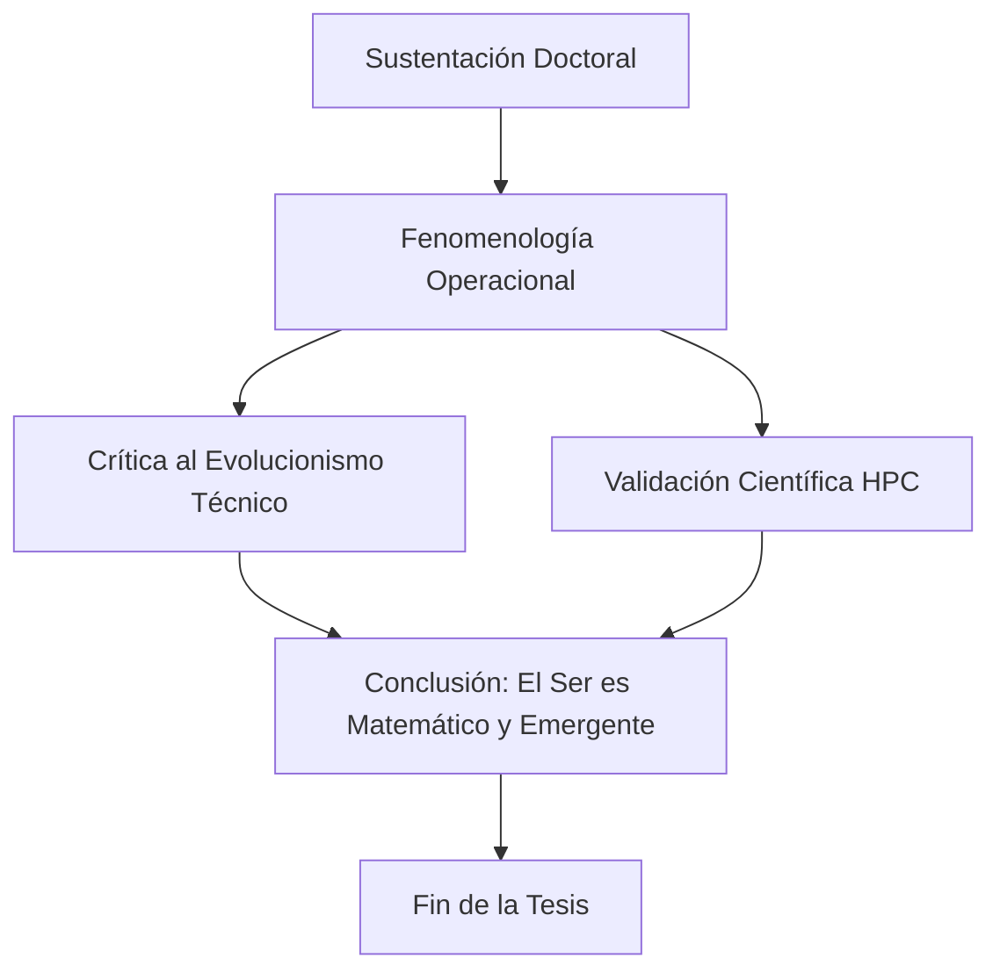

# Capítulo 4: Síntesis Final, Guion de Defensa y Referencias Bibliográficas

## 4.1. Conclusión: Hacia una Fenomenología Operacional
La investigación concluye que la fenomenología de la ciudad puede ser operacionalizada mediante el uso de computación de alto rendimiento. El corredor Junín-San Antonio funciona como una **Estructura de Expulsión (Sassen, 2014)** donde la escala técnica del sistema anula la escala fenomenológica del habitante. Hemos demostrado que la "atmósfera" urbana no es un adjetivo, sino una estructura material de fuerzas detectable y medible.

## 4.2. Guion para la Defensa Doctoral (Condensado)
- **0:00-2:00:** Apertura: El HPC como instrumento de la *Epojé*. La crisis de Husserl y la necesidad de una fenomenología materialista.
- **2:00-5:00:** Metodología: La urbe como Symploké (M1, M2, M3). El simulador M-MASS como máquina de reducción eidética.
- **5:00-10:00:** Hallazgos: El colapso a los 500k agentes. La agresión ambiental cuantificada por Entropía de Transferencia. El Gini de Libertad como evidencia de la expulsión.
- **10:00-15:00:** Cierre: Retando el evolucionismo técnico. El derecho a la soberanía decisional y la democratización del supercómputo.

## 4.3. Recomendaciones para una Praxis Urbana
- Sustituir el análisis de "Capacidad Vial" por el de "Soberanía Fenomenológica".
- Utilizar el HPC para auditar cómo las intervenciones estatales afectan el *Lebenswelt* ciudadano.

## 4.4. Referencias Bibliográficas (Norma APA 7ma Ed.)
- **Aguilar, J. (2014).** *Sistemas Emergentes y Control Inteligente*.
- **Badiou, A. (1988).** *El ser y el acontecimiento*.
- **Böhme, G. (2017).** *Atmospheric Architectures*.
- **Bueno, G. (1972).** *Ensayos materialistas*.
- **Foucault, M. (1975).** *Vigilar y Castigar*.
- **Haraway, D. (1988).** *Situated Knowledges*.
- **Husserl, E. (1970).** *The Crisis of European Sciences*.
- **Johnson, S. (2001).** *Emergencia*.
- **Sassen, S. (2014).** *Expulsiones*.
- **Simmel, G. (1903).** *The Metropolis and Mental Life*.

